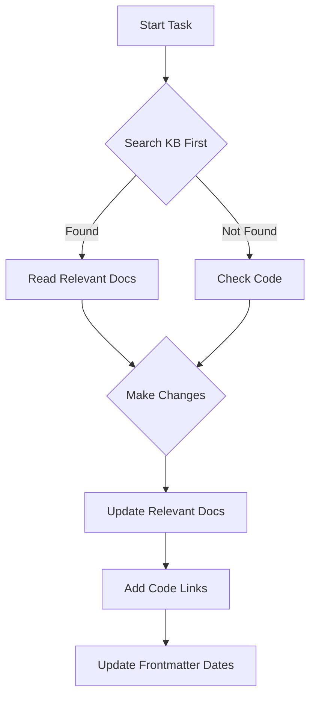
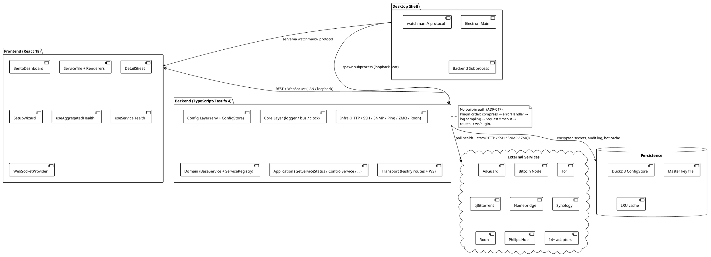
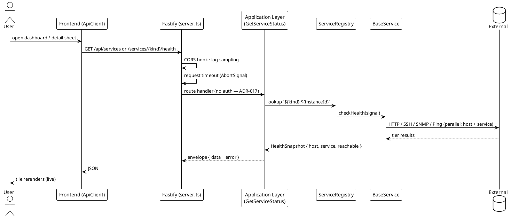

# Watchman Knowledge Base

> [!abstract] About This KB
> Welcome to the Watchman project documentation. This knowledge base is designed for **developers**, **AI agents**, and **computer scientists**. It contains architectural decisions, API documentation, guides, code references, and all project knowledge needed to understand, contribute to, and extend Watchman.
>
> **For AI Agents**: Use `Ctrl/Cmd+O` to quick-open any document. Start with the [[docs/guides/ai-agent-workflow|AI Agent Workflow]] document for comprehensive instructions.

## Quick Start — Three Startup Flows

Choose the path that matches your use case:

| Startup Flow                    | Commands                              | Next Steps                                         |
| ------------------------------- | ------------------------------------- | -------------------------------------------------- |
| **Option A — macOS Desktop**    | `./install.sh && npm run electron:prod` | [[docs/guides/running-the-desktop-app | Desktop App Guide]] |
| **Option B — Production Server** | `npm install && npm run build && npm run start` | [[docs/guides/deployment | Deployment Guide]] |
| **Option C — Development**      | `npm install && npm run dev`          | [[docs/guides/setup | Setup Guide]]               |

Or jump to:

| If you're...                         | Start here                            |
| ------------------------------------ | ------------------------------------- |
| **New developer**                    | [[docs/getting-started | Getting Started MOC]] |
| **Contributing**                     | [[docs/guides/contributing | Contributing Guide]] |
| **Looking for an API**               | [[docs/api/index | API Overview]] or [[docs/integrations/index | Service Integrations]] |
| **Making an architectural decision** | [[docs/adr/index | ADR Index]] → [[docs/adr/template | ADR Template]] |
| **Understanding the architecture**   | [[docs/architecture/index | Architecture Overview]] |
| **Adding a service**                 | [[docs/guides/adding-services | Adding Services Guide]] |
| **An AI agent**                      | [[docs/guides/ai-agent-workflow | AI Agent Workflow]] (start here!) |

> [!tip] AI Agent Quick Reference
>
> 1. **Read before writing** - Check existing docs before adding new content
> 2. **Use ADRs for decisions** - Document significant design choices in `docs/adr/`
> 3. **Update relevant docs** - Keep API, features, and integration docs in sync with code
> 4. **Use templates** - Start new documents from templates in each section
> 5. **Use wiki-links** - Link to code with `[[apps/backend/services/ServiceName.js]]` format
> 6. **Search first** - Use Obsidian MCP tools to search the KB before reading code

## Knowledge Areas

| Area                         | Description              | Documents                            |
| ---------------------------- | ------------------------ | ------------------------------------ | ------------------- |
| 🏗️ [[docs/adr/index          | Architecture Decisions]] | Major design decisions and rationale | 24 ADRs             |
| 📡 [[docs/api/index          | API Documentation]]      | REST API endpoints and schemas       | 9 endpoints         |
| 📖 [[docs/guides/index       | Guides]]                 | Setup, deployment, Pi deploy, contributing, and wizard  | 8 guides            |
| ⚡ [[docs/features/index     | Features]]               | Feature documentation                | 5 features          |
| 🔌 [[docs/integrations/index | Integrations]]           | External service integrations        | 15 integrations     |
| 🔒 [[docs/security/index     | Security]]               | Security policies and practices      | 4 security docs     |
| 🚀 [[docs/performance/index  | Performance]]            | Performance optimizations            | 2 docs              |
| 🎨 [[docs/architecture/frontend-design-system | Design System]] | Dark-luxury tokens, primitives, motion | Complete reference |
| 🧩 [[docs/components/index   | Components]]             | Frontend React components and hooks  | 30+ components + 14 primitives |
| 🧪 [[docs/testing/index      | Testing]]                | Testing strategies and patterns      | 2 testing docs      |
| 📐 [[docs/architecture/index | Architecture]]           | System diagrams and architecture     | 3 architecture docs |

## AI Agent Workflow



### Common AI Agent Tasks

| Task                   | Documentation                 |
| ---------------------- | ----------------------------- | ------------------------------------------------- | ----------------- |
| Add a new service      | [[docs/guides/adding-services | Adding Services Guide]]                           |
| Add a new API endpoint | [[docs/api/index              | API Documentation]] + [[apps/backend/openapi.yaml | OpenAPI Spec]]    |
| Fix a bug              | [[docs/guides/contributing    | Contributing Guide]] + [[docs/troubleshooting     | Troubleshooting]] |
| Add tests              | [[docs/testing/index          | Testing Index]]                                   |
| Security review        | [[docs/security/index         | Security Index]]                                  |

## Reference

| Resource                                  | Description             |
| ----------------------------------------- | ----------------------- |
| 📚 [[docs/glossary                        | Glossary]]              | Key terms, aliases, and disambiguation   |
| 🏷️ [[docs/tag-taxonomy                    | Tag Taxonomy]]          | Controlled vocabulary for KB tags        |
| 🔧 [[docs/troubleshooting                 | Troubleshooting]]       | Common issues and solutions              |
| 🗺️ [[docs/getting-started                 | Getting Started]]       | Map of Content for navigation            |
| 📋 [[docs/common-tasks                    | Common Tasks]]          | Task-oriented quick reference            |
| 🔑 [[docs/reference/environment-variables | Environment Variables]] | All env vars in one place                |
| ⚙️ [[docs/reference/scripts               | Scripts Reference]]     | All npm commands grouped by purpose      |
| 💻 [[docs/reference/code-patterns         | Code Patterns]]         | Standard code patterns for all layers    |
| ❌ [[docs/reference/error-codes           | Error Codes]]           | All API error responses and status codes |
| 📝 [[docs/LOGGING.md                      | Logging]]               | Structured logging configuration         |

## Recent Updates

```dataview
TABLE WITHOUT ID file.link AS "Document", date AS "Date", type AS "Type", tags AS "Tags"
FROM "docs"
WHERE date AND date >= date(today) - dur(14 days)
SORT date DESC
LIMIT 15
```

## Project Overview

Watchman is a comprehensive **self-hosted service monitoring dashboard** supporting:

- **Service Monitoring**: Health checks and statistics for 14+ service types
- **Multi-Instance Support**: Run multiple nodes of the same service type
- **Real-Time Updates**: WebSocket-based status broadcasting
- **Single-User Design**: Simplified for home-lab deployments (no authentication)
- **UI-Driven Configuration**: Service management via web UI with encrypted secrets
- **OpenAPI**: Full API documentation with Swagger UI

### Tech Stack

- **Frontend**: React 18 + TypeScript + Vite + Tailwind CSS + OKLCH tokens + Geist typography + 14 custom primitives
- **Backend**: Node.js 18+ + TypeScript + Fastify 4 + Zod validation + Pino logging + DuckDB ConfigStore
- **Communication**: WebSocket for real-time updates (WebSocketProvider singleton + useWebSocket hook)
- **State**: In-process LRU cache, croner-based polling, circuit breaker, in-memory recent-activity ring buffer
- **Tooling**: ESLint, Prettier, Vitest (396 tests across backend+frontend)
- **Architecture**: npm workspaces monorepo, Electron desktop wrapper spawning backend subprocess, layered backend (config → core → infra → domain → application → transport)

### Project Structure

```
Watchman/
├── apps/
│   ├── frontend/          # React 18 + TypeScript + Vite + Tailwind
│   │   ├── src/
│   │   │   ├── components/ # Bento tiles, detail sheets, primitives
│   │   │   ├── hooks/     # useServiceHealth, useWebSocket
│   │   │   ├── pages/     # Page components
│   │   │   ├── services/  # API client, WebSocket, renderer registry
│   │   │   ├── styles/    # OKLCH tokens, Geist fonts
│   │   │   ├── providers/ # WebSocketProvider
│   │   │   └── lib/       # Utilities
│   │   └── tests/         # Frontend tests (150+)
│   ├── backend/           # TypeScript + Fastify 4 + DuckDB ConfigStore
│   │   ├── src/
│   │   │   ├── config/    # Env validation, service registry, master key
│   │   │   ├── core/      # Logger, errors, Result, eventBus
│   │   │   ├── infra/     # HTTP, SSH, GPIO, SNMP, cache, poller, DuckDB ConfigStore
│   │   │   ├── domain/    # BaseService, ServiceRegistry
│   │   │   ├── application/ # UseCases (GetServiceStatus, ControlService, etc.)
│   │   │   └── transport/ # Fastify routes, WebSocket
│   │   ├── openapi.yaml   # OpenAPI 3.1 spec
│   │   ├── dist/          # Compiled JavaScript
│   │   └── package.json
│   └── desktop/           # Electron 33 wrapper
│       ├── src/
│       │   ├── main.ts    # Electron main process
│       │   ├── preload.ts # Sandboxed preload script
│       │   ├── backend.ts # Backend process spawner
│       │   ├── frontendProtocol.ts # Custom watchman:// protocol
│       │   └── freePort.ts # Port acquisition
│       ├── electron-builder.yml # Distribution targets
│       └── package.json
├── docs/                   # Obsidian knowledge base (157 docs)
├── packages/               # Shared packages
└── tools/                 # Dev scripts
```

## Key Concepts

> [!info] Startup Flows
> Watchman supports three startup modes: **(A) macOS Desktop** — single-click installer with auto-spawned backend; **(B) Production Server** — native backend + frontend for Raspberry Pi or VPS; **(C) Development** — full dev environment with hot reload. See [[docs/adr/023-startup-flow-npm-script-overhaul|ADR-023]] for the unified npm script surface.

> [!info] Desktop Distribution
> Watchman ships as a standalone Electron desktop application (macOS dmg, Windows NSIS, Linux AppImage+deb) that auto-spawns the Node.js backend as a child process on a loopback port and serves the React frontend via a custom `watchman://` protocol. Each installation gets a unique master key for encrypting service credentials. See [[docs/adr/016-electron-desktop-wrapper|ADR-016]] and [[docs/guides/running-the-desktop-app|Desktop App Guide]].

> [!info] Design System & Bento Dashboard
> The frontend uses a dark-luxury OKLCH token set, Geist Variable typography, and 14 custom primitives. The dashboard is a renderer-driven bento grid with a generic `ServiceTile` component driven by a `ServiceRenderer` registry. See [[docs/architecture/frontend-design-system|Frontend Design System]], [[docs/components/primitives/index|Primitives Index]], and [[docs/components/bento-dashboard|Bento Dashboard]].

> [!info] Service Pattern
> Each service extends [[apps/backend/src/domain/BaseService.ts|BaseService]] and implements `checkHealth()` for status checks and `getStats()` for detailed metrics. Services are registered in [[apps/backend/src/domain/ServiceRegistry.ts|ServiceRegistry]] using `${kind}:${instanceId}` keys (e.g., `qbittorrent:1`, `qbittorrent:2`).

> [!info] Multi-Instance Services
> Services like qBittorrent support multiple instances via numbered env vars: `QBITTORRENT_1_URL`, `QBITTORRENT_2_URL`, etc. Legacy single-instance config is still supported. See [[docs/features/multi-instance|Multi-Instance Feature]].

> [!info] Single-User Design
> Watchman is a single-user home-lab monitoring application with no built-in authentication. Network isolation (firewall, VPN, or closed LAN) is the operator's responsibility. See [[docs/adr/017-remove-authentication-frontend-v2-migration|ADR-017]] for design rationale.

> [!info] Devcontainer (optional)
> A hardened Docker devcontainer at `.devcontainer/` lets contributors run Claude CLI in `--dangerously-skip-permissions` mode without exposing the host. It uses iptables default-deny egress, a non-root container user, Keychain-backed auth, and volume-isolated `~/.claude`. See [[docs/guides/devcontainer|Devcontainer Guide]] and [[docs/adr/024-claude-code-devcontainer|ADR-024]].

> [!info] Rate Limiting Tiers
>
> - **Health**: 100 req/15min per IP
> - **Auth**: 5 req/15min per IP
> - **Sensitive write endpoints**: 20 req/15min per IP
> - **General API**: 100 req/15min per IP

## Code Search Quick Reference

| Search For          | Location                                             |
| ------------------- | ---------------------------------------------------- |
| Service classes     | `apps/backend/src/domain/services/*/`                |
| Frontend components | `apps/frontend/src/components/*.tsx`                 |
| Desktop app (Electron) | `apps/desktop/src/`                               |
| API routes          | `apps/backend/src/transport/http/routes/`            |
| Core layer          | `apps/backend/src/core/`                             |
| Infrastructure      | `apps/backend/src/infra/`                            |
| Configuration       | `apps/backend/src/config/`                           |
| Frontend hooks      | `apps/frontend/src/hooks/*.ts`                       |
| API client          | `apps/frontend/src/services/ApiClient.ts`            |
| Environment config  | `apps/backend/.env.example`                          |
| Circuit breaker     | `apps/backend/src/infra/circuitBreaker.ts`           |

## Contributing

1. Read the [[docs/guides/contributing|Contributing Guide]]
2. Check [[docs/adr/index|ADRs]] for context on decisions
3. Follow [[docs/reference/code-patterns|Code Patterns]]
4. Add tests for new features
5. Update relevant docs
6. Run `npm run lint` before committing

## Interactive Flow Visualizer

> [!tip] Click-through architecture map
> Open [[docs/flow-visualizer.html|flow-visualizer.html]] for an interactive single-page diagram of every component and end-to-end workflow (poller cycle, real-time WebSocket broadcast, dashboard load, service control, setup wizard, Electron startup, …). Pick a flow on the left to watch data move across the system.

## PlantUML Diagrams

### System Architecture Overview



### Request Processing Flow



### Data Flow Summary

```plantuml
@startuml
!theme plain

skinparam backgroundColor #F0F8FF

partition "Frontend" {
    [ServiceTile] as Tile
    [useAggregatedHealth /\nuseServiceHealth] as Hook
    [React Query Cache] as Query
    [WebSocketProvider] as WS
}

partition "Backend" {
    [Fastify Route] as API
    [Application UseCase] as App
    [ServiceRegistry] as Reg
    [BaseService (per kind)] as Svc
    [BackgroundPoller] as Poll
    [EventBus] as Bus
    [WS Broadcaster] as WSB
}

partition "External" {
    [Monitored Service] as Ext
}

Tile -> Hook : render
Hook -> Query : useQuery

Query -> API : GET /services / /health
API -> App : run(signal)
App -> Reg : lookup
Reg -> Svc : checkHealth
Svc -> Ext : probe (host + service)
Ext --> Svc : tier results
Svc --> App : HealthSnapshot
App --> Query : envelope → cache

note over Poll, Ext
  Live updates: BackgroundPoller ticks on healthMs / statsMs.
end note

Poll -> Svc : tick (jittered)
Svc -> Ext : probe
Svc --> Bus : service.health.updated (snapshot)
Bus --> WSB : subscriber
WSB --> WS : ws.send({ type: 'service_update', snapshot })
WS --> Query : invalidate / direct merge
Query --> Tile : auto-refresh
@enduml
```

### Knowledge Base Structure

```plantuml
@startuml
!theme plain

folder "docs/" as KB {
    folder "adr/" as ADRs {
        [001-012 ADRs] as ADR
    }

    folder "api/" as API {
        [Endpoints] as API_DOC
    }

    folder "architecture/" as ARCH {
        [Backend, Frontend, Data Flow] as ARCH_DOC
    }

    folder "components/" as COMP {
        [Cards, Hooks, UI] as COMP_DOC
    }

    folder "features/" as FEAT {
        [Service Monitoring, Multi-Instance, Real-Time] as FEAT_DOC
    }

    folder "guides/" as GUIDES {
        [Setup, Deployment, Adding Services] as GUIDE_DOC
    }

    folder "integrations/" as INT {
        [14+ Service Docs] as INT_DOC
    }

    folder "security/" as SEC {
        [Auth, Rate Limiting, IP Control] as SEC_DOC
    }

    folder "performance/" as PERF {
        [Caching, Request Optimization] as PERF_DOC
    }

    folder "reference/" as REF {
        [Environment Variables, Code Patterns] as REF_DOC
    }

    [INDEX.md] as INDEX
    [glossary.md] as GLOSSARY
    [getting-started.md] as GS
}

INDEX --> ADRs
INDEX --> API
INDEX --> ARCH
INDEX --> COMP
INDEX --> FEAT
INDEX --> GUIDES
INDEX --> INT
INDEX --> SEC
INDEX --> PERF
INDEX --> REF
INDEX --> GLOSSARY
INDEX --> GS

note right of KB
  117+ documents
  14 directories
  Dataview queries
  PlantUML diagrams
end note
@enduml
```


