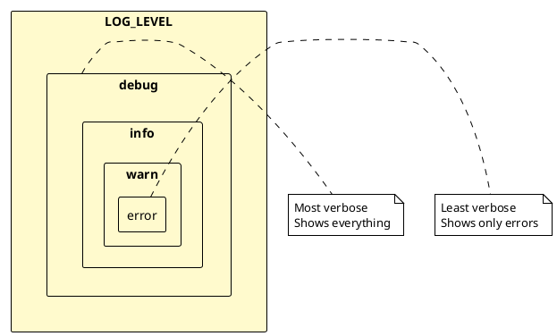
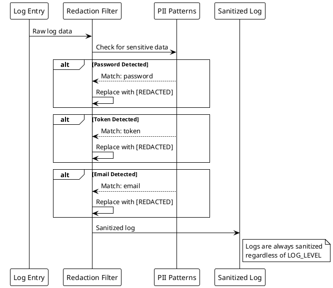
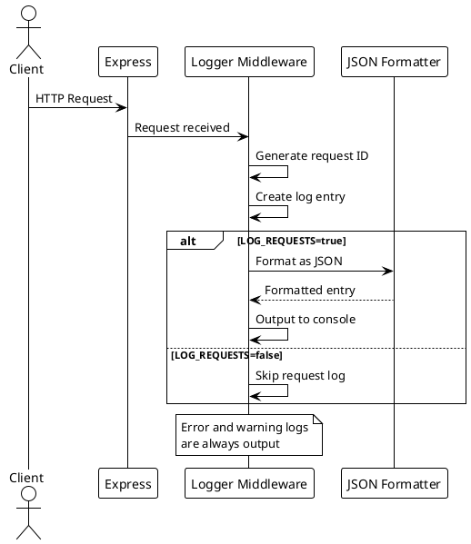

# Logging Configuration

> [!abstract] Overview
> The Watchman backend includes a structured logging system with security-focused redaction. You can easily control logging behavior through environment variables.

## Environment Variables

### LOG_ENABLED

**Default:** `true`

Completely disable all logging output.

```bash
# Disable all logging
LOG_ENABLED=false

# Enable all logging (default)
LOG_ENABLED=true
```

### LOG_REQUESTS

**Default:** `true`

Disable verbose request/response logging while keeping other application logs.

```bash
# Disable request logging only
LOG_REQUESTS=false

# Enable request logging (default)
LOG_REQUESTS=true
```

### LOG_LEVEL

**Default:** `info`

Control the minimum log level to output. Available levels (in order of verbosity):

- `error` - Only error messages
- `warn` - Warnings and errors
- `info` - Informational messages, warnings, and errors (default)
- `debug` - All messages including debug information

```bash
# Only show errors
LOG_LEVEL=error

# Show warnings and errors
LOG_LEVEL=warn

# Show info, warnings, and errors (default)
LOG_LEVEL=info

# Show everything including debug logs
LOG_LEVEL=debug
```

## Common Use Cases

### Startup Severity Adjustment

Startup background issues that do not block server boot (for example Homebridge background login failures) are logged at `warn` severity instead of startup/progress `info`, reducing noise while keeping degraded startup states visible.

### Development - Minimal Logging

For a cleaner console during development:

```bash
# In your .env.local file
LOG_REQUESTS=false
LOG_LEVEL=warn
```

### Development - No Logging

To completely silence all logs:

```bash
# In your .env.local file
LOG_ENABLED=false
```

### Production - Full Logging

For production environments with comprehensive logging:

```bash
# In your .env.local file
LOG_ENABLED=true
LOG_REQUESTS=true
LOG_LEVEL=info
```

### Production - Errors Only

For production with minimal output:

```bash
# In your .env.local file
LOG_ENABLED=true
LOG_REQUESTS=false
LOG_LEVEL=error
```

## Security Features

The logger automatically redacts sensitive information from logs:

- Passwords
- Tokens
- Secrets
- Authorization headers
- Bearer tokens
- Email addresses

This happens regardless of the logging level, ensuring sensitive data is never written to logs.

## Request ID Generation

- `requestIdMiddleware` in `apps/backend/middleware/logger.js` generates IDs with `crypto.randomUUID()` when an incoming request does not provide one.
- `generateRequestId()` in `apps/backend/middleware/performanceMonitor.js` also uses `crypto.randomUUID()` for consistent request/metric correlation IDs.

## Quick Start

To disable extensive logging right now, add this to your `.env.local` file:

```bash
LOG_REQUESTS=false
```

Then restart your backend server. This will keep error and warning logs but remove the verbose request/response logging.

## PlantUML Diagrams

### Logging Architecture

```plantuml
@startuml
!theme plain

package "Logger Middleware" {
    [requestLogger] as Logger
    [requestIdMiddleware] as ReqID
}

package "Configuration" {
    [LOG_ENABLED] as Enabled
    [LOG_REQUESTS] as ReqLog
    [LOG_LEVEL] as Level
}

package "Log Output" {
    [Console] as Console
    [File] as File
}

ReqID -> Logger : Attach request ID

Logger -> Enabled : Check enabled
alt LOG_ENABLED=false
    Logger -> Logger : Skip logging
else LOG_ENABLED=true
    Logger -> ReqLog : Check request logging
    alt LOG_REQUESTS=false
        Logger -> Logger : Log errors/warnings only
    else LOG_REQUESTS=true
        Logger -> Logger : Log all requests
    end

    Logger -> Level : Check level

    alt debug
    case error
    case warn
    case info
    end

    Logger -> Console : Write log
    Logger -> File : Write to file (if configured)
end
@enduml
```

### Log Level Hierarchy



### PII Redaction Flow



### Request Logging Flow



## Related

- [[docs/architecture/backend-architecture|Backend Architecture]]
- [[docs/reference/environment-variables|Environment Variables]]
- `apps/backend/middleware/logger.js` (Logger Middleware)
