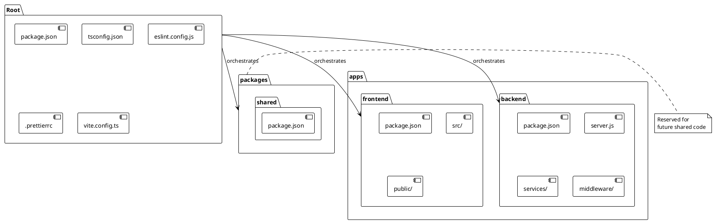
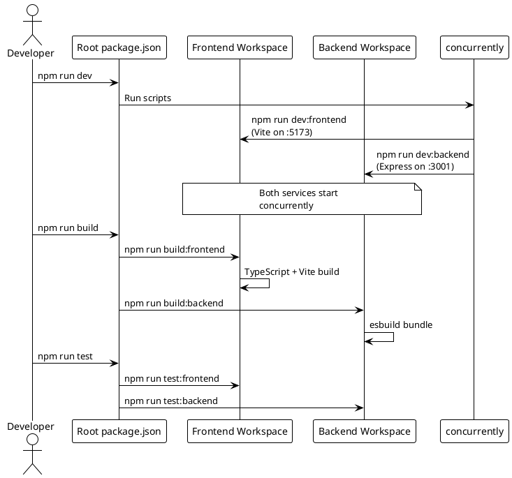

# ADR-001: Monorepo Architecture with npm Workspaces

> [!abstract] Summary
> Watchman uses an npm workspaces monorepo to colocate frontend, backend, and shared packages under a single repository with unified tooling.

## Status

- **Status**: Accepted
- **Date**: 2026-04-02

## Context

Watchman is a full-stack application with a React frontend and Node.js backend. The team needed to decide how to structure the codebase for maintainability, shared tooling, and developer experience.

Key forces:

- Single product, tightly coupled frontend and backend
- Need for unified development commands (`npm run dev`, `npm run build`)
- Anticipated need for shared utilities between frontend and backend
- Desire to keep deployment simple

## Decision

Use an **npm workspaces monorepo** with three packages:

| Package              | Path               | Description                  |
| -------------------- | ------------------ | ---------------------------- |
| `@watchman/frontend` | `apps/frontend/`   | React TypeScript application |
| `@watchman/backend`  | `apps/backend/`    | Node.js Express API          |
| (reserved)           | `packages/shared/` | Shared utilities (future)    |

Root-level scripts orchestrate both workspaces using `concurrently`:

```bash
npm run dev          # Runs both frontend and backend
npm run build        # Builds both workspaces
npm run test         # Runs tests in all workspaces
```

Workspace-specific operations use the `--workspace` flag:

```bash
npm run dev --workspace=apps/frontend
npm run test --workspace=apps/backend
```

## Consequences

### Positive

- Single repository for the entire product -- easy to trace changes across layers
- Unified tooling (ESLint, Prettier, Vitest) configured once at root
- Simple CI/CD -- one repo to build and deploy
- Colocated code makes cross-stack changes straightforward
- Reserved `packages/shared/` enables future code sharing without restructuring

### Negative

- `packages/shared/` is reserved but unused -- adds structure without current benefit
- No shared TypeScript types between frontend and backend -- frontend defines its own API response interfaces
- Root `package.json` includes some backend-specific dependencies (`express`, `esbuild`) for the build pipeline

### Risks

- Monorepo can grow unwieldy if additional apps are added
- Frontend and backend are coupled at the repository level -- harder to reuse backend independently

## PlantUML Diagrams

### Monorepo Structure



### Development Workflow



### Dependency Graph

```plantuml
@startuml
!theme plain

package "Frontend" {
    [React 18] as React
    [TypeScript] as TS_FE
    [Vite] as Vite
    [Tailwind CSS] as Tailwind
    [shadcn/ui] as Shadcn
    [TanStack Query] as Query
    [React Router] as Router
}

package "Backend" {
    [Express] as Express
    [Node.js] as Node
    [JWT] as JWT
    [node-cache] as Cache
    [esbuild] as Esbuild
}

package "Root Config" {
    [concurrently] as Conc
    [ESLint] as ESLint
    [Prettier] as Prettier
    [Vitest] as Vitest
}

React --> TS_FE
Tailwind --> TS_FE
Shadcn --> React
Query --> React
Router --> React

Express --> Node
JWT --> Express
Cache --> Express
Esbuild --> Node

Conc --> FE
Conc --> BE

note right of Root Config
  Shared across
  all workspaces
end note
@enduml
```

## Alternatives Considered

| Alternative                    | Why Rejected                                                      |
| ------------------------------ | ----------------------------------------------------------------- |
| Separate repositories          | Would complicate cross-stack changes and require API versioning   |
| Single package (no workspaces) | Would mix build tooling and dependencies for frontend and backend |
| Turborepo/Nx                   | Overkill for a two-app monorepo; npm workspaces are sufficient    |

## References

- [[docs/getting-started\|Getting Started]]
- [[docs/guides/setup\|Setup Guide]]
- Related code: `[[package.json]]`, `[[apps/frontend/package.json]]`, `[[apps/backend/package.json]]`
