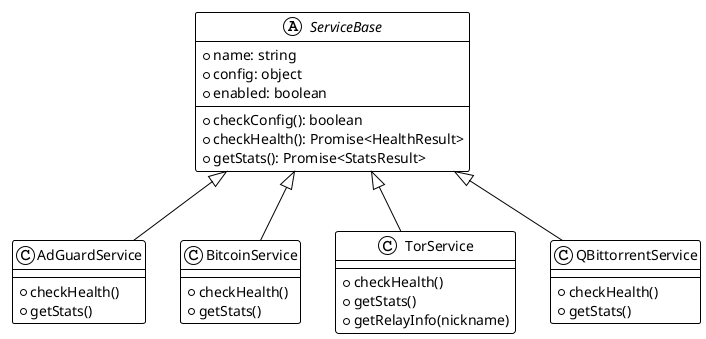
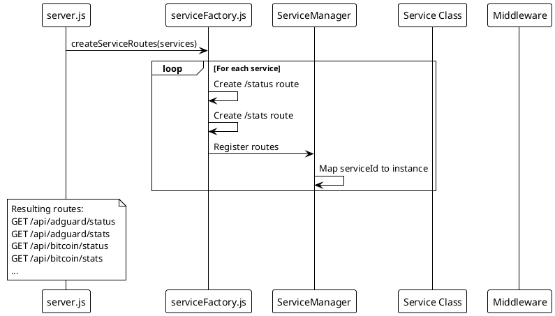

# ADR-002: Declarative Service Factory Pattern

> [!abstract] Summary
> Services are registered declaratively in a configuration object, and routes are generated dynamically via factory functions, eliminating boilerplate for 13+ services.

## Status

- **Status**: Accepted
- **Date**: 2026-04-02

## Context

Watchman monitors 13+ service types (AdGuard, Bitcoin, Tor, qBittorrent, etc.), each requiring:

- Health check endpoints (`/status`)
- Statistics endpoints (`/stats`)
- Update check endpoints (`/updates`)
- Service-specific environment variable parsing
- Lifecycle management (initialization, cleanup)

Without a pattern, each service would require duplicated route handlers, middleware chains, and error handling code.

## Decision

Use a **declarative service factory pattern** with three components:

### 1. Service Class (`[[apps/backend/services/ServiceName.js]]`)

Each service implements a standard interface:

```javascript
class ServiceName {
  constructor(config) { ... }
  checkConfig() { ... }    // Returns true if configured
  async checkHealth() { ... } // Lightweight ping
  async getStats() { ... }    // Detailed metrics
}
```

### 2. Factory Configuration (`[[apps/backend/services/serviceFactoryConfig.js]]`)

Services are registered declaratively:

```javascript
export const serviceFactoryConfigs = {
  servicename: {
    ServiceClass: ServiceName,
    getConfig: () => {
      /* parse env vars, return config or null */
    },
    required: false, // Optional: skip if config is null
    postInit: "methodName", // Optional: call after initialization
  },
};
```

### 3. Dynamic Route Generation (`[[apps/backend/routes/serviceFactory.js]]`)

`createServiceRoutes()` and `createUpdatesRoute()` generate `/status`, `/stats`, and `/updates` routes for each registered service, applying the standard middleware stack.

## Consequences

### Positive

- **DRY**: Adding a new service requires only a class file and a config entry
- **Consistent**: All services follow the same lifecycle and error handling
- **Maintainable**: Route logic is centralized, not duplicated across 13+ services
- **Optional services**: Returning `null` from `getConfig()` skips initialization cleanly

### Negative

- **Special endpoints break the pattern**: Services with non-standard endpoints (Bitcoin `/health`, Tor `/relay/:nickname`, Homebridge `/accessories`) require manual route definitions in `[[apps/backend/server.js]]`
- **Factory is limited**: Only generates `/status`, `/stats`, `/updates` -- any additional endpoint needs manual wiring
- **`postInit` is string-based**: Hooks are method name strings rather than callbacks, limiting flexibility

### Risks

- As more services need special endpoints, the manual route section in `server.js` grows, reducing the factory's value
- No automatic OpenAPI spec generation from the factory -- API docs must be maintained separately

## PlantUML Diagrams

### Service Factory Pattern

```plantuml
@startuml
!theme plain

package "Service Factory Config" as Config {
    object "serviceFactoryConfigs" as SFC {
        servicename: { ServiceClass, getConfig(), required, postInit }
        bitcoin: { ServiceClass, getConfig(), required, postInit }
        tor: { ServiceClass, getConfig(), required, postInit }
    }
}

package "Service Manager" as SM {
    [Initialize] as Init
    [Route Health] as RouteHealth
    [Route Stats] as RouteStats
}

package "Route Factory" as RF {
    [createServiceRoutes] as CreateRoutes
    [createUpdatesRoute] as CreateUpdates
}

package "Generated Routes" as Routes {
    [GET /api/:serviceId/status]
    [GET /api/:serviceId/stats]
    [GET /api/:serviceId/updates]
}

Config -> Init : Configuration
Init -> CreateRoutes : For each service
CreateRoutes --> Routes : Creates
CreateUpdates --> Routes : Creates

RouteHealth --> Routes : Routes to correct service
RouteStats --> Routes : Routes to correct service
@enduml
```

### Service Class Interface



### Dynamic Route Generation



## Alternatives Considered

| Alternative               | Why Rejected                              |
| ------------------------- | ----------------------------------------- |
| Manual routes per service | Too much duplication, hard to maintain    |
| Plugin system with hooks  | Over-engineered for the current scope     |
| Code generation (CLI)     | Adds build complexity; factory is simpler |

## References

- [[docs/features/service-monitoring\|Service Monitoring]]
- [[docs/integrations/index\|Service Integrations]]
- Related code: `[[apps/backend/services/serviceFactoryConfig.js]]`, `[[apps/backend/routes/serviceFactory.js]]`, `[[apps/backend/services/ServiceManager.js]]`
