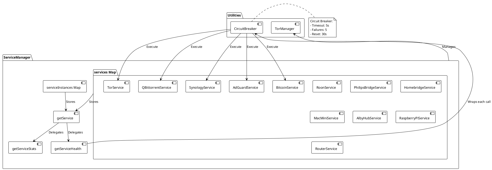
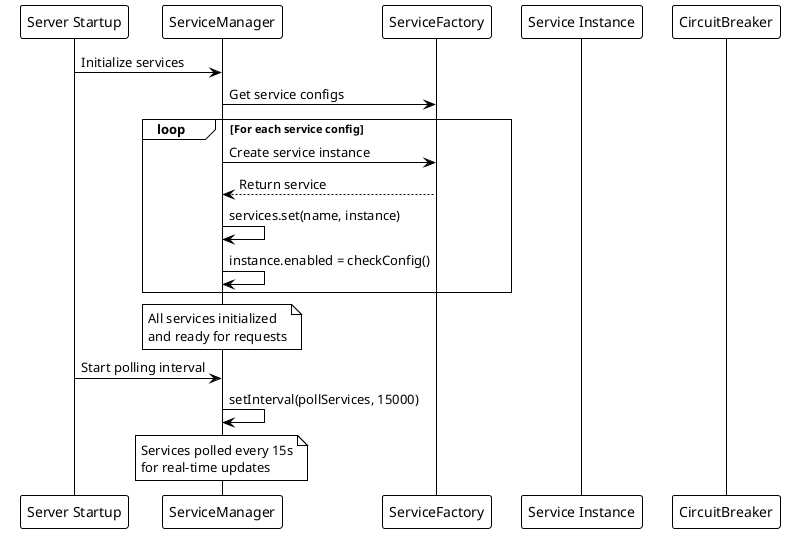

# ADR-003: Central Service Orchestration via ServiceManager

> [!abstract] Summary
> A single `ServiceManager` class acts as the central orchestrator for all service instances, managing lifecycle, providing unified access methods, and wrapping health checks with circuit breakers.

## Status

- **Status**: Accepted
- **Date**: 2026-04-02

## Context

Watchman monitors 13+ different self-hosted services (AdGuard Home, Bitcoin, Tor, qBittorrent, etc.). Each service has its own class for health checks and stats. Without a central orchestrator, managing service lifecycle, aggregation, and error handling would be scattered across the codebase.

## Decision

A single `ServiceManager` class manages all service instances:

- Holds all services in a `Map` keyed by service name
- Provides unified access: `getService()`, `getServiceHealth()`, `getServiceStats()`
- Wraps every health check with circuit breaker protection (timeout: 5000ms, failureThreshold: 5, resetTimeout: 30000ms)
- Manages TorManager as a special dependency alongside services
- Enables the `/api/services/health` aggregate endpoint
- Provides ordered shutdown sequence

### Key Code

- `[[apps/backend/services/ServiceManager.js]]` - Central orchestrator
- `[[apps/backend/services/serviceFactoryConfig.js]]` - Service registry

## Consequences

### Positive

- Single point of control for service lifecycle management
- Circuit breaker integration is centralized -- every health check automatically gets protection
- Enables aggregate health endpoint that checks all services at once
- Consistent error handling across all services

### Negative

- ServiceManager holds all services in a single `Map` -- no hierarchical grouping by type
- Circuit breaker configuration is hardcoded per call rather than configurable per service
- Multi-instance support exists (`serviceInstances` Map) but current implementation only stores a single default instance per type

### Risks

- ServiceManager becomes a bottleneck if it grows too large
- Hardcoded circuit breaker values may not suit all services equally

## PlantUML Diagrams

### ServiceManager Architecture



### Service Lifecycle Management



### Health Check with Circuit Breaker

```plantuml
@startuml
!theme plain

participant "API Request" as API
participant "ServiceManager" as SM
participant "CircuitBreaker" as CB
participant "Service" as Svc
database "External Service" as Ext

API -> SM : getServiceHealth(serviceId)

alt Service Exists
    SM -> CB : Execute with circuit breaker

    state Closed {
        [*] --> Normal
        Normal : Requests execute
        Normal --> Open : 5 failures
    }

    state Open {
        [*] --> FastFail
        FastFail : Return 503 immediately
        FastFail --> HalfOpen : 30s timeout
    }

    state HalfOpen {
        [*] --> Testing
        Testing : Allow test request
        Testing --> Closed : Success
        Testing --> Open : Failure
    }

    alt Circuit Closed
        CB -> Svc : checkHealth()
        Svc -> Ext : HTTP/SSH
        Ext --> Svc : Response
        Svc --> CB : Result
        CB --> SM : Result
        SM --> API : Health response

    else Circuit Open
        CB --> SM : Error: Circuit Open
        SM --> API : 503 Service Unavailable
    end

else Service Not Found
    SM --> API : 404 Not Found
end
@enduml
```

## References

- [[docs/architecture/backend-architecture|Backend Architecture]]
- Related code: `[[apps/backend/services/ServiceManager.js]]`
- Related code: `[[apps/backend/services/serviceFactoryConfig.js]]`
