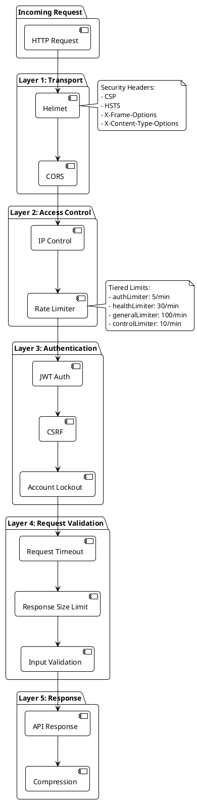
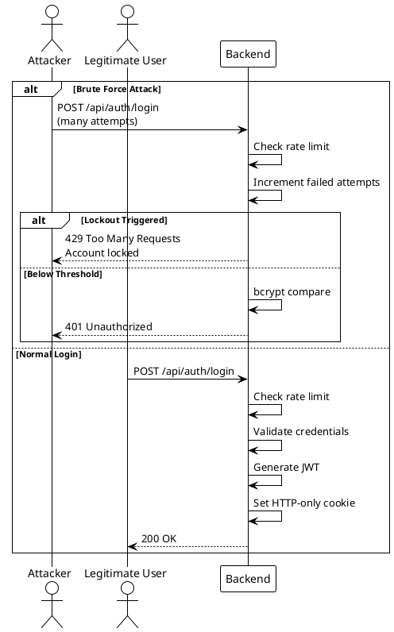
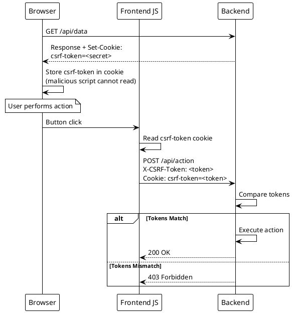

# ADR-004: Layered Security Middleware Stack

> [!abstract] Summary
> The backend applies security in multiple layers: Helmet, CORS, JWT authentication, CSRF protection, tiered rate limiting, IP access control, account lockout, request timeout, response size limits, and input validation.

## Status

- **Status**: Accepted
- **Date**: 2026-04-02

## Context

As a monitoring dashboard exposing service health and control endpoints, Watchman needs robust security. The backend is accessible over the network and must protect against common web vulnerabilities while maintaining usability.

## Decision

Security is implemented as a defense-in-depth middleware stack applied in `server.js`:

1. **Helmet** - CSP, HSTS, X-Frame-Options, and other HTTP security headers
2. **CORS** - Strict origin validation against `FRONTEND_URL`
3. **JWT Authentication** - HTTP-only cookies prevent XSS token theft
4. **CSRF Protection** - Double-submit cookie pattern (no server-side session storage needed)
5. **Tiered Rate Limiting** - Different limits per endpoint category:
   - `authLimiter` - Strictest for login endpoints
   - `healthLimiter` - Moderate for health checks
   - `generalLimiter` - Standard for most endpoints
   - `controlLimiter` - Strict for service control actions
6. **IP Access Control** - Allow/deny lists for specific IPs
7. **Account Lockout** - Prevents brute force attacks
8. **Request Timeout** - Prevents slow-loris and resource exhaustion
9. **Response Size Limits** - Prevents memory exhaustion
10. **Input Validation** - Server-side validation on all inputs

### Key Code

- `[[apps/backend/middleware/auth.js]]` - JWT authentication
- `[[apps/backend/middleware/csrf.js]]` - CSRF protection
- `[[apps/backend/middleware/rateLimiting.js]]` - Tiered rate limiting
- `[[apps/backend/middleware/ipControl.js]]` - IP access control
- `[[apps/backend/middleware/accountLockout.js]]` - Brute force protection
- `[[apps/backend/middleware/validation.js]]` - Input validation

## Consequences

### Positive

- Defense-in-depth: if one layer fails, others provide protection
- JWT in HTTP-only cookies prevents XSS token theft
- Double-submit CSRF works without server-side session storage
- Tiered rate limiting applies appropriate limits per endpoint sensitivity
- Production-specific enforcement (HTTPS required, JWT secret minimum length)

### Negative

- Single-user auth model -- no user management, roles, or database
- bcrypt compare is always performed even for wrong usernames (intentional timing attack prevention, but adds latency)
- CSRF token is accessible to JavaScript (`httpOnly: false`) which slightly reduces XSS protection

### Risks

- JWT tokens are short-lived (15m) but login cookie is 8 hours -- potential mismatch
- No multi-user support limits deployment scenarios

## PlantUML Diagrams

### Security Middleware Stack

### Request Processing Pipeline

### CSRF Double-Submit Pattern

## Alternatives Considered

| Alternative        | Why Rejected                                     |
| ------------------ | ------------------------------------------------ |
| Session-based auth | Requires server-side storage, doesn't scale well |
| API key auth       | Less secure for browser-based applications       |
| OAuth/OIDC         | Overkill for single-user self-hosted deployment  |
| No CSRF protection | Vulnerable to cross-site request forgery         |

## References

- [[docs/security/index|Security Overview]]
- [[docs/security/authentication|Authentication]]
- [[docs/security/rate-limiting|Rate Limiting]]
- [[docs/security/ip-control|IP Control]]
- Related code: `[[apps/backend/middleware/auth.js]]`
- Related code: `[[apps/backend/middleware/csrf.js]]`
- Related code: `[[apps/backend/middleware/rateLimiting.js]]`
