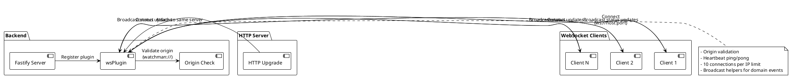
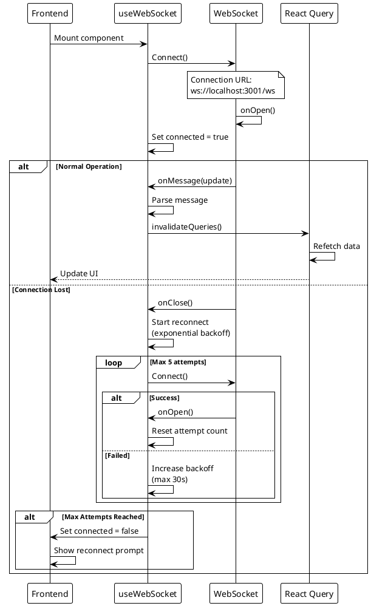
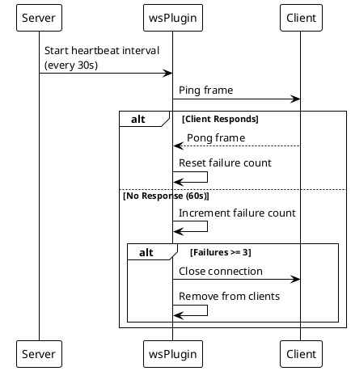
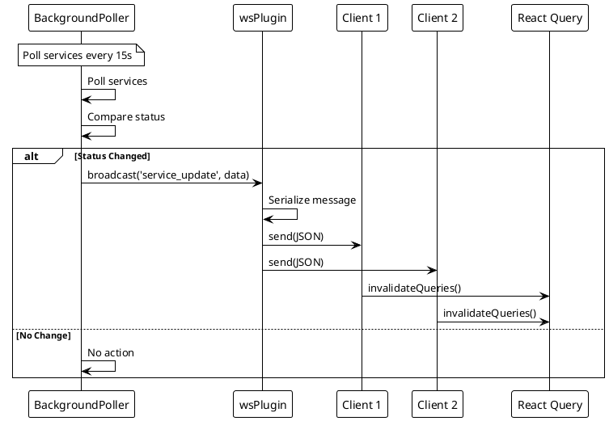

# ADR-005: Real-Time Communication via WebSocket

> [!warning] Amended by ADR-017 and ADR-013
> Core decision (persistent WS for real-time updates) still stands. But the following details are stale and have been updated in this document:
> - **JWT authentication on WebSocket** — removed in v2.3 per [[docs/adr/017-remove-authentication-frontend-v2-migration|ADR-017]]. `AuthGate` now returns anonymous by default.
> - **Express → Fastify 4** — backend rewritten per [[docs/adr/013-backend-rewrite-typescript-fastify|ADR-013]]. The `ws` library is now wrapped in a Fastify plugin.
> - **File path** — `apps/backend/services/WebSocketManager.js` → `apps/backend/src/transport/ws/wsPlugin.ts`.
> - **Connection limit** — 5 per IP → 10 per IP (current default in `wsPlugin.ts`).

> [!abstract] Summary
> Real-time status updates use the `ws` library wrapped in a Fastify plugin on the backend, with origin validation, heartbeat monitoring, and a frontend global singleton with automatic reconnection.

## Status

- **Status**: Amended
- **Amended by**: [[docs/adr/017-remove-authentication-frontend-v2-migration|ADR-017]] (auth removed), [[docs/adr/013-backend-rewrite-typescript-fastify|ADR-013]] (Express → Fastify)
- **Date**: 2026-04-09
- **Amended date**: 2026-04-19

## Context

Watchman monitors service health in real-time. Polling via REST API would create unnecessary load and introduce latency. A persistent bidirectional connection is needed for live status broadcasting.

## Decision

### Backend

- Uses `ws` library wrapped in a Fastify plugin (`wsPlugin.ts`) attached to the same HTTP server
- Origin validation restricts connections to the `watchman://` Electron origin (anonymous by default)
- Heartbeat monitoring (ping/pong) detects dead connections
- Connection limit per IP (default 10) prevents abuse
- Plugin exposes broadcast helpers consumed by domain layers (poller, config writes) for status updates
- Disconnect handling is idempotent to avoid double-processing from close+error races
- Broadcast cleanup paths funnel stale sockets through disconnect handling so per-IP counters remain consistent

### Frontend

- Global singleton WebSocket instance prevents multiple connections across React re-renders
- Automatic reconnection with exponential backoff
- Max 5 reconnect attempts before requiring manual refresh
- WebSocket messages trigger batched/debounced targeted React Query invalidations (150ms debounce)
- Frontend hook logging for invalidation failures and flush summaries is routed through the frontend logger (`logger.warn`/`logger.debug`) to reduce console noise during normal message flow

### Key Code

- `[[apps/backend/src/transport/ws/wsPlugin.ts]]` - Backend Fastify WebSocket plugin
- `[[apps/frontend/src/hooks/useWebSocket.ts]]` - Frontend WebSocket hook

## Consequences

### Positive

- Persistent bidirectional communication for live service status updates
- Origin validation restricts connections to trusted Electron client (`watchman://`)
- Heartbeat monitoring detects dead connections automatically
- Frontend global singleton prevents connection multiplicity issues
- React Query cache invalidation keeps UI in sync with backend state

### Negative

- Connection limit per IP may be low for legitimate multi-tab usage
- Max reconnect attempts of 5 means persistent network issues require manual intervention
- No WebSocket message persistence -- missed updates on disconnect are lost
- Broadcast API relies on plugin-exposed helpers; domain events fan out through direct calls rather than a pub/sub abstraction

### Risks

- WebSocket connections consume server resources even when idle
- No graceful handoff during server shutdown beyond a generic close message

## PlantUML Diagrams

### WebSocket Connection Architecture

### WebSocket Lifecycle

### Heartbeat Monitoring

### Message Broadcasting Flow

## References

- [[docs/features/real-time-updates|Real-Time Updates]]
- [[docs/architecture/data-flow|Data Flow]]
- Related code: `[[apps/backend/src/transport/ws/wsPlugin.ts]]`
- Related code: `[[apps/frontend/src/hooks/useWebSocket.ts]]`
