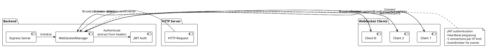
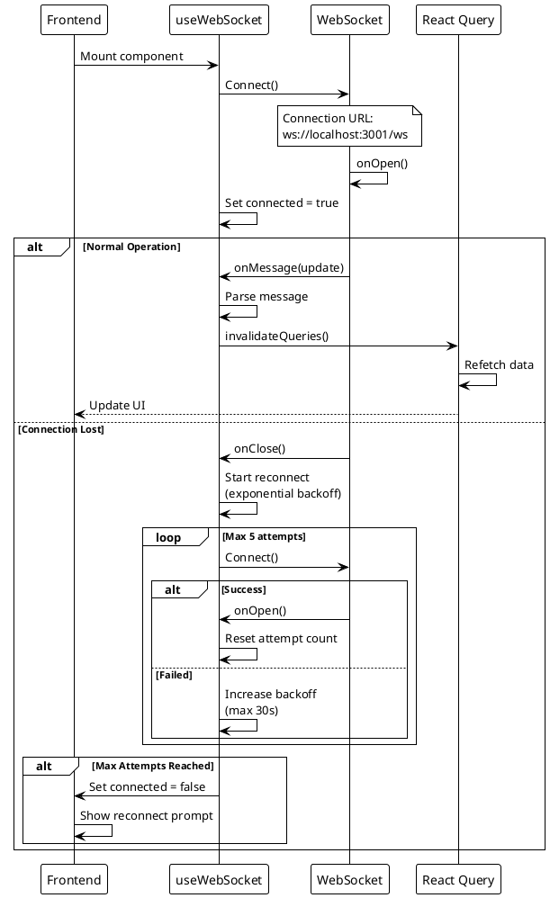
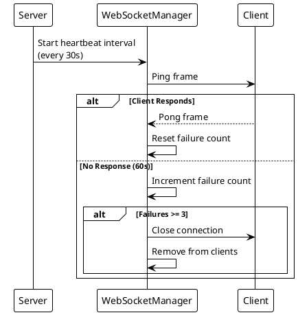
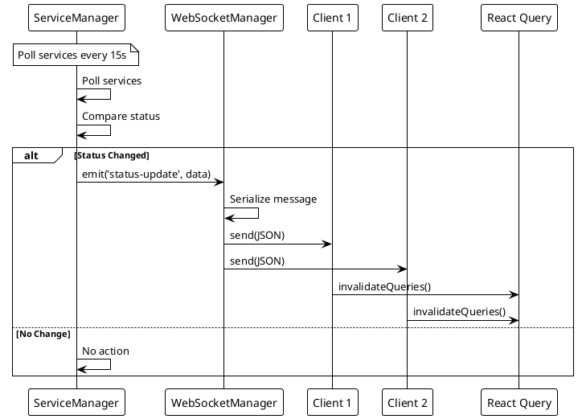

# ADR-005: Real-Time Communication via WebSocket

> [!abstract] Summary
> Real-time status updates use the `ws` library on the backend attached to the same HTTP server, with JWT authentication, heartbeat monitoring, and a frontend global singleton with automatic reconnection.

## Status

- **Status**: Accepted
- **Date**: 2026-04-02

## Context

Watchman monitors service health in real-time. Polling via REST API would create unnecessary load and introduce latency. A persistent bidirectional connection is needed for live status broadcasting.

## Decision

### Backend

- Uses `ws` library attached to the same HTTP server as the Express app
- Connections authenticated via JWT (extracted from Authorization header or cookies)
- Heartbeat monitoring (ping/pong) detects dead connections
- Connection limit per IP (default 5) prevents abuse
- `WebSocketManager` extends EventEmitter for event broadcasting

### Frontend

- Global singleton WebSocket instance prevents multiple connections across React re-renders
- Automatic reconnection with exponential backoff
- Max 5 reconnect attempts before requiring manual refresh
- WebSocket messages trigger batched/debounced React Query invalidations (150ms debounce)

### Key Code

- `[[apps/backend/services/WebSocketManager.js]]` - Backend WebSocket manager
- `[[apps/frontend/src/hooks/useWebSocket.ts]]` - Frontend WebSocket hook

## Consequences

### Positive

- Persistent bidirectional communication for live service status updates
- JWT auth on WebSocket reuses the same auth mechanism as REST API
- Heartbeat monitoring detects dead connections automatically
- Frontend global singleton prevents connection multiplicity issues
- React Query cache invalidation keeps UI in sync with backend state

### Negative

- Connection limit per IP may be low for legitimate multi-tab usage
- Max reconnect attempts of 5 means persistent network issues require manual intervention
- No WebSocket message persistence -- missed updates on disconnect are lost
- Backend WebSocketManager extends EventEmitter but event system is underutilized

### Risks

- WebSocket connections consume server resources even when idle
- No graceful handoff during server shutdown beyond a generic close message

## PlantUML Diagrams

### WebSocket Connection Architecture

### WebSocket Lifecycle

### Heartbeat Monitoring

### Message Broadcasting Flow

## References

- [[docs/features/real-time-updates|Real-Time Updates]]
- [[docs/architecture/data-flow|Data Flow]]
- Related code: `[[apps/backend/services/WebSocketManager.js]]`
- Related code: `[[apps/frontend/src/hooks/useWebSocket.ts]]`
