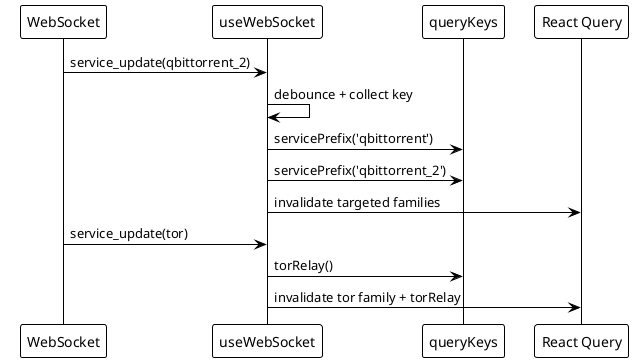
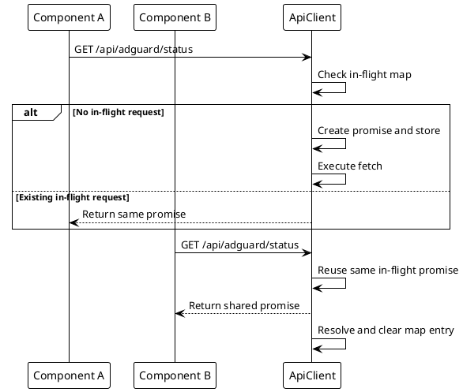
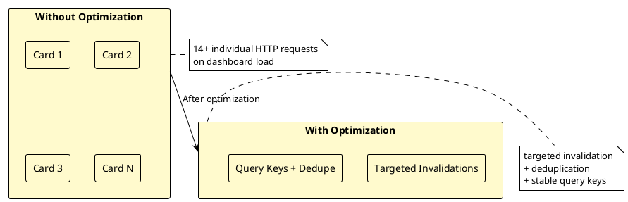

# ADR-006: Request Optimization and Batching

> [!abstract] Summary
> The frontend uses in-flight request deduplication, centralized query keys, and targeted debounced WebSocket invalidation to optimize API communication without changing API contracts.

## Status

- **Status**: Accepted
- **Date**: 2026-04-09

## Context

The Watchman dashboard loads multiple service cards simultaneously, each potentially making health check and stats requests. Without optimization, this creates a burst of HTTP requests that can overwhelm the server and waste bandwidth.

## Decision

Current optimization strategies:

### 1. In-Flight Request Deduplication (`ApiClient`)

- Tracks concurrent identical in-flight requests
- Returns the same promise to all callers requesting the same endpoint
- Prevents duplicate API calls from multiple components

### 2. Query Key Centralization (`queryKeys`)

- Uses centralized key factories in `[[apps/frontend/src/lib/queryKeys.ts]]`
- Includes `servicePrefix(serviceKey)` to support targeted invalidation families

### 3. Debounced Targeted WebSocket Invalidation (`useWebSocket`)

- Collects updates in a short debounce window
- Invalidates targeted query families via `queryKeys.servicePrefix(...)` and service-specific keys
- Deduplicates key families before invalidation (servicePrefix/adguardFull/torRelay/routerArp/metrics/servicesHealth)
- Avoids broad predicate scans across the full query cache

### Key Code

- `[[apps/frontend/src/services/ApiClient.ts]]` - API client with deduplication
- `[[apps/frontend/src/lib/queryKeys.ts]]` - Centralized query keys
- `[[apps/frontend/src/hooks/useWebSocket.ts]]` - Batched targeted cache invalidation

## Consequences

### Positive

- Reduces HTTP request count when multiple service cards load simultaneously
- Prevents duplicate API calls from concurrent identical requests
- Reduces invalidation work by targeting affected query families directly
- Keeps cache behavior aligned with centralized key architecture

### Negative

- Requires disciplined query-key design so invalidations remain accurate

### Risks

- Overly broad key families could still trigger unnecessary refetches if key conventions drift

## PlantUML Diagrams

### Targeted Invalidation Flow

### Request Deduplication

### Optimization Comparison

## References

- [[docs/performance/request-optimization|Request Optimization]]
- [[docs/performance/index|Performance Overview]]
- Related code: `[[apps/frontend/src/services/ApiClient.ts]]`
- Related code: `[[apps/frontend/src/lib/queryKeys.ts]]`
- Related code: `[[apps/frontend/src/hooks/useWebSocket.ts]]`
