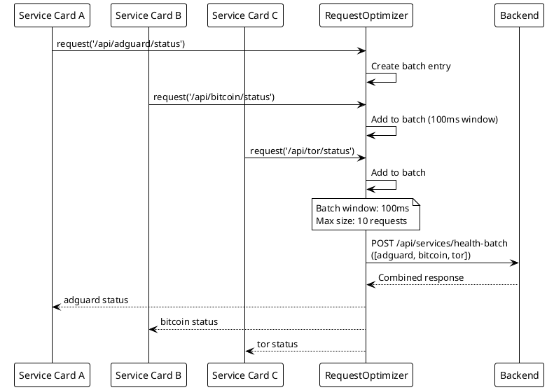
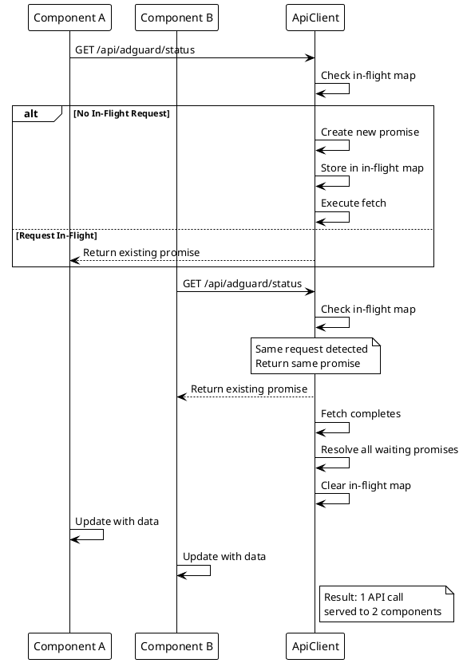
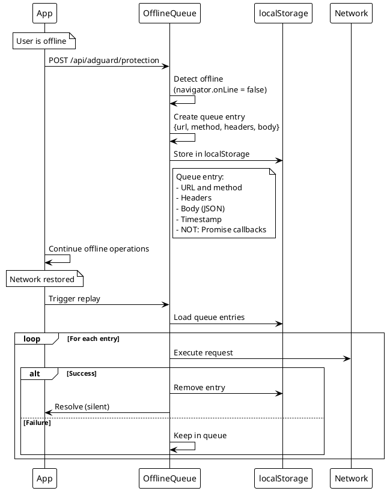
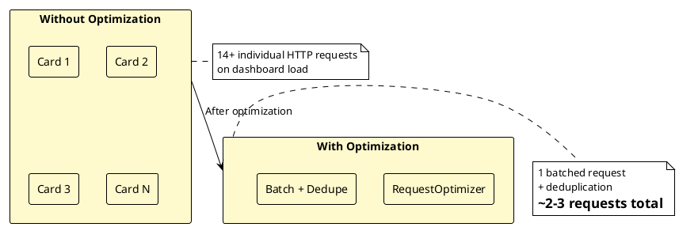

# ADR-006: Request Optimization and Batching

> [!abstract] Summary
> The frontend implements request batching, in-flight request deduplication, and offline queue management to optimize API communication and provide resilience.

## Status

- **Status**: Accepted
- **Date**: 2026-04-02

## Context

The Watchman dashboard loads multiple service cards simultaneously, each potentially making health check and stats requests. Without optimization, this creates a burst of HTTP requests that can overwhelm the server and waste bandwidth.

## Decision

Three optimization strategies are implemented:

### 1. Request Batching (`RequestBatcher`)

- Batches multiple health check requests into a single `/api/services/health-batch` POST call
- Batch timeout: 100ms window to collect simultaneous requests
- Max batch size: 10 on frontend (backend supports up to 25)

### 2. In-Flight Request Deduplication (`ApiClient`)

- Tracks concurrent identical in-flight requests
- Returns the same promise to all callers requesting the same endpoint
- Prevents duplicate API calls from multiple components

### 3. Offline Queue (`BackgroundSync`)

- Queues requests when the browser detects offline status
- Replays queued requests when connectivity returns
- Persists queue to localStorage

### Key Code

- `[[apps/frontend/src/services/RequestOptimizer.ts]]` - Batching and deduplication
- `[[apps/frontend/src/services/ApiClient.ts]]` - API client with deduplication

## Consequences

### Positive

- Reduces HTTP request count when multiple service cards load simultaneously
- Prevents duplicate API calls from concurrent identical requests
- Provides resilience for intermittent connectivity
- Backend supports batch endpoint with input sanitization and max size limits

### Negative

- Batch timeout of 100ms is very short -- may not capture all simultaneous requests
- Background sync queue persists to localStorage but resolve/reject callbacks are not serializable
- Offline queue stores only URL, method, headers, and body -- no retry metadata or priority
- Frontend max batch size (10) is more restrictive than backend (25)

### Risks

- Lost promise resolvers on persisted offline queue items may cause silent failures
- No retry metadata means all queued requests are treated equally regardless of importance

## PlantUML Diagrams

### Request Batching Flow

### Request Deduplication

### Offline Queue Architecture

### Optimization Comparison

## References

- [[docs/performance/request-optimization|Request Optimization]]
- [[docs/performance/index|Performance Overview]]
- Related code: `[[apps/frontend/src/services/RequestOptimizer.ts]]`
- Related code: `[[apps/frontend/src/services/ApiClient.ts]]`
