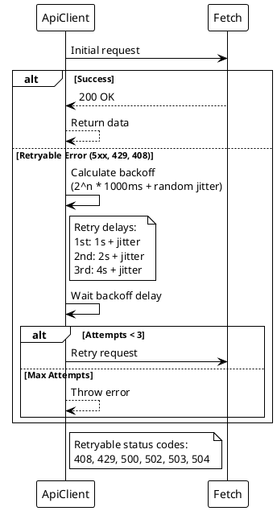
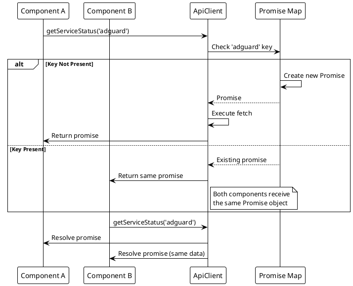
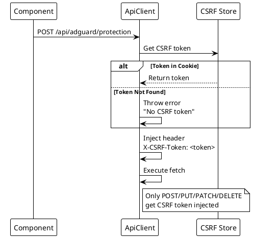

# ADR-007: API Client with Retry and Error Handling

> [!abstract] Summary
> A singleton `ApiClient` class provides typed methods for every backend endpoint with idempotent-method retry, in-flight deduplication, AbortController timeouts, and CSRF token injection.

## Status

- **Status**: Accepted
- **Date**: 2026-04-02

## Context

Multiple React components need to communicate with the backend API. Without a centralized client, each component would implement its own error handling, retry logic, and authentication -- leading to inconsistency and duplicated code.

## Decision

A singleton `ApiClient` class provides:

- **Typed methods** for every backend endpoint (health, stats, auth, service control)
- **Automatic retry for idempotent methods only (`GET`/`HEAD`)** with exponential backoff + jitter (up to 3 attempts)
  - Retryable status codes: 408, 429, 500, 502, 503, 504
- **In-flight request deduplication** - concurrent identical requests share the same promise
- **AbortController-based timeouts** - prevents hanging requests
- **CSRF token injection** - automatically adds CSRF token to POST/PUT/PATCH/DELETE requests
- **Response unwrapping** via `unwrapApiResponse` for standardized response envelope
- **Auth token compatibility fallback** is in-memory only (set when backend returns deprecated body token)
- **Typed in-flight dedup map** based on `Promise<unknown>` (no `Promise<any>` in request dedup internals)
- **Compatibility alias methods** for Homebridge endpoints delegate to canonical client methods to keep call sites stable during cleanup
  - `getHomebridgeStatus()`, `getHomebridgeStats()`, and `getStatusHomebridge()` are marked deprecated and delegate to `getHomebridgeServerInformation()`
- **Header defaulting hygiene** applies `Content-Type: application/json` automatically only for non-`GET`/`HEAD` requests unless explicitly provided
- **Additional exported response interfaces/types** are available for consuming hooks/components (for example auth, services-health, frontend-config, and service-instance response shapes)

### Key Code

- `[[apps/frontend/src/services/ApiClient.ts]]` - stable public API client surface
- `[[apps/frontend/src/services/apiClient/core.ts]]` - request pipeline (retry, timeout, dedup, headers, CSRF/auth header injection)
- `[[apps/frontend/src/services/apiClient/endpoints.ts]]` - endpoint method layer
- `[[apps/frontend/src/services/apiClient/types.ts]]` - exported API types/interfaces

## Consequences

### Positive

- Centralized API client ensures consistent error handling across all components
- In-flight deduplication prevents race conditions from concurrent requests
- Retry with jitter handles transient network issues gracefully
- Restricting retries to `GET`/`HEAD` avoids replaying non-idempotent writes
- CSRF token automatically added to state-changing requests
- In-memory compatibility token avoids persistence risks from browser storage

### Negative

- Each endpoint has a dedicated method -- adding new endpoints requires modifying the client class
- Response unwrapping assumes a standardized response envelope from the backend
- Compatibility-mode body token still exists and should remain disabled unless required by legacy clients
- No request caching -- every call goes to the server (caching handled by React Query)

### Risks

- Client class becomes large as endpoints are added
- Compatibility body-token mode (`AUTH_RETURN_TOKEN=true`) increases bearer-token exposure in frontend runtime

## PlantUML Diagrams

### ApiClient Architecture

```plantuml
@startuml
!theme plain

package "ApiClient" {
    [Singleton Instance] as Instance
    [get(), post(), put(), delete()] as Methods
    [Retry Logic] as Retry
    [Deduplication] as Dedup
    [CSRF Injection] as CSRF
    [Timeout Handler] as Timeout
}

package "Request Pipeline" {
    [Component] as Comp
    [ApiClient] as API
    [Fetch] as Fetch
    [Retry with Backoff] as Backoff
}

Comp -> API : Call method
API -> Dedup : Check in-flight

alt Duplicate Request
    Dedup --> Comp : Return shared promise
else New Request
    API -> CSRF : Add CSRF token
    API -> Timeout : Set AbortController
    API -> Retry : Execute with retry

    Retry -> Fetch : fetch()

    alt Success
        Fetch --> Retry : Response
        Retry --> API : Data
        API --> Comp : Result
    else Retryable Error
        Retry -> Retry : Wait with backoff
        Retry -> Retry : Retry (max 3)
    end
end
@enduml
```

### Retry with Exponential Backoff



### Request Deduplication Flow



### CSRF Token Injection



## References

- [[docs/components/index|Frontend Components]]
- [[docs/architecture/frontend-architecture|Frontend Architecture]]
- Related code: `[[apps/frontend/src/services/ApiClient.ts]]`, `[[apps/frontend/src/services/apiClient/core.ts]]`, `[[apps/frontend/src/services/apiClient/endpoints.ts]]`, `[[apps/frontend/src/services/apiClient/types.ts]]`
