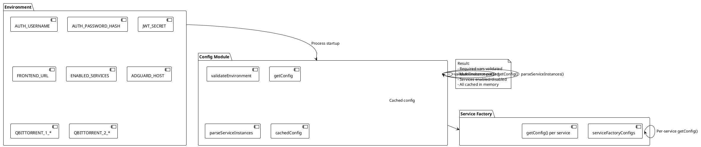
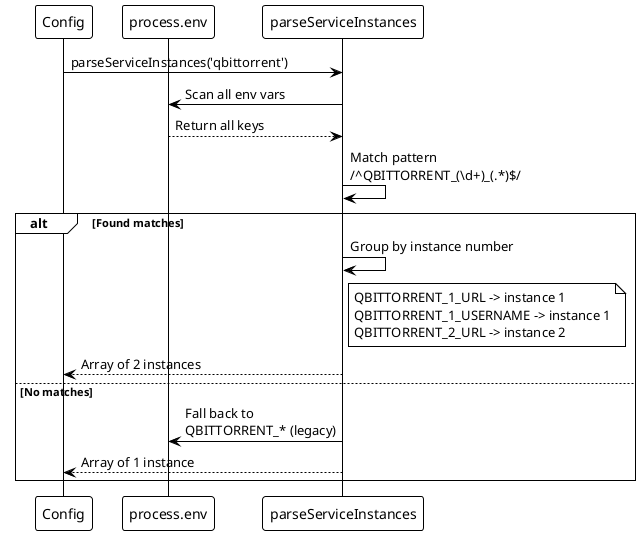
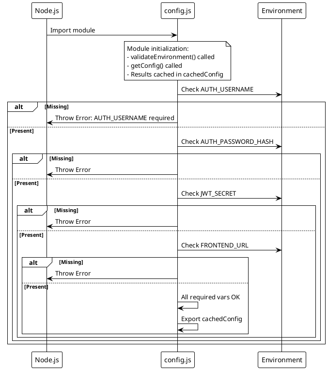
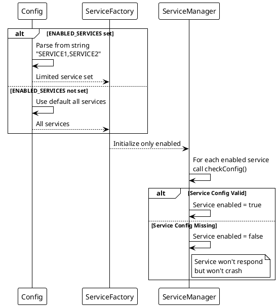

# ADR-008: Configuration Management via Environment Variables

> [!abstract] Summary
> All configuration comes from environment variables, parsed and validated at startup, with multi-instance support via numbered env var patterns (`SERVICE_N_*`).

## Status

- **Status**: Accepted
- **Date**: 2026-04-02

## Context

Watchman runs as a self-hosted application that needs to connect to various external services. Configuration must be flexible for different deployment environments (Docker, bare metal, development) while ensuring required values are present at startup.

## Decision

Configuration is managed through environment variables:

### Core Configuration (`config.js`)

- `validateEnvironment()` - Fails fast on missing required variables
- `getConfig()` - Returns structured config object
- `parseServiceInstances()` - Discovers multi-instance services from numbered env var patterns (e.g., `QBITTORRENT_1_URL`, `QBITTORRENT_2_URL`)
- `ENABLED_SERVICES` env var allows selective service activation (defaults to all if unset)

### Per-Service Configuration (`serviceFactoryConfig.js`)

- Each service's `getConfig()` function encapsulates its own environment variable parsing and defaults
- Optional services can return `null` from `getConfig()` to skip initialization
- Configuration is parsed once at startup and cached

### Key Code

- `[[apps/backend/config.js]]` - Core configuration management
- `[[apps/backend/services/serviceFactoryConfig.js]]` - Per-service config parsing

## Consequences

### Positive

- Environment variables are the standard for 12-factor apps and containerized deployments
- Validation at startup prevents runtime failures from missing configuration
- Multi-instance support via numbered env var patterns enables horizontal scaling
- Selective service activation via `ENABLED_SERVICES`
- Per-service config encapsulation keeps configuration logic modular

### Negative

- Config is parsed once at startup and cached -- no hot-reloading
- Multi-instance parsing uses regex matching on all env var keys -- potentially slow with very large env
- No configuration file support (YAML/JSON) -- everything must be env vars
- `cachedConfig` export is a snapshot at module load time -- changes to `process.env` after that are not reflected

### Risks

- Large number of environment variables become hard to manage without a config file
- No validation of env var values beyond presence checks (e.g., URL format validation)

## PlantUML Diagrams

### Configuration Architecture

### Multi-Instance Discovery

### Startup Validation Flow

### Service Enabling Logic

## References

- [[docs/reference/environment-variables|Environment Variables]]
- [[docs/features/multi-instance|Multi-Instance Support]]
- Related code: `[[apps/backend/config.js]]`
- Related code: `[[apps/backend/services/serviceFactoryConfig.js]]`
