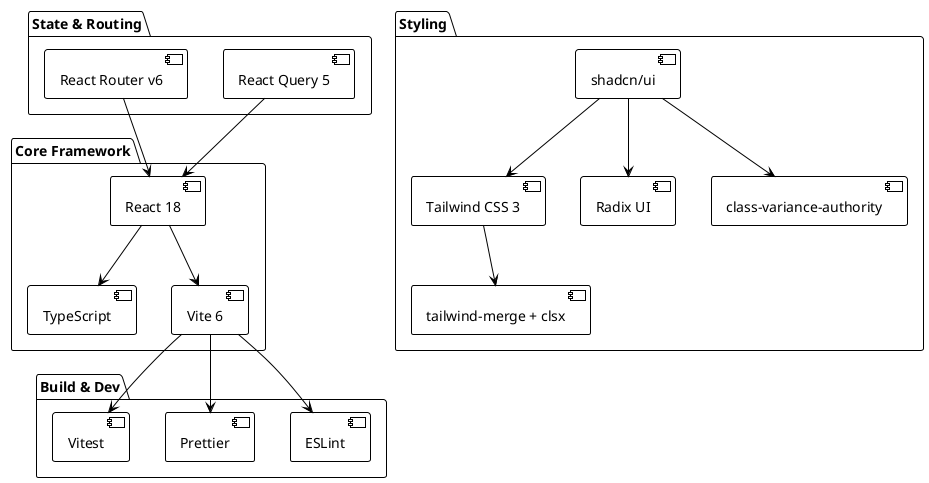
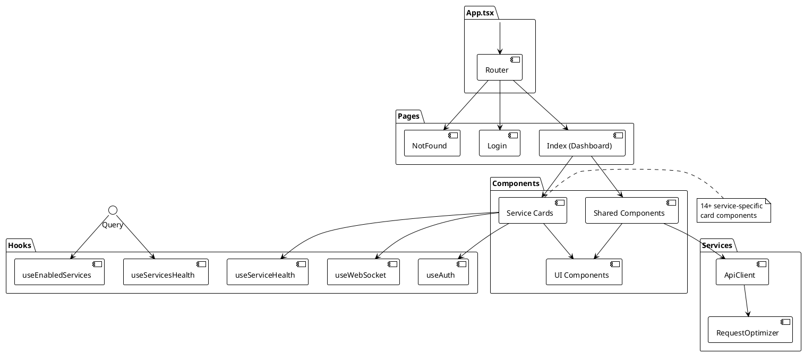
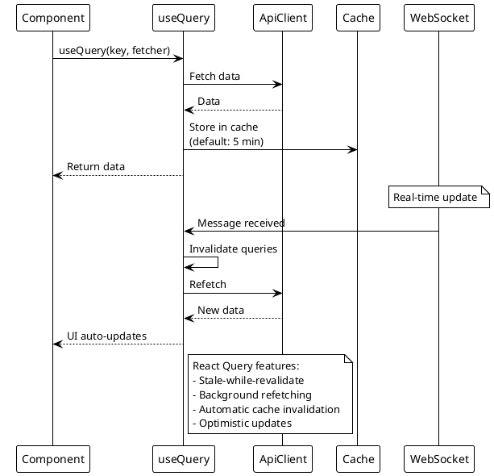

# ADR-009: Frontend Technology Stack

> [!abstract] Summary
> The frontend uses React 18 with TypeScript, built with Vite 6, styled with Tailwind CSS 3 and shadcn/ui components, with React Query 5 for server state and React Router v6 for routing.

## Status

- **Status**: Accepted
- **Date**: 2026-04-02

## Context

The Watchman dashboard needs a modern, responsive UI that displays real-time service status, supports authentication flows, and provides a good developer experience. The technology stack must balance performance, developer productivity, and maintainability.

## Decision

### Core Stack

- **React 18** - Component-based UI with hooks
- **TypeScript** - Type safety for frontend code (backend remains JavaScript-only)
- **Vite 6** - Fast HMR and optimized production builds
- **Tailwind CSS 3** - Utility-first styling with consistent design tokens
- **shadcn/ui** - Accessible, customizable components built on Radix UI primitives

### State Management & Routing

- **React Query 5** - Server state management with caching, background refetching, and optimistic updates
- **React Router v6** - Client-side routing

### Additional Libraries

- `class-variance-authority` - Component variant management
- `tailwind-merge` + `clsx` - Conditional class name composition
- `tailwindcss-animate` - Animation utilities
- `@testing-library/react` + Vitest + jsdom - Testing

### TypeScript Configuration

- `strict: false` in `tsconfig.app.json` -- relaxed strictness for incremental adoption
- `noUnusedLocals`, `noUnusedParameters`, `noImplicitAny` all set to `false`
- Path alias: `@/*` maps to `apps/frontend/src/*`

### Key Code

- `[[apps/frontend/package.json]]` - Dependencies
- `[[apps/frontend/tsconfig.app.json]]` - TypeScript configuration

## Consequences

### Positive

- Vite provides fast HMR and optimized production builds
- TypeScript catches type errors at compile time
- React Query handles caching, background refetching, and pairs well with WebSocket-driven invalidation
- shadcn/ui provides accessible components without heavy library dependency
- Tailwind CSS enables rapid UI development with consistent design tokens
- Relaxed TypeScript strictness allows faster development

### Negative

- `strict: false` means no `noImplicitAny`, `noUnusedLocals`, or `noUnusedParameters` enforcement
- No global state management library beyond React Query
- `tailwindcss-animate` and `class-variance-authority` add complexity for component variants
- No E2E testing framework (Playwright/Cypress)
- No TypeScript on backend creates type inconsistency between frontend and backend

### Risks

- Relaxed TypeScript settings may allow type-related bugs to slip through
- No shared TypeScript types between frontend and backend -- frontend defines its own API response interfaces

## PlantUML Diagrams

### Frontend Technology Stack



### Component Architecture



### Data Flow with React Query



### shadcn/ui Component Pattern

```plantuml
@startuml
!theme plain

participant "Developer" as Dev
participant "shadcn CLI" as CLI
participant "Radix UI" as Radix
participant "Tailwind"] as TW

Dev -> CLI : npx shadcn@latest add button

CLI -> Radix : Copy primitive\n(without heavy dependency)

CLI -> TW : Apply Tailwind classes

CLI -> Dev : Create button.tsx

note right of Dev
  Component is fully
  customizable now
end note

Dev -> Dev : Customize variants\nwith class-variance-authority

Dev -> Dev : Add to project\nwith full control
@enduml
```

## References

- [[docs/architecture/frontend-architecture|Frontend Architecture]]
- [[docs/components/index|Frontend Components]]
- Related code: `[[apps/frontend/package.json]]`
- Related code: `[[apps/frontend/tsconfig.app.json]]`
