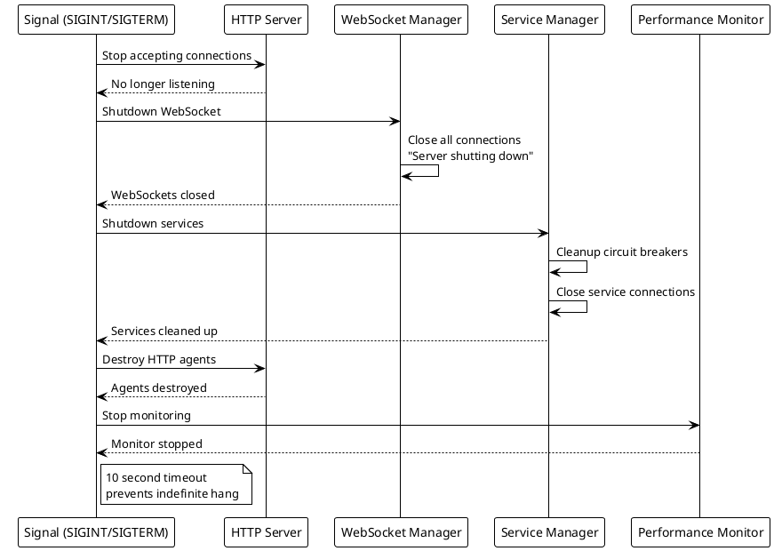
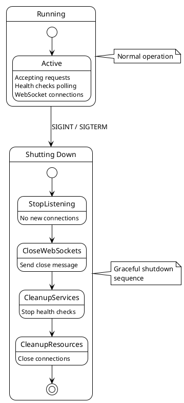
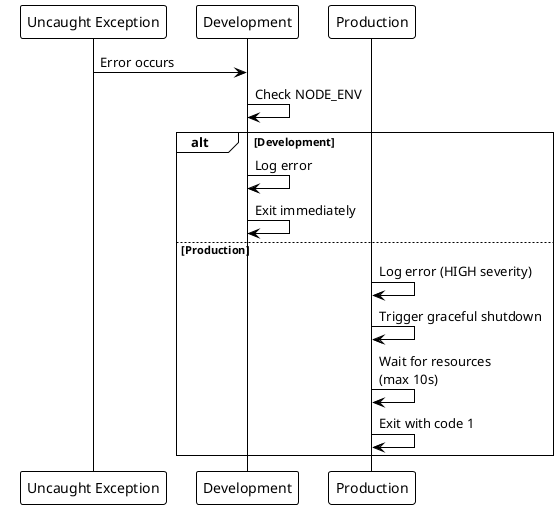
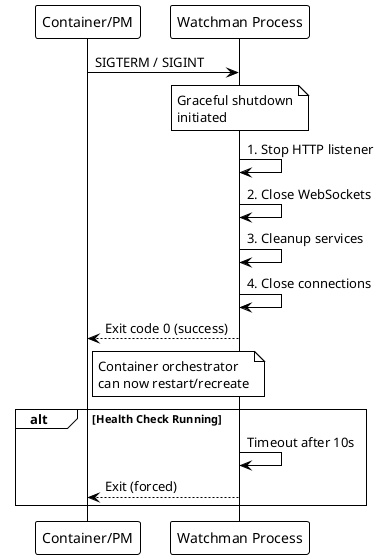

# ADR-010: Graceful Shutdown and Process Management

> [!danger] Superseded by ADR-013 — No Longer Implemented
> This document describes **v1 shutdown handling** (Express.js/JavaScript). The backend was rewritten to TypeScript + Fastify 4 in v2.0; shutdown is handled via Fastify's built-in lifecycle hooks (see [[docs/adr/013-backend-rewrite-typescript-fastify|ADR-013]]). Content retained for archival reference only.

> [!abstract] Summary
> The backend implements comprehensive graceful shutdown handling for SIGINT, SIGTERM, uncaught exceptions, and unhandled rejections with ordered resource cleanup.

## Status

- **Status**: Superseded
- **Superseded by**: [[docs/adr/013-backend-rewrite-typescript-fastify|ADR-013]]
- **Date**: 2026-04-02
- **Superseded date**: 2026-04-20

## Context

Watchman runs as a long-lived process managing HTTP connections, WebSocket connections, and service health checks. During deployments or system restarts, resources need to be cleaned up properly to prevent data loss, orphaned connections, and resource leaks.

## Decision

Graceful shutdown is triggered by:

- `SIGINT` (Ctrl+C)
- `SIGTERM` (kill command, container orchestrators)
- Uncaught exceptions (production only)
- Unhandled promise rejections (production only)

### Shutdown Sequence (ordered)

1. **Stop accepting new HTTP connections** - HTTP server stops listening
2. **Shutdown WebSocket server** - Close all WebSocket connections with "Server shutting down" message
3. **Shutdown ServiceManager** - Clean up all service instances and circuit breakers
4. **Destroy HTTP agents** - Release keep-alive connections
5. **Shutdown performance monitor** - Stop metrics collection

### Configuration

- 10-second timeout on HTTP server close prevents indefinite hanging
- Production vs. development behavior differs: production does graceful shutdown, development exits immediately

### Key Code

- `[[apps/backend/server.js]]` - Signal handlers and shutdown sequence

## Consequences

### Positive

- Prevents data loss and connection drops during deployments
- Ordered cleanup ensures dependent resources are released in the correct order
- Timeout prevents indefinite hanging on stuck connections
- Signal-based triggering works with container orchestrators (Docker, Kubernetes)

### Negative

- In-flight requests are not waited for -- HTTP server just stops accepting new connections
- WebSocket clients receive a generic close message with no graceful handoff
- Uncaught exceptions trigger shutdown in production -- may be too aggressive for recoverable errors

### Risks

- Long-running health checks may be interrupted mid-flight
- WebSocket clients may not handle the abrupt close gracefully

## PlantUML Diagrams

### Shutdown Sequence

### Signal Handling Flow

### Production vs Development Behavior

### Process Lifecycle

## References

- [[docs/architecture/backend-architecture|Backend Architecture]]
- Related code: `[[apps/backend/server.js]]`
