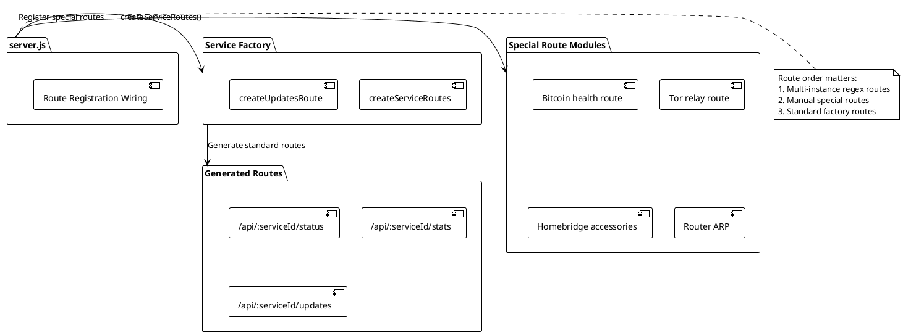
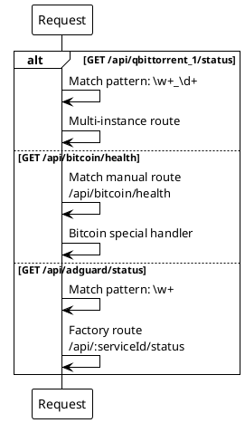
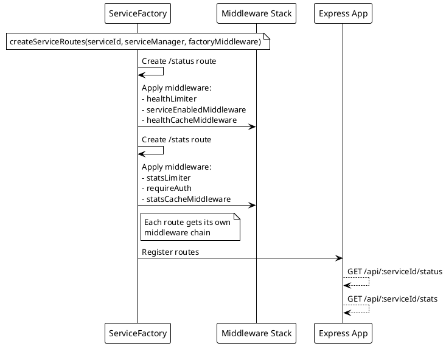

# ADR-011: Dynamic Route Generation with Mixed Manual Routes

> [!abstract] Summary
> Standard service routes (`/status`, `/stats`, `/updates`) are generated via factory functions, while services with special endpoints are registered through dedicated route modules wired by `server.js`.

## Status

- **Status**: Accepted
- **Date**: 2026-04-02

## Context

Watchman supports 13+ services, each needing at least `/status` and `/stats` endpoints. Writing route handlers for each service would create significant boilerplate. However, some services need additional special endpoints that don't fit the standard pattern.

## Decision

### Factory-Generated Routes

Standard routes are generated via `createServiceRoutes()` and `createUpdatesRoute()`:

- `/api/services/:service/status` - Health check
- `/api/services/:service/stats` - Detailed stats
- `/api/services/:service/updates` - WebSocket upgrade

### Manual Routes for Special Cases

Services with additional endpoints are registered through dedicated route modules (wired in `server.js`):

- **Bitcoin** - `/api/services/bitcoin/health` (additional health endpoint)
- **Tor** - `/api/services/tor/relay/:nickname` (relay lookup)
- **Homebridge** - `/api/services/homebridge/accessories` (accessory listing)
- **Router** - ARP lookup endpoint

Current modular registrations include:

- `[[apps/backend/routes/authRoutes.js]]`
- `[[apps/backend/routes/metaRoutes.js]]`
- `[[apps/backend/routes/controlRoutes.js]]`
- `[[apps/backend/routes/instanceRoutes.js]]`
- `[[apps/backend/routes/homebridgeRoutes.js]]`
- `[[apps/backend/routes/routerRoutes.js]]`

This route-module decomposition is a structural refactor only; endpoint behavior and contracts are preserved.

### Refinements in Current State

- Synology stats rely on the standard factory route (`/api/synology/stats`) with no duplicate explicit override route in `server.js`.
- Factory route success logs were intentionally reduced to lower log noise; error logs remain.

### Multi-Instance Support

Multi-instance services use regex route patterns (`:serviceId(\w+_\d+)`) to match dynamic instance IDs.

### Key Code

- `[[apps/backend/routes/serviceFactory.js]]` - Route factory functions
- `[[apps/backend/server.js]]` - Route registration wiring
- `[[apps/backend/routes/authRoutes.js]]` - Authentication routes
- `[[apps/backend/routes/metaRoutes.js]]` - Aggregate/meta routes
- `[[apps/backend/routes/controlRoutes.js]]` - Control/mutation routes
- `[[apps/backend/routes/instanceRoutes.js]]` - Multi-instance routes
- `[[apps/backend/routes/homebridgeRoutes.js]]` - Homebridge special routes
- `[[apps/backend/routes/routerRoutes.js]]` - Router ARP route

## Consequences

### Positive

- Factory pattern eliminates boilerplate for the common case (80% of endpoints)
- Manual routes handle the 20% of endpoints that don't fit the standard pattern
- Adding a new standard service requires only adding to `serviceFactoryConfigs`
- Multi-instance support via regex patterns

### Negative

- Route ordering matters -- multi-instance regex routes must come before specific hardcoded routes
- Route modules still duplicate some error handling patterns that the factory handles automatically
- Factory middleware object (`factoryMiddleware`) is passed as a dependency, creating coupling
- No route-level OpenAPI spec generation from the factory -- API docs must be maintained separately

### Risks

- Route ordering bugs if new module registrations are added in the wrong position
- Inconsistency between factory-generated and manual route error handling

## PlantUML Diagrams

### Route Generation Architecture



### Route Matching Priority



### Factory Route Creation



### Multi-Instance Route Pattern

```plantuml
@startuml
!theme plain

database "Environment" as Env {
    QBITTORRENT_1_*
    QBITTORRENT_2_*
    QBITTORRENT_3_*
}

participant "Route Parser" as Parser
participant "ServiceManager" as SM

note over Parser
  Regex: :serviceId(\w+_\d+)
  Matches: qbittorrent_1,
  qbittorrent_2, etc.
end note

Env --> Parser : Instance 1 config
Env --> Parser : Instance 2 config
Env --> Parser : Instance 3 config

Parser -> SM : Route to qbittorrent_1
SM -> SM : Get service instance\nqbittorrent_1

Parser -> SM : Route to qbittorrent_2
SM -> SM : Get service instance\nqbittorrent_2
@enduml
```

## References

- [[docs/api/index|API Documentation]]
- [[docs/architecture/backend-architecture|Backend Architecture]]
- Related code: `[[apps/backend/routes/serviceFactory.js]]`
- Related code: `[[apps/backend/server.js]]`
- Related code: `[[apps/backend/routes/authRoutes.js]]`
- Related code: `[[apps/backend/routes/metaRoutes.js]]`
- Related code: `[[apps/backend/routes/controlRoutes.js]]`
- Related code: `[[apps/backend/routes/instanceRoutes.js]]`
- Related code: `[[apps/backend/routes/homebridgeRoutes.js]]`
- Related code: `[[apps/backend/routes/routerRoutes.js]]`
