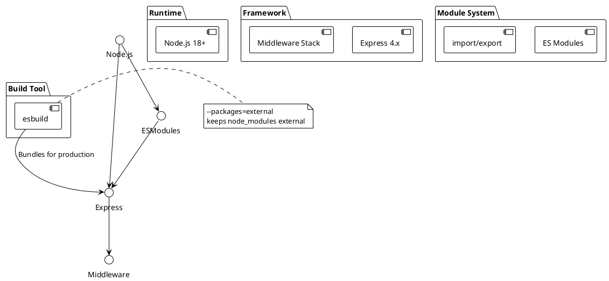
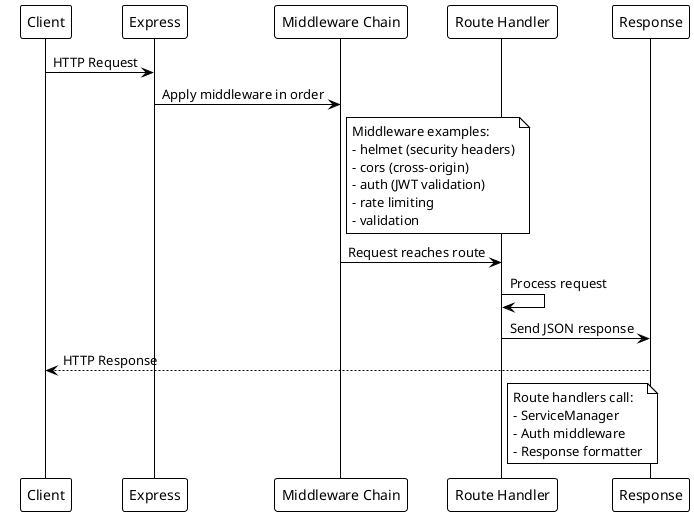
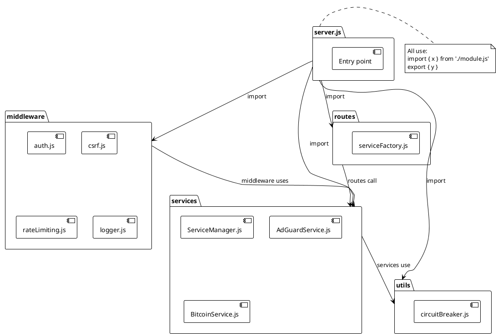
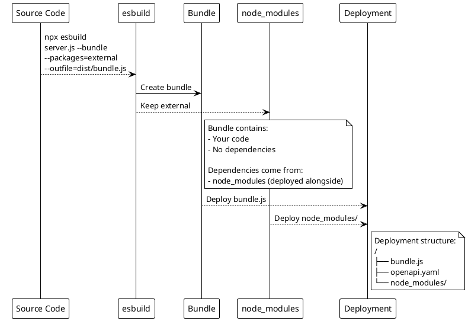

# ADR-012: Backend Framework and Module System

> [!abstract] Summary
> The backend uses Express.js 4.x as the HTTP framework with Node.js ES Modules (`"type": "module"`) and esbuild for production bundling.

## Status

- **Status**: Accepted
- **Date**: 2026-04-02

## Context

The backend needs a reliable HTTP framework to serve REST API endpoints, handle middleware, and manage WebSocket connections. The module system should align with modern Node.js best practices.

## Decision

### Framework: Express.js 4.x

- Mature, well-understood framework with vast middleware ecosystem
- Express 4.x (not 5.x) maximizes middleware compatibility
- Sufficient for REST API needs without unnecessary complexity

### Module System: ES Modules (ESM)

- `"type": "module"` in `package.json` enables ESM
- Uses `import`/`export` syntax throughout
- Aligns with modern Node.js best practices (Node 18+ target)

### Build Tool: esbuild

- Bundles backend code with `--packages=external` flag
- Keeps dependencies external in production bundle
- Fast build times

### Language: JavaScript (no TypeScript)

- Backend code is plain JavaScript
- Frontend uses TypeScript independently
- No shared TypeScript types between frontend and backend

### Key Code

- `[[apps/backend/server.js]]` - Main entry point
- `[[apps/backend/package.json]]` - Dependencies and build configuration

## Consequences

### Positive

- Express is mature with vast middleware ecosystem
- ESM modules align with modern Node.js best practices
- esbuild provides fast bundling
- External packages in bundle means `node_modules` must be deployed alongside (simpler dependency management)

### Negative

- Express 4.x limits some modern features available in 5.x
- No TypeScript on backend -- no compile-time type checking
- Frontend defines its own TypeScript interfaces for API responses (no shared types)
- esbuild with external packages means deployment must include `node_modules`

### Risks

- Lack of TypeScript on backend means type errors only surface at runtime
- Express 4.x will eventually reach end-of-life, requiring migration to 5.x

## PlantUML Diagrams

### Backend Stack Architecture

### Request Processing Pipeline

### ESM Module Structure

### Production Build Flow

## References

- [[docs/architecture/backend-architecture|Backend Architecture]]
- [[docs/reference/code-patterns|Code Patterns]]
- Related code: `[[apps/backend/server.js]]`
- Related code: `[[apps/backend/package.json]]`
