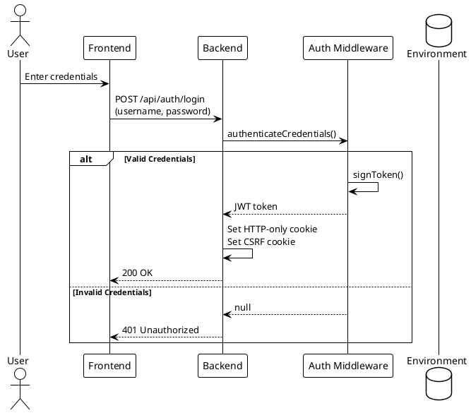
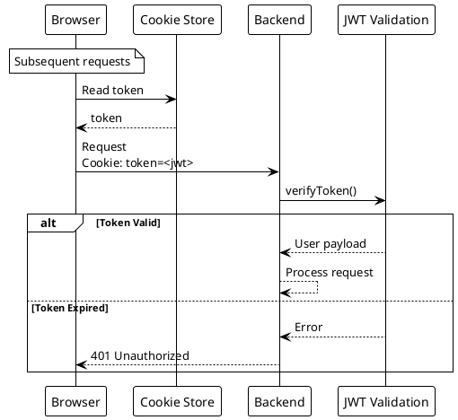

# Authentication Endpoints

> [!abstract] Overview
> JWT-based authentication with HTTP-only cookies and CSRF protection. Single-user model with credentials from environment variables.

## Endpoints Summary

| Method | Path               | Description       | Auth Required | Rate Limit       |
| ------ | ------------------ | ----------------- | ------------- | ---------------- |
| `POST` | `/api/auth/login`  | Authenticate user | No            | `authLimiter`    |
| `POST` | `/api/auth/logout` | End session       | Yes           | `generalLimiter` |
| `GET`  | `/api/auth/me`     | Check auth status | No            | `generalLimiter` |

---

## POST /api/auth/login

> [!warning] Account Lockout
> Failed login attempts trigger account lockout after repeated failures. See [[docs/security/authentication|Authentication]] for lockout details.

### Request

```json
{
  "username": "admin",
  "password": "yourpassword"
}
```

| Field      | Type     | Required | Description         |
| ---------- | -------- | -------- | ------------------- |
| `username` | `string` | Yes      | Admin username      |
| `password` | `string` | Yes      | Plain text password |

### Response

#### 200 OK

```json
{
  "message": "Login successful",
  "token": "eyJhbGciOiJIUzI1NiIs...",
  "user": {
    "username": "admin",
    "id": "admin"
  }
}
```

Cookies set on success:

- `token` (HTTP-only, secure, SameSite=strict) - JWT access token, 8 hour expiry
- CSRF token cookie (accessible to JS) - Double-submit CSRF pattern

#### 401 Unauthorized

```json
{
  "message": "Invalid credentials"
}
```

### Security Details

- **Timing Attack Prevention**: bcrypt compare is always performed even for wrong usernames (uses dummy hash)
- **Account Lockout**: See [[docs/security/authentication|Account Lockout]]
- **Rate Limiting**: `authLimiter` - stricter than general endpoints
- **CSRF Token**: Issued on login for subsequent state-changing requests

### Source

- Route module: [[apps/backend/routes/authRoutes.js]]
- Registration: [[apps/backend/server.js]]
- Auth middleware: [[apps/backend/middleware/auth.js]]
- CSRF middleware: [[apps/backend/middleware/csrf.js]]
- Lockout middleware: [[apps/backend/middleware/accountLockout.js]]

---

## POST /api/auth/logout

### Request

No body required. Requires valid JWT cookie.

### Response

#### 200 OK

```json
{
  "success": true
}
```

Cookies cleared:

- `token` (with original cookie options)
- CSRF token cookie

### Source

- Route module: [[apps/backend/routes/authRoutes.js]]
- Registration: [[apps/backend/server.js]]

---

## GET /api/auth/me

### Request

No parameters. Token extracted from:

1. `Authorization: Bearer <token>` header
2. `token` cookie (fallback)

### Response

#### 200 OK (Authenticated)

```json
{
  "authenticated": true,
  "user": {
    "username": "admin"
  }
}
```

#### 200 OK (Not Authenticated)

```json
{
  "authenticated": false
}
```

> [!note] CSRF Refresh
> On authenticated requests, a new CSRF token is issued to keep the client's CSRF token valid.

### Source

- Route module: [[apps/backend/routes/authRoutes.js]]
- Registration: [[apps/backend/server.js]]
- Auth middleware: [[apps/backend/middleware/auth.js]]

---

## Related

- [[docs/security/authentication|Authentication]]
- [[docs/api/index|API Index]]
- [[docs/adr/adr-004-layered-security-middleware|ADR-004: Layered Security Middleware]]

## PlantUML Diagrams

### Authentication Flow



### Session Management


