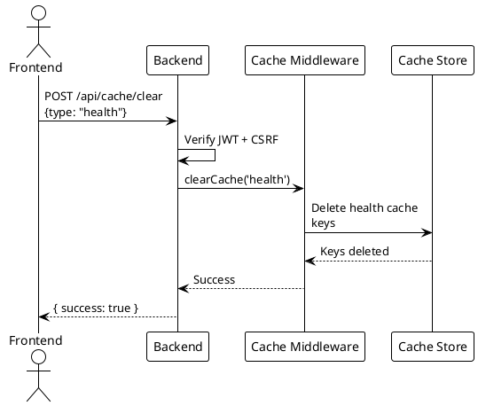
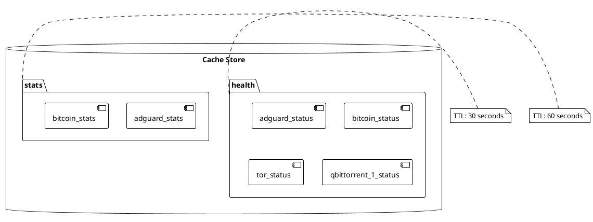

# Cache Management Endpoint

> [!abstract] Overview
> Clears the response cache for health checks, stats, or all cached responses. Requires authentication and CSRF verification.

## Endpoint

| Property   | Value                      |
| ---------- | -------------------------- |
| **Method** | `POST`                     |
| **Path**   | `/api/cache/clear`         |
| **Auth**   | Yes + CSRF                 |
| **Rate**   | `controlLimiter`           |
| **Source** | [[apps/backend/server.js]] |

## Request

```json
{
  "type": "health"
}
```

| Field  | Type     | Required | Description                                        |
| ------ | -------- | -------- | -------------------------------------------------- |
| `type` | `string` | No       | Cache type: `"health"`, `"stats"`, or omit for all |

### Validation

- If `type` is provided, it must be a non-empty string
- Empty string or non-string values return 400

## Response

### 200 OK

```json
{
  "success": true,
  "message": "Cache cleared: health"
}
```

### 400 Bad Request

```json
{
  "error": "Invalid cache type"
}
```

## Cache Types

| Type     | Description                 |
| -------- | --------------------------- |
| `health` | Health check response cache |
| `stats`  | Stats response cache        |
| _(none)_ | Clears all caches           |

## Behavior

- Cache is cleared immediately across all cache stores
- Used internally after AdGuard protection toggle to ensure fresh data
- Frontend can trigger manually for debugging

## Source

- Route: [[apps/backend/server.js]]
- Cache middleware: [[apps/backend/middleware/cache.js]]

## Related

- [[docs/performance/caching-strategies|Caching Strategies]]
- [[docs/api/index|API Index]]

## PlantUML Diagrams

### Cache Clear Flow



### Cache Types


