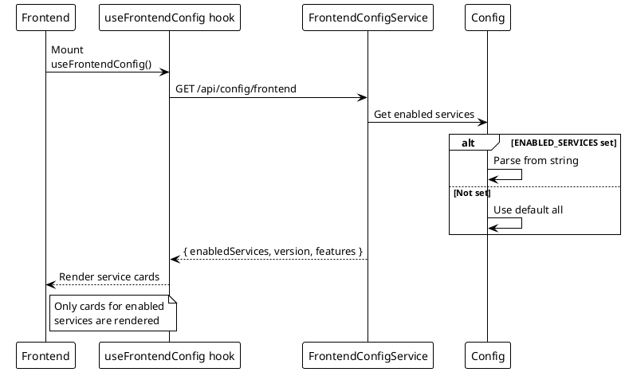

# Frontend Configuration Endpoint

> [!abstract] Overview
> Provides runtime configuration to the frontend application. No authentication required.

## Endpoint

| Property   | Value                                 |
| ---------- | ------------------------------------- |
| **Method** | `GET`                                 |
| **Path**   | `/api/config/frontend`                |
| **Auth**   | None                                  |
| **Rate**   | `generalLimiter`                      |
| **Source** | [[apps/backend/routes/metaRoutes.js]] |

## Response

### 200 OK

```json
{
  "enabledServices": ["adguard", "bitcoin", "tor", "qbittorrent"],
  "version": "1.0.0",
  "features": {
    "multiInstance": true,
    "webSocket": true
  }
}
```

| Field             | Type       | Description                         |
| ----------------- | ---------- | ----------------------------------- |
| `enabledServices` | `string[]` | List of enabled service identifiers |
| `version`         | `string`   | Backend version                     |
| `features`        | `object`   | Feature flags for frontend          |

## Usage

Called by the frontend on initial load to determine which service cards to render.

### Frontend Hook

```typescript
// apps/frontend/src/hooks/useFrontendConfig.ts
const { data: config } = useFrontendConfig();
// config.enabledServices determines which cards are shown
```

## Source

- Route module: [[apps/backend/routes/metaRoutes.js]]
- Registration: [[apps/backend/server.js]]
- Service: [[apps/backend/services/FrontendConfigService.js]]
- Frontend hook: [[apps/frontend/src/hooks/useFrontendConfig.ts]]
- Query keys: [[apps/frontend/src/lib/queryKeys.ts]]

## Related

- [[docs/api/index|API Index]]
- [[docs/features/service-monitoring|Service Monitoring]]
- [[docs/features/multi-instance|Multi-Instance Support]]

## PlantUML Diagrams

### Frontend Config Flow


