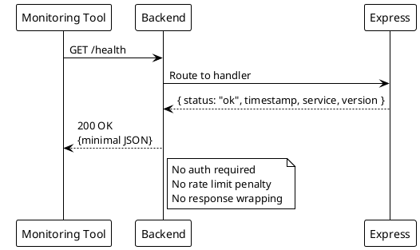

# Health Check Endpoint

> [!abstract] Overview
> Lightweight health check to verify the backend server is running and responsive. No authentication required.

## Endpoint

| Property   | Value                      |
| ---------- | -------------------------- |
| **Method** | `GET`                      |
| **Path**   | `/health`                  |
| **Auth**   | None                       |
| **Rate**   | `healthLimiter`            |
| **Cache**  | None                       |
| **Source** | `apps/backend/server.js` |

## Request

No parameters or body required.

## Response

### 200 OK

```json
{
  "status": "ok",
  "timestamp": "2026-04-02T12:00:00.000Z",
  "service": "watchman-backend",
  "version": "1.0.0"
}
```

| Field       | Type     | Description                       |
| ----------- | -------- | --------------------------------- |
| `status`    | `string` | Always `"ok"` when healthy        |
| `timestamp` | `string` | ISO 8601 timestamp                |
| `service`   | `string` | Service identifier                |
| `version`   | `string` | Backend version from package.json |

> [!note] Response Standardization
> This endpoint **opts out** of the standard API response wrapper (`res.locals.skipStandardization = true`) to keep the response minimal for monitoring tools.

## Usage

### curl

```bash
curl http://localhost:3001/health
```

### Frontend

```typescript
// Used by LiveServerDashboard to verify backend connectivity
const response = await fetch(`${API_BASE}/health`);
const data = await response.json();
```

## Related

- [[docs/api/index|API Index]]
- [[docs/api/services-health|Services Health]]
- [[docs/architecture/backend-architecture|Backend Architecture]]

## PlantUML Diagrams

### Health Check Response


