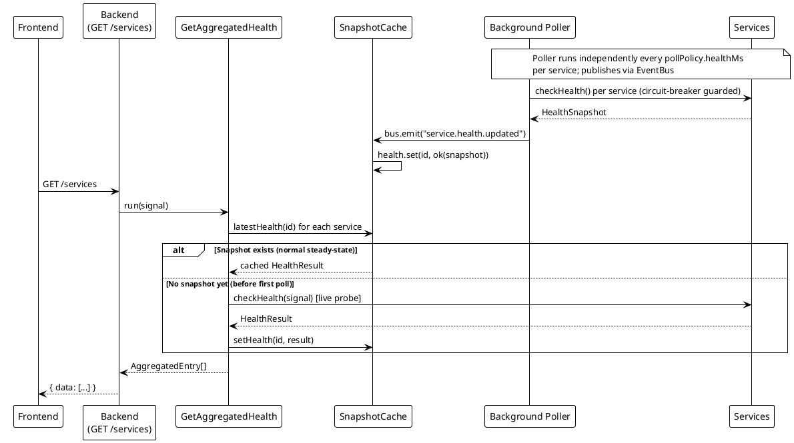
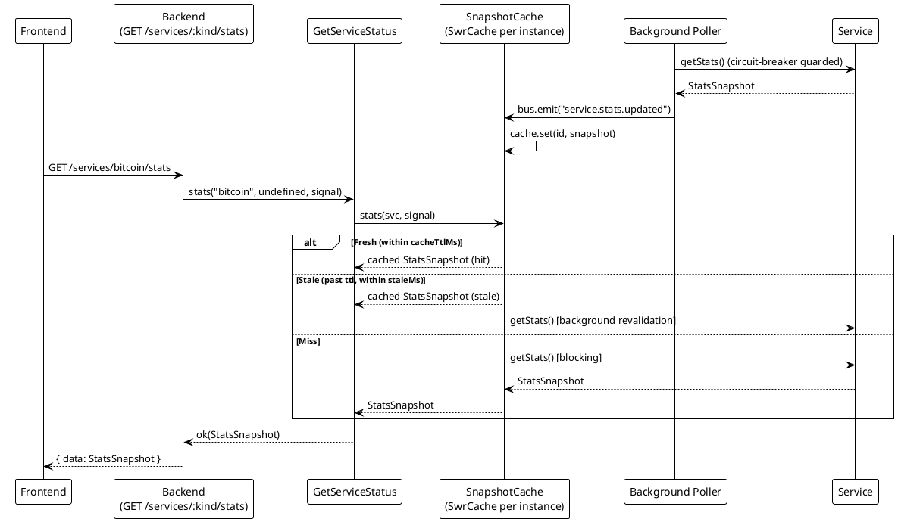

# Services Health

> [!abstract] Overview
> Per-service health snapshots using a two-tier reachability model. Each service exposes separate ICMP host reachability and protocol-specific service reachability, enabling fine-grained diagnostics. Health and stats are served from the [[docs/performance/caching-strategies|SnapshotCache]] — a poller-published cache — so GET requests read cached state rather than fan-out live probes. A live probe is made only before the first poll has completed (e.g., right after startup or service registration).
>
> **Two-Tier Model** (since ADR-019 Phase 0a):
>
> - **Host tier** (`host.reachable`) — ICMP ping to the host
> - **Service tier** (`service.reachable`) — Protocol-specific probe (HTTP, RPC, etc.)
> - **Composite** (`reachable`) — Semantics vary by service; typically `host AND service` for HTTP services, `host OR service` for others

## Endpoints Summary

| Path                      | Method | Description                                        |
| ------------------------- | ------ | -------------------------------------------------- |
| `/services`               | GET    | Aggregated health for all registered services      |
| `/services/{kind}/health` | GET    | Single service instance health with two-tier model |

See [[docs/api/index|API Index]] for full endpoint reference.

---

## GET /services

Returns aggregated health snapshot for all registered service instances.

> [!info] Cache behavior
> Serves the most-recent poller-published health snapshot for each service (`SnapshotCache.latestHealth`). Live probes are made only before the first poll has completed. The snapshot's `at` field reflects when the poller last ran, not when the HTTP request was received.

### Response

```json
{
  "data": [
    {
      "id": "bitcoin:main",
      "kind": "bitcoin",
      "instanceId": "main",
      "result": {
        "ok": true,
        "value": {
          "reachable": true,
          "latencyMs": 45,
          "message": "OK",
          "at": 1714668000000,
          "host": {
            "reachable": true,
            "pingMs": 12
          },
          "service": {
            "reachable": true,
            "latencyMs": 45
          }
        }
      }
    },
    {
      "id": "adguard:main",
      "kind": "adguard",
      "instanceId": "main",
      "result": {
        "ok": true,
        "value": {
          "reachable": false,
          "message": "Service probe failed",
          "at": 1714668000000,
          "host": {
            "reachable": true,
            "pingMs": 8
          },
          "service": {
            "reachable": false,
            "message": "HTTP GET /control/status: connection refused"
          }
        }
      }
    },
    {
      "id": "tor:main",
      "kind": "tor",
      "instanceId": "main",
      "result": {
        "ok": false,
        "error": {
          "code": "UNAVAILABLE",
          "message": "Service unreachable"
        }
      }
    }
  ]
}
```

| Field          | Type      | Description                                                        |
| -------------- | --------- | ------------------------------------------------------------------ |
| `id`           | `string`  | Composite ID: `{kind}:{instanceId}`                                |
| `kind`         | `string`  | Service kind (bitcoin, adguard, tor, etc.)                         |
| `instanceId`   | `string`  | Instance identifier for multi-instance services                    |
| `result.ok`    | `boolean` | `true` if health check succeeded, `false` if error occurred        |
| `result.value` | `object`  | **HealthSnapshot** (present only if `ok=true`)                     |
| `result.error` | `object`  | **DomainError** with code and message (present only if `ok=false`) |

---

## GET /services/{kind}/health

Returns health snapshot for a specific service instance.

> [!info] Cache behavior
> Same as `GET /services`: serves the latest poller-published snapshot. Live probe only before first poll.

### Parameters

- `{kind}` — Service kind (e.g., `bitcoin`, `adguard`, `homebridge`)
- `?instance` — Instance ID (optional; defaults to first instance of the kind)

### Response

```json
{
  "data": {
    "reachable": true,
    "latencyMs": 45,
    "message": "OK",
    "at": 1714668000000,
    "host": {
      "reachable": true,
      "pingMs": 12
    },
    "service": {
      "reachable": true,
      "latencyMs": 45
    }
  }
}
```

### HealthSnapshot Structure

| Field       | Type      | Description                                                                 |
| ----------- | --------- | --------------------------------------------------------------------------- |
| `reachable` | `boolean` | Composite reachability. Semantics depend on service type.                   |
| `latencyMs` | `number?` | Service latency, falls back to `host.pingMs` if service tier has no latency |
| `message`   | `string?` | Service-level failure reason if `service.reachable=false`                   |
| `details`   | `object?` | Service-specific diagnostic details (varies by service)                     |
| `at`        | `number`  | Timestamp in milliseconds when snapshot was taken                           |
| `host`      | `object`  | **HostHealth** — ICMP ping tier                                             |
| `service`   | `object`  | **ServiceHealth** — Protocol probe tier                                     |

### HostHealth Structure

| Field       | Type      | Description                     |
| ----------- | --------- | ------------------------------- |
| `reachable` | `boolean` | ICMP ping to host succeeded     |
| `pingMs`    | `number?` | Round-trip time in milliseconds |

### ServiceHealth Structure

| Field       | Type      | Description                                            |
| ----------- | --------- | ------------------------------------------------------ |
| `reachable` | `boolean` | Protocol probe succeeded (HTTP, RPC, etc.)             |
| `latencyMs` | `number?` | Probe latency in milliseconds                          |
| `message`   | `string?` | Human-readable failure reason                          |
| `details`   | `object?` | Service-specific data (varies by service and protocol) |

### Example: Host Up, Service Down

```json
{
  "data": {
    "reachable": false,
    "message": "Service probe failed",
    "at": 1714668000000,
    "host": {
      "reachable": true,
      "pingMs": 8
    },
    "service": {
      "reachable": false,
      "message": "HTTP GET /control/status: connection refused"
    }
  }
}
```

This indicates the host is reachable via ICMP, but the service daemon is not responding to its protocol probe.

### Example: Host Down, Service Down

```json
{
  "data": {
    "reachable": false,
    "message": "Host unreachable",
    "at": 1714668000000,
    "host": {
      "reachable": false
    },
    "service": {
      "reachable": false,
      "message": "skipped (host down)"
    }
  }
}
```

Host is offline; service probe was not attempted.

---

## GET /services/{kind}/stats

Returns stats snapshot for a specific service instance.

> [!info] SWR cache behavior
> Stats are served through a per-instance SWR (stale-while-revalidate) cache whose TTL is set by the instance's `cacheTtlMs` (default 10 s, configurable per service in the config store). The poller publishes stats into this cache after each poll cycle. On a cache hit the cached value is returned immediately; on a stale hit the cached value is returned and revalidation is triggered in the background; on a miss a live `getStats()` call is made and the result is cached.
>
> Cache entries appear in `GET /metrics` as `cache["{kind}:{instanceId}:stats"]` with `{ size, hits, misses }` fields.

---

## WebSocket Contract (`/ws`)

The backend publishes real-time events over WebSocket. The endpoint is origin-gated by the same allow-list used for CORS (loopback, `watchman://`, and any entries in `CORS_ALLOWED_ORIGINS`). Token authentication is optional — callers can pass a JWT as `Authorization: Bearer <token>` or `?token=<token>` in the upgrade request, but the connection is accepted without a token when `requireToken` is false (the default trusted-network deployment).

### Upgrade behavior

| Condition                          | Outcome                                                    |
| ---------------------------------- | ---------------------------------------------------------- |
| Origin allowed, no token (default) | Accepted as `{ username: "anonymous" }`                    |
| Origin allowed, valid token        | Accepted with decoded user identity                        |
| Origin allowed, invalid token      | Rejected with close code 1008 (`Invalid or expired token`) |
| Origin blocked                     | Rejected with close code 1008 (`origin_not_allowed`)       |
| IP at connection limit             | Rejected with close code 1013                              |

### Frame types

All frames are JSON. A `timestamp` (ISO-8601) is always included.

**`connection`** — Sent once on successful upgrade:

```json
{
  "type": "connection",
  "message": "Connected",
  "timestamp": "2026-06-12T10:00:00.000Z",
  "serverVersion": "2.0.0"
}
```

**`service_update`** — Emitted after every poller cycle for each service, for both health and stats scopes:

```json
{
  "type": "service_update",
  "scope": "health",
  "id": "bitcoin:main",
  "kind": "bitcoin",
  "instanceId": "main",
  "at": 1749722400000,
  "snapshot": { "reachable": true, "latencyMs": 32, "at": 1749722400000 },
  "timestamp": "2026-06-12T10:00:00.000Z"
}
```

| Field        | Description                                                                           |
| ------------ | ------------------------------------------------------------------------------------- |
| `scope`      | `"health"` or `"stats"`                                                               |
| `id`         | Composite `{kind}:{instanceId}`                                                       |
| `kind`       | Service kind                                                                          |
| `instanceId` | Instance identifier                                                                   |
| `at`         | Epoch-ms timestamp of the snapshot                                                    |
| `snapshot`   | The HealthSnapshot or StatsSnapshot payload (omitted if the poller produced an error) |

**`service_config_changed`** — Emitted when a service instance is created, updated, or deleted via the Config API:

```json
{
  "type": "service_config_changed",
  "kind": "bitcoin",
  "instanceId": "main",
  "action": "updated",
  "timestamp": "2026-06-12T10:00:01.000Z"
}
```

`action` is `"created"`, `"updated"`, or `"deleted"`.

**`alert`** — Emitted on first poll failure for a service, and again on recovery (deduped: repeated failures while already in error state do not emit additional alerts):

```json
{
  "type": "alert",
  "level": "error",
  "message": "bitcoin:main: connect ECONNREFUSED 127.0.0.1:8332",
  "service": "bitcoin",
  "kind": "bitcoin",
  "instanceId": "main",
  "id": "bitcoin:main",
  "timestamp": "2026-06-12T10:00:05.000Z"
}
```

Recovery alert uses `level: "info"` and `message: "{id}: recovered"`.

| `level`     | When                                            |
| ----------- | ----------------------------------------------- |
| `"error"`   | First poll failure after a period of success    |
| `"info"`    | Service recovers after being in error state     |
| `"warning"` | Manual alert (emitted by `Broadcaster.alert()`) |

---

## Related

- [[docs/api/index|API Index]]
- [[docs/features/real-time-updates|Real-Time Updates]]
- [[docs/features/multi-instance|Multi-Instance Support]]
- [[docs/architecture/data-flow|Data Flow]]

## PlantUML Diagrams

### GET /services — Cache-Backed Aggregated Health Flow



### Stats SWR Cache Flow



BE --> FE : { instances: { qbittorrent: { count: 2, instances: [...] } } }
@enduml

```

```
