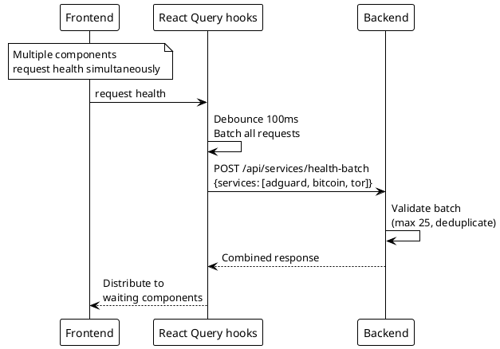
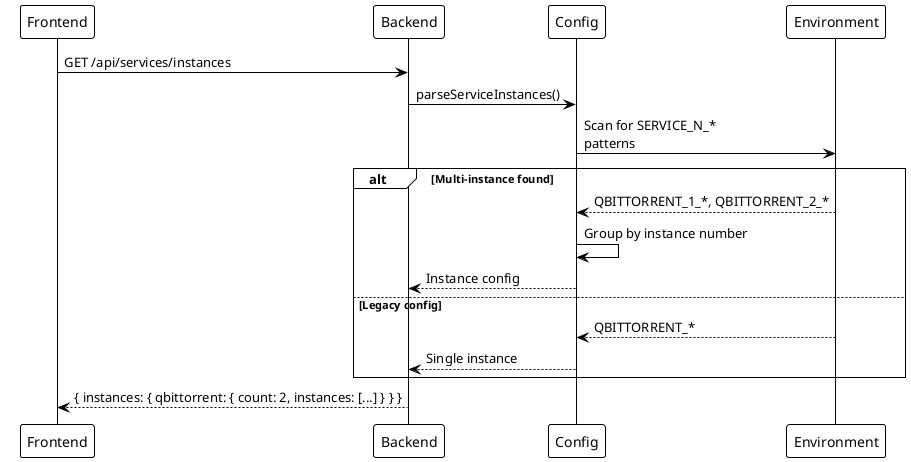

# Services Health

> [!abstract] Overview
> Per-service health snapshots using a two-tier reachability model. Each service exposes separate ICMP host reachability and protocol-specific service reachability, enabling fine-grained diagnostics.
>
> **Two-Tier Model** (since ADR-019 Phase 0a):
> - **Host tier** (`host.reachable`) — ICMP ping to the host
> - **Service tier** (`service.reachable`) — Protocol-specific probe (HTTP, RPC, etc.)
> - **Composite** (`reachable`) — Semantics vary by service; typically `host AND service` for HTTP services, `host OR service` for others

## Endpoints Summary

| Path                          | Method | Description                                      |
| ----------------------------- | ------ | ------------------------------------------------ |
| `/services`                   | GET    | Aggregated health for all registered services   |
| `/services/{kind}/health`     | GET    | Single service instance health with two-tier model |

See [[docs/api/index|API Index]] for full endpoint reference.

---

## GET /services

Returns aggregated health snapshot for all registered service instances.

### Response

```json
{
  "data": [
    {
      "id": "bitcoin:main",
      "kind": "bitcoin",
      "instanceId": "main",
      "result": {
        "ok": true,
        "value": {
          "reachable": true,
          "latencyMs": 45,
          "message": "OK",
          "at": 1714668000000,
          "host": {
            "reachable": true,
            "pingMs": 12
          },
          "service": {
            "reachable": true,
            "latencyMs": 45
          }
        }
      }
    },
    {
      "id": "adguard:main",
      "kind": "adguard",
      "instanceId": "main",
      "result": {
        "ok": true,
        "value": {
          "reachable": false,
          "message": "Service probe failed",
          "at": 1714668000000,
          "host": {
            "reachable": true,
            "pingMs": 8
          },
          "service": {
            "reachable": false,
            "message": "HTTP GET /control/status: connection refused"
          }
        }
      }
    },
    {
      "id": "tor:main",
      "kind": "tor",
      "instanceId": "main",
      "result": {
        "ok": false,
        "error": {
          "code": "UNAVAILABLE",
          "message": "Service unreachable"
        }
      }
    }
  ]
}
```

| Field              | Type      | Description                                                           |
| ------------------ | --------- | --------------------------------------------------------------------- |
| `id`               | `string`  | Composite ID: `{kind}:{instanceId}`                                  |
| `kind`             | `string`  | Service kind (bitcoin, adguard, tor, etc.)                           |
| `instanceId`       | `string`  | Instance identifier for multi-instance services                       |
| `result.ok`        | `boolean` | `true` if health check succeeded, `false` if error occurred           |
| `result.value`     | `object`  | **HealthSnapshot** (present only if `ok=true`)                       |
| `result.error`     | `object`  | **DomainError** with code and message (present only if `ok=false`)   |

---

## GET /services/{kind}/health

Returns health snapshot for a specific service instance.

### Parameters

- `{kind}` — Service kind (e.g., `bitcoin`, `adguard`, `homebridge`)
- `?instance` — Instance ID (optional; defaults to first instance of the kind)

### Response

```json
{
  "data": {
    "reachable": true,
    "latencyMs": 45,
    "message": "OK",
    "at": 1714668000000,
    "host": {
      "reachable": true,
      "pingMs": 12
    },
    "service": {
      "reachable": true,
      "latencyMs": 45
    }
  }
}
```

### HealthSnapshot Structure

| Field           | Type      | Description                                                           |
| --------------- | --------- | --------------------------------------------------------------------- |
| `reachable`     | `boolean` | Composite reachability. Semantics depend on service type.             |
| `latencyMs`     | `number?` | Service latency, falls back to `host.pingMs` if service tier has no latency |
| `message`       | `string?` | Service-level failure reason if `service.reachable=false`            |
| `details`       | `object?` | Service-specific diagnostic details (varies by service)               |
| `at`            | `number`  | Timestamp in milliseconds when snapshot was taken                    |
| `host`          | `object`  | **HostHealth** — ICMP ping tier                                      |
| `service`       | `object`  | **ServiceHealth** — Protocol probe tier                               |

### HostHealth Structure

| Field       | Type      | Description                      |
| ----------- | --------- | -------------------------------- |
| `reachable` | `boolean` | ICMP ping to host succeeded      |
| `pingMs`    | `number?` | Round-trip time in milliseconds  |

### ServiceHealth Structure

| Field       | Type      | Description                                                    |
| ----------- | --------- | -------------------------------------------------------------- |
| `reachable` | `boolean` | Protocol probe succeeded (HTTP, RPC, etc.)                    |
| `latencyMs` | `number?` | Probe latency in milliseconds                                  |
| `message`   | `string?` | Human-readable failure reason                                  |
| `details`   | `object?` | Service-specific data (varies by service and protocol)         |

### Example: Host Up, Service Down

```json
{
  "data": {
    "reachable": false,
    "message": "Service probe failed",
    "at": 1714668000000,
    "host": {
      "reachable": true,
      "pingMs": 8
    },
    "service": {
      "reachable": false,
      "message": "HTTP GET /control/status: connection refused"
    }
  }
}
```

This indicates the host is reachable via ICMP, but the service daemon is not responding to its protocol probe.

### Example: Host Down, Service Down

```json
{
  "data": {
    "reachable": false,
    "message": "Host unreachable",
    "at": 1714668000000,
    "host": {
      "reachable": false
    },
    "service": {
      "reachable": false,
      "message": "skipped (host down)"
    }
  }
}
```

Host is offline; service probe was not attempted.

---

## Related

- [[docs/api/index|API Index]]
- [[docs/features/real-time-updates|Real-Time Updates]]
- [[docs/features/multi-instance|Multi-Instance Support]]
- [[docs/architecture/data-flow|Data Flow]]

## PlantUML Diagrams

### Health Check Flow

```plantuml
@startuml
!theme plain

participant "Frontend" as FE
participant "Backend" as BE
participant "ServiceManager" as SM
participant "CircuitBreaker" as CB
participant "Services" as Svc

FE -> BE : GET /api/services/health
BE -> SM : getAllServiceHealth()

SM -> CB : Execute for each service

par
    CB -> Svc[AdGuard] : checkHealth()
    CB -> Svc[Bitcoin] : checkHealth()
    CB -> Svc[Tor] : checkHealth()
    CB -> Svc[qbittorrent] : checkHealth()
end

par
    Svc[AdGuard] --> CB : Result
    Svc[Bitcoin] --> CB : Result
    Svc[Tor] --> CB : Result (offline)
    Svc[qbittorrent] --> CB : Result
end

CB --> SM : Aggregated results
SM --> BE : JSON response
BE --> FE : { services: {...} }
@enduml
```

### Batch Health Check



### Instance Discovery


