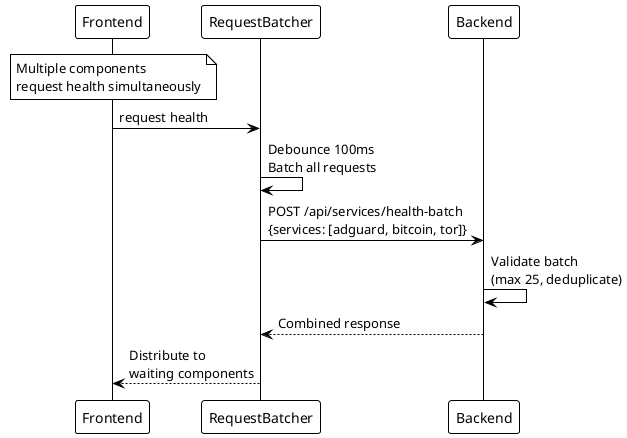
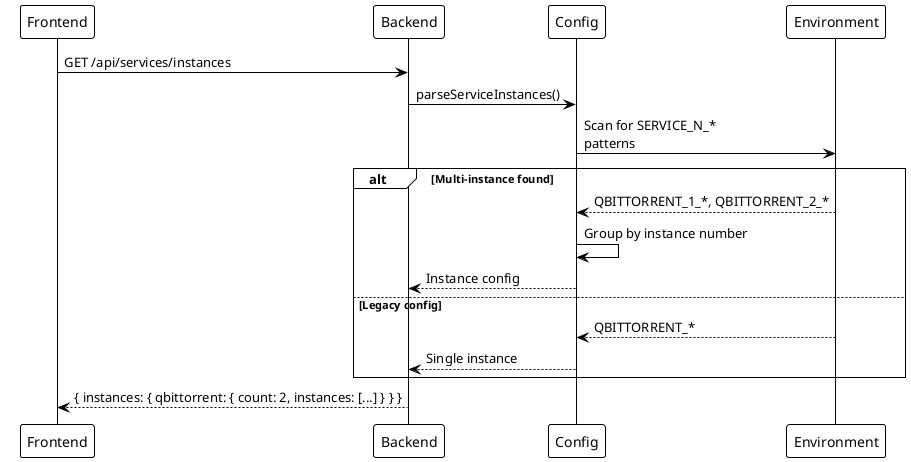

# Services Health Endpoints

> [!abstract] Overview
> Aggregate health checks for all or a subset of monitored services. Used by the frontend dashboard to display service status cards.

## Endpoints Summary

| Method | Path                         | Description                 | Auth | Rate Limit      |
| ------ | ---------------------------- | --------------------------- | ---- | --------------- |
| `GET`  | `/api/services/health`       | All enabled services health | Yes  | `healthLimiter` |
| `POST` | `/api/services/health-batch` | Batch health check          | Yes  | `healthLimiter` |
| `GET`  | `/api/services/instances`    | Service instance metadata   | Yes  | `healthLimiter` |

---

## GET /api/services/health

Returns health status for all enabled services in a single request.

### Response

#### 200 OK

```json
{
  "services": {
    "adguard": {
      "status": "online",
      "timestamp": "2026-04-02T12:00:00.000Z",
      "data": { "protection": true }
    },
    "bitcoin": {
      "status": "online",
      "timestamp": "2026-04-02T12:00:00.000Z"
    },
    "tor": {
      "status": "offline",
      "timestamp": "2026-04-02T12:00:00.000Z",
      "error": "Connection refused"
    }
  },
  "timestamp": "2026-04-02T12:00:00.000Z"
}
```

| Field                  | Type     | Description                              |
| ---------------------- | -------- | ---------------------------------------- |
| `services`             | `object` | Map of service name → health result      |
| `services.*.status`    | `string` | `"online"`, `"offline"`, or `"degraded"` |
| `services.*.timestamp` | `string` | ISO 8601 timestamp                       |
| `services.*.data`      | `object` | Optional service-specific data           |
| `services.*.error`     | `string` | Error message if offline                 |
| `timestamp`            | `string` | Response timestamp                       |

### Behavior

- Checks only services listed in `ENABLED_SERVICES` env var
- Each health check has a **5-second timeout**
- Failed checks return `offline` status with error message
- Health checks are wrapped with **circuit breaker** protection

### Source

- Route: [[apps/backend/server.js]]
- ServiceManager: [[apps/backend/services/ServiceManager.js]]

---

## POST /api/services/health-batch

Check health for a specific subset of services. More efficient than individual status calls.

### Request

```json
{
  "services": ["adguard", "bitcoin", "tor"]
}
```

| Field      | Type       | Required | Description                   |
| ---------- | ---------- | -------- | ----------------------------- |
| `services` | `string[]` | Yes      | Array of service IDs to check |

### Validation

- **Max batch size**: 25 services
- **Service ID validation**: Must match `isValidServiceId()` pattern
- **Input sanitization**: Strings truncated to 64 chars
- **Duplicates**: Automatically deduplicated

### Response

#### 200 OK

```json
{
  "adguard": {
    "status": "online",
    "timestamp": "2026-04-02T12:00:00.000Z"
  },
  "bitcoin": {
    "status": "online",
    "timestamp": "2026-04-02T12:00:00.000Z"
  }
}
```

#### 400 Bad Request

```json
{
  "error": "Invalid request body. Expected { services: string[] }"
}
```

```json
{
  "error": "Too many services requested. Maximum 25"
}
```

```json
{
  "error": "Invalid service id: invalid-service-name"
}
```

### Frontend Usage

Used by [[apps/frontend/src/services/RequestOptimizer.ts|RequestBatcher]] to batch multiple health check requests into a single API call.

### Source

- Route: [[apps/backend/server.js]]
- Request optimizer: [[apps/frontend/src/services/RequestOptimizer.ts]]

---

## GET /api/services/instances

Returns metadata about multi-instance service configurations.

### Response

#### 200 OK

```json
{
  "instances": {
    "qbittorrent": {
      "count": 2,
      "instances": [
        { "id": "qbittorrent_1", "type": "qbittorrent" },
        { "id": "qbittorrent_2", "type": "qbittorrent" }
      ]
    },
    "synology": {
      "count": 1,
      "instances": [{ "id": "synology", "type": "synology" }]
    }
  },
  "timestamp": "2026-04-02T12:00:00.000Z"
}
```

### Source

- Route: [[apps/backend/server.js]]
- ServiceManager: [[apps/backend/services/ServiceManager.js]]

---

## Related

- [[docs/api/index|API Index]]
- [[docs/features/real-time-updates|Real-Time Updates]]
- [[docs/features/multi-instance|Multi-Instance Support]]
- [[docs/architecture/data-flow|Data Flow]]

## PlantUML Diagrams

### Health Check Flow

```plantuml
@startuml
!theme plain

participant "Frontend" as FE
participant "Backend" as BE
participant "ServiceManager" as SM
participant "CircuitBreaker" as CB
participant "Services" as Svc

FE -> BE : GET /api/services/health
BE -> SM : getAllServiceHealth()

SM -> CB : Execute for each service

par
    CB -> Svc[AdGuard] : checkHealth()
    CB -> Svc[Bitcoin] : checkHealth()
    CB -> Svc[Tor] : checkHealth()
    CB -> Svc[qbittorrent] : checkHealth()
end

par
    Svc[AdGuard] --> CB : Result
    Svc[Bitcoin] --> CB : Result
    Svc[Tor] --> CB : Result (offline)
    Svc[qbittorrent] --> CB : Result
end

CB --> SM : Aggregated results
SM --> BE : JSON response
BE --> FE : { services: {...} }
@enduml
```

### Batch Health Check



### Instance Discovery


