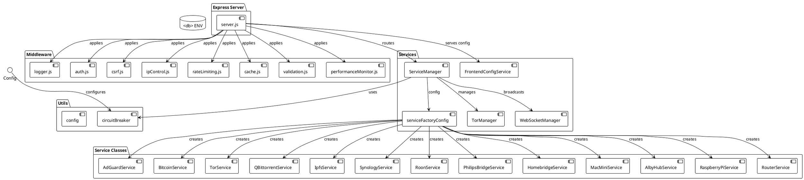

# Backend Architecture

> [!abstract] Overview
> The Watchman backend is a TypeScript + Fastify 4 server with layered architecture (config → core → infra → domain → application → transport). It orchestrates service integrations via BaseService subclasses, handles authentication, and provides REST API + WebSocket with in-process LRU caching and croner-based polling.

## Layered Architecture

The backend uses a clean layered architecture where dependencies flow downward only:

```
config/        → Environment validation (Zod), service registry
↓
core/          → Logger (Pino), DomainError hierarchy, Result<T>, clock, eventBus, container
↓
infra/         → HTTP (Undici), SSH (ssh2), GPIO (pigpio-client), SNMP (net-snmp)
                → Cache (LRU with SWR), Scheduler (croner), CircuitBreaker, Metrics
↓
domain/        → BaseService abstract, ServiceRegistry keyed by ${kind}:${instanceId}
↓
application/   → UseCases: GetServiceStatus, GetAggregatedHealth, ControlService, ListInstances
↓
transport/     → HTTP (Fastify routes), WebSocket (AuthGate, ConnectionManager, Broadcaster)
```

Each layer has clear responsibilities and minimal coupling.

## Entry Point

[[apps/backend/src/index.ts|index.ts]] bootstraps the application:

1. Loads and validates environment (Zod schema)
2. Initializes core layer (logger, errorHandler, eventBus)
3. Sets up infra layer (cache, circuitBreaker, httpClient, sshClient)
4. Loads services from [[apps/backend/src/config/ServiceRegistry.ts|ServiceRegistry]]
5. Registers domain layer (BaseService instances in ServiceRegistry)
6. Mounts HTTP routes and WebSocket handlers via Fastify
7. Attaches graceful shutdown handler (SIGTERM, SIGINT)
8. Starts background poller (croner-based, with AbortSignal for clean shutdown)

## Plugin Stack (in order)

Fastify plugins are registered in the following order in [[apps/backend/src/index.ts|index.ts]]:

| #   | Plugin                  | Purpose                                                          |
| --- | ----------------------- | ---------------------------------------------------------------- |
| 1   | `@fastify/compress`     | gzip/brotli response compression                                 |
| 2   | Helmet security headers | Security headers (CSP, HSTS, X-Frame-Options, etc.)              |
| 3   | CORS pre-flight handler | CORS restrictions using normalized frontend origin allowlist     |
| 4   | Request ID middleware   | Unique request ID attachment for logging correlation             |
| 5   | Structured logger       | Pino-based JSON logging with automatic request/response tracking |
| 6   | IP control middleware   | IP whitelist/blacklist enforcement on sensitive routes           |
| 7   | JWT authentication      | Token validation from cookies or Authorization header            |
| 8   | CSRF protection         | Double-submit cookie pattern for state-changing requests         |
| 9   | Rate limiting           | Tiered per-IP throttling (health, auth, control, general)        |
| 10  | Circuit breaker hooks   | Service availability checks before routing                       |

Request timeout and cancellation use Fastify's native request lifecycle hooks with AbortSignal propagation through service layers, allowing graceful cancellation on timeout or client disconnect.

## Core Layer

The core layer (`[[apps/backend/src/core/]]`) provides shared foundations:

| Module              | Purpose                                                                        |
| ------------------- | ------------------------------------------------------------------------------ |
| logger              | Pino-based structured JSON logging with request ID correlation                |
| errors              | DomainError hierarchy (NotFound, Unavailable, Unauthorized, Timeout, etc.)   |
| Result              | Result<T, E> type for explicit success/failure semantics (no thrown errors)   |
| clock               | Clock interface with real and test implementations for time-dependent logic   |
| eventBus            | Pub/sub event emission for status change notifications (WebSocket broadcast) |
| container           | Simple service container for dependency injection (no external DI library)   |

## Infrastructure Layer

The infra layer (`[[apps/backend/src/infra/]]`) provides protocol-agnostic adapters:

| Module          | Dependencies       | Purpose                                                  |
| --------------- | ------------------ | -------------------------------------------------------- |
| http            | Undici             | HTTP client with pooling, timeout, retry semantics      |
| ssh             | ssh2               | SSH client wrapper for remote command execution         |
| gpio            | pigpio-client      | GPIO interface for Raspberry Pi monitoring              |
| snmp            | net-snmp           | SNMP querying for network device monitoring             |
| cache           | lru-cache          | In-process LRU cache with stale-while-revalidate (SWR) |
| scheduler       | croner, AbortSignal | Background poller with configurable interval + jitter   |
| circuitBreaker  | -                  | Per-service fault tolerance (5 failures, 30s reset)     |
| metrics         | -                  | Metrics snapshot (circuit state, poller stats, memory)  |

## Domain Layer

The domain layer (`[[apps/backend/src/domain/]]`) contains service implementations:

### BaseService

[[apps/backend/src/domain/BaseService.ts|BaseService.ts]] - Abstract base class:

All service integrations extend BaseService and implement:
- `checkHealth(): Promise<ServiceHealth>` – Lightweight health check
- `getStats(): Promise<ServiceStats>` – Detailed metrics

Services are keyed by `${kind}:${instanceId}` in [[apps/backend/src/domain/ServiceRegistry.ts|ServiceRegistry.ts]]:
- `adguard:1` – Single instance
- `qbittorrent:1`, `qbittorrent:2` – Multiple instances

### Service Classes

| Service          | Location                                          | Description                        | Multi-Instance |
| ---------------- | ------------------------------------------------- | ---------------------------------- | -------------- |
| AdGuard Home     | `src/domain/services/adguard/AdGuardService.ts`  | DNS-level ad blocker monitoring    | No             |
| Bitcoin          | `src/domain/services/bitcoin/BitcoinService.ts`  | Bitcoin full node RPC              | No             |
| Tor              | `src/domain/services/tor/TorService.ts`          | Tor relay monitoring               | No             |
| qBittorrent      | `src/domain/services/qbittorrent/...`            | BitTorrent client                  | **Yes**        |
| IPFS             | `src/domain/services/ipfs/IpfsService.ts`        | IPFS node monitoring               | No             |
| Synology         | `src/domain/services/synology/...`               | Synology NAS                       | **Yes**        |
| Roon             | `src/domain/services/roon/...`                   | Music server                       | **Yes**        |
| Philips Hue      | `src/domain/services/philips/...`                | Smart lighting                     | No             |
| Homebridge       | `src/domain/services/homebridge/...`             | HomeKit bridge                     | No             |
| Mac Mini         | `src/domain/services/macmini/...`                | macOS server                       | **Yes**        |
| Alby Hub         | `src/domain/services/albyhub/...`                | Lightning wallet                   | **Yes**        |
| Raspberry Pi     | `src/domain/services/raspi/...`                  | Raspberry Pi device                | **Yes**        |
| Router           | `src/domain/services/router/...`                 | Network router                     | No             |
| Nostrcheck       | Configured in ServiceRegistry                    | Nostr relay checker                | No             |

## Application Layer

The application layer (`[[apps/backend/src/application/]]`) contains orchestration logic:

| UseCase                 | Purpose                                                  |
| ----------------------- | -------------------------------------------------------- |
| GetServiceStatus        | Fetch current health for one service with circuit check  |
| GetAggregatedHealth     | Fetch health for all enabled services in parallel        |
| ControlService          | Execute state-changing action (e.g., toggle protection)  |
| ListInstances           | Return service instance configuration and metadata       |

Each UseCase:
- Takes domain objects as input
- Returns Result<T, E> (never throws)
- Applies circuit breaker, timeout, caching logic
- Emits events on status change

## Transport Layer

The transport layer (`[[apps/backend/src/transport/]]`) handles HTTP and WebSocket:

### HTTP Routes

Fastify routes in `[[apps/backend/src/transport/http/routes/]]`:

1. **Auth**: `/api/auth/login`, `/api/auth/logout`, `/api/auth/me`
2. **Meta**: `/health`, `/meta/health`, `/metrics`
3. **Services**: `/api/services`, `/api/services/:kind`, `/api/services/:kind/stats`
4. **Multi-Instance**: `/api/:kind_:num/status`, `/api/:kind_:num/stats`
5. **Control**: Service-specific actions (e.g., `/api/adguard/protection`)
6. **Special**: Homebridge accessories, router ARP, Tor relay info
7. **WebSocket**: `GET /ws` (upgrade to WebSocket)

### WebSocket

Split into 4 focused classes in `[[apps/backend/src/transport/ws/]]`:

| Class                | Responsibility                              |
| -------------------- | ------------------------------------------- |
| AuthGate             | CORS/origin validation on handshake        |
| ConnectionManager    | Track client connections, IP tracking      |
| HeartbeatScheduler   | Ping/pong keep-alives (30s interval)       |
| Broadcaster          | Publish status changes to connected clients |

## Configuration

[[apps/backend/src/config/]]—Environment variable parsing and validation:

- `[[apps/backend/src/config/env.ts]]` – Zod schema for all env vars
- `[[apps/backend/src/config/ServiceRegistry.ts]]` – Maps enabled services to BaseService implementations
- Multi-instance discovery via numbered env vars: `SERVICE_KIND_1_*`, `SERVICE_KIND_2_*`, etc.
- CORS allowlist precomputed from `FRONTEND_URL` during bootstrap
- `TRUST_PROXY` applied to Fastify configuration per deployment

## In-Process State Management

### Circuit Breaker

`[[apps/backend/src/infra/circuitBreaker.ts]]` – Per-service fault tolerance:

- Threshold: 5 consecutive failures
- Reset timeout: 30 seconds
- Request timeout: 5 seconds (per-request, not circuit-wide)
- States: Closed → Open → Half-Open → Closed
- Volatile state (lost on restart, acceptable for self-hosted)

### Response Caching

`[[apps/backend/src/infra/cache.ts]]` – LRU cache with SWR semantics:

- Health checks: 30s TTL (serve stale while refetch in background)
- Stats endpoints: 60s TTL
- Bounded max entries (default: 1000, configurable)
- Memory safe: LRU eviction prevents unbounded growth
- No persistence (volatile, lost on restart)

### Background Polling

`[[apps/backend/src/infra/scheduler/]]` – Croner-based polling:

- Interval: 15 seconds (configurable)
- Jitter: ±2 seconds (prevents thundering herd)
- Polls all enabled services in parallel (up to 10 concurrent)
- AbortSignal propagation for graceful shutdown
- Emits status changes via eventBus (triggers WebSocket broadcast)
- Integrated with circuit breaker (skips poll if circuit open)

## PlantUML Diagrams

### Component Architecture



### Middleware Stack Sequence

```plantuml
@startuml
!theme plain

actor "Client" as Client
participant "Server" as Server
participant "Middleware Chain" as MW

Client -> Server : HTTP Request
Server -> MW[1] : requestIdMiddleware
MW[1] -> MW[2] : requestLogger
MW[2] -> MW[3] : performanceMonitor
MW[3] -> MW[4] : enforceIPControl
MW[4] -> MW[5] : requestTimeout
MW[5] -> MW[6] : responseSizeLimit
MW[6] -> MW[7] : apiResponseStandardizer
MW[7] -> MW[8] : helmet
MW[8] -> MW[9] : cors
MW[9] -> MW[10] : compression
MW[10] -> Server : Route Handler
Server -> Client : HTTP Response

note right of MW[1]
  1. requestIdMiddleware
  Adds unique ID for tracing
end note

note right of MW[2]
  2. requestLogger
  Structured JSON logging
end note

note right of MW[4]
  4. enforceIPControl
  IP whitelist/blacklist
end note

note right of MW[5]
  5. requestTimeout
  30s default timeout
end note
@enduml
```

## Related

- [[docs/architecture/data-flow|Data Flow]]
- [[docs/integrations/index|Service Integrations]]
- [[docs/security/index|Security]]
- [[docs/api/index|API Documentation]]
