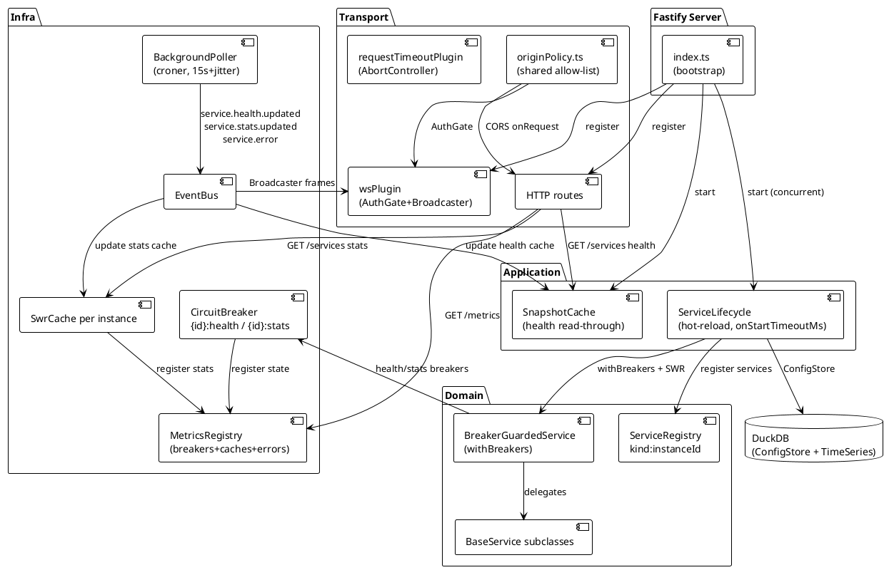
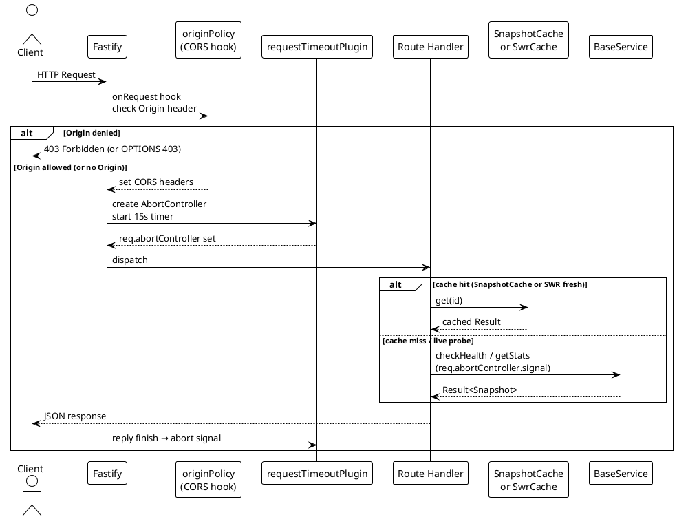

# Backend Architecture

> [!abstract] Overview
> The Watchman backend is a TypeScript + Fastify 5 server with layered architecture (config → core → infra → domain → application → transport). It orchestrates service integrations via BaseService subclasses and exposes them through a REST API + WebSocket with in-process LRU caching, a SnapshotCache for read-through HTTP serving, per-service circuit breakers, and a jittered background poller. There is no built-in authentication — Watchman is single-user (see [[docs/adr/017-remove-authentication-frontend-v2-migration|ADR-017]]); security relies on network isolation.

## Layered Architecture

The backend uses a clean layered architecture where dependencies flow downward only:

```
config/        → Environment validation (Zod), service registry, feature flags
↓
core/          → Logger (Pino), DomainError hierarchy, Result<T>, clock, eventBus, container
↓
infra/         → HTTP (Undici), SSH (ssh2), GPIO (pigpio-client), SNMP (net-snmp)
                → Cache (LRU with SWR), Scheduler (croner), CircuitBreaker, Metrics
                → TimeSeries (DuckDB @duckdb/node-api, Writer, Reader, RollupWorker, Migrations)
↓
domain/        → BaseService abstract, ServiceRegistry keyed by ${kind}:${instanceId}
↓
application/   → UseCases: GetServiceStatus, GetAggregatedHealth, GetServiceHistory, ControlService, ListInstances
↓
transport/     → HTTP (Fastify routes), WebSocket (AuthGate, ConnectionManager, Broadcaster)
```

Each layer has clear responsibilities and minimal coupling.

## Entry Point

[[apps/backend/src/index.ts|index.ts]] bootstraps the application:

1. Loads and validates environment (Zod schema)
2. Initializes core layer (logger, errorHandler, eventBus)
3. Sets up infra layer (cache, circuitBreaker, httpClient, sshClient)
4. Creates SnapshotCache and MetricsRegistry; starts SnapshotCache (subscribes to bus)
5. Loads services from [[apps/backend/src/domain/ServiceRegistry.ts|ServiceRegistry]]
6. Registers domain layer (BaseService instances wrapped with `withBreakers` + SWR stats caches via `instrument` lifecycle hook)
7. **Starts HTTP server (`app.listen()`) before `lifecycle.start()`** — port is open and health endpoint responds while services initialise
8. Brings all services up concurrently (`lifecycle.start()`) with a 10 s per-service `onStart` timeout
9. Mounts HTTP routes and WebSocket handlers via Fastify
10. Attaches graceful shutdown handler (SIGTERM, SIGINT)
11. Starts background poller (croner-based, with AbortSignal for clean shutdown)

## Plugin Stack (in order)

Fastify plugins are registered in the following order in [[apps/backend/src/transport/http/server.ts|server.ts]]:

| #   | Plugin / hook          | Purpose                                                                                                                                                                                                                                          |
| --- | ---------------------- | ------------------------------------------------------------------------------------------------------------------------------------------------------------------------------------------------------------------------------------------------ |
| 1   | CORS `onRequest` hook  | Shared origin allow-list via [[apps/backend/src/transport/originPolicy.ts\|originPolicy.ts]]: always allows `watchman://`, `http://localhost:*`, `http://127.0.0.1:*`, plus `CORS_ALLOWED_ORIGINS`. OPTIONS → 204 when allowed, 403 when denied. |
| 2   | `logSamplingPlugin`    | Sample `/meta/health` request logs to keep noise down                                                                                                                                                                                            |
| 3   | `requestTimeoutPlugin` | Per-request `AbortController` decorated on `req.abortController`; aborted on 15 s timeout or client disconnect. Signal threaded into service calls for prompt cancellation.                                                                      |
| 4   | `@fastify/compress`    | Brotli / gzip response compression (≥1 KiB)                                                                                                                                                                                                      |
| 5   | `errorHandlerPlugin`   | DomainError → envelope `{ error: { code, message } }` mapping                                                                                                                                                                                    |
| 6   | `metaRoutes`           | `/meta/health`, `/meta/version`                                                                                                                                                                                                                  |
| 7   | `metricsRoutes`        | `/metrics` snapshot — includes `breakers`, `caches`, and `errors: { total, byService }` fields                                                                                                                                                   |
| 8   | `servicesRoutes`       | `/services` (SnapshotCache), `/services/:kind/health` (SnapshotCache), `/services/:kind/stats` (SWR stats cache), `/services/:kind/control`                                                                                                      |
| 9   | `instancesRoutes`      | `/instances`, `/instances/:kind`, `/kinds`                                                                                                                                                                                                       |
| 10  | `setupRoutes`          | `/setup/status`, `/setup/philips-bridge/pair`                                                                                                                                                                                                    |
| 11  | `configRoutes`         | UI-driven ConfigStore CRUD + export/import + audit log; `PUT /config/services/:id/profile` moves a service between profiles                                                                                                                      |
| 12  | `profileRoutes`        | Profiles CRUD, active-profile get/switch, auto-switch setting, `/profiles/current-network`, `/profiles/:id/capture-network` (see [[docs/features/profiles\|Profiles]], [[docs/adr/027-service-profiles-and-network-auto-switch\|ADR-027]])       |
| 13  | `wsPlugin`             | `/ws` upgrade — shared origin gate, connection manager, heartbeat, broadcaster subscribed to the event bus; token optional (browser-compatible). Broadcasts `profile_switched` / `profile_network_unrecognized` alongside service updates.       |

Request timeout and cancellation: `requestTimeoutPlugin` creates a real `AbortController` per request and decorates it onto `req.abortController`. It is aborted on 15 s timeout, client disconnect (`req.raw.once("aborted")`), or reply finish. The signal is threaded through route handlers into service calls, cancelling in-flight network I/O promptly.

> [!note] Removed since the original spec
> Earlier drafts of this section listed Helmet, JWT, CSRF, and tiered rate limiting. None of them are wired up today — they were removed when Watchman became single-user ([[docs/adr/017-remove-authentication-frontend-v2-migration|ADR-017]]). Use network isolation (firewall, VPN, closed LAN) instead.

## Core Layer

The core layer (`[[apps/backend/src/core/]]`) provides shared foundations:

| Module    | Purpose                                                                                                                                                                                                                                                                         |
| --------- | ------------------------------------------------------------------------------------------------------------------------------------------------------------------------------------------------------------------------------------------------------------------------------- |
| logger    | Pino-based structured JSON logging with request ID correlation; `redact` config strips authorization/cookie headers and `password`/`passwd`/`token`/`secret`/`apiKey` fields from all log output.                                                                               |
| errors    | DomainError hierarchy (NotFound, Unavailable, Unauthorized, Timeout, etc.)                                                                                                                                                                                                      |
| Result    | Result<T, E> type for explicit success/failure semantics (no thrown errors)                                                                                                                                                                                                     |
| clock     | Clock interface with real and test implementations for time-dependent logic                                                                                                                                                                                                     |
| eventBus  | Typed pub/sub event emission with handler safety (see [[docs/architecture/core-systems\|Core Systems]]); `service.error` payload now includes `kind`, `instanceId`, `scope: "health"\|"stats"`. Profile events `profile.switched` and `profile.network.unrecognized` (ADR-027). |
| metrics   | MetricsRegistry with `removeBreaker`, `removeCache`, `recordServiceError`; `GET /metrics` snapshot has `errors: { total, byService }` field                                                                                                                                     |
| container | Simple service container for dependency injection (no external DI library)                                                                                                                                                                                                      |

## Infrastructure Layer

The infra layer (`[[apps/backend/src/infra/]]`) provides protocol-agnostic adapters:

| Module                | Dependencies          | Purpose                                                                                                                                                                                                                                                                                                                                                                                                                                                                                                                                                                                                                                                                                                                                                              |
| --------------------- | --------------------- | -------------------------------------------------------------------------------------------------------------------------------------------------------------------------------------------------------------------------------------------------------------------------------------------------------------------------------------------------------------------------------------------------------------------------------------------------------------------------------------------------------------------------------------------------------------------------------------------------------------------------------------------------------------------------------------------------------------------------------------------------------------------- | ------------------------------------------------------------------------------------------------------------------------------------------------------------------------------------------------------------------------------------------------------------------------------------------------- | ------------------------------------------------------- |
| http                  | Undici                | HTTP client with pooling, timeout, retry semantics                                                                                                                                                                                                                                                                                                                                                                                                                                                                                                                                                                                                                                                                                                                   |
| http/jwtClient        | -                     | **HB1 + I3 Tasks** — JWT token injection and single-retry wrapper for HttpClient. Injects `Authorization: Bearer <token>` on every request; on 401, calls `refresh()` once, retries with new token, returns response as-is. Concurrent 401s share one pending refresh promise (thundering herd prevention). Supports optional initial token; falsy tokens (empty string or undefined) skip Bearer injection. See [[apps/backend/src/infra/http/jwtClient.ts\|jwtClient.ts]]. Tested (8 tests covering token injection, 401 refresh, retry semantics, concurrent refresh sharing, empty-token fallback, failure propagation). Used by [[apps/backend/src/domain/services/homebridge/homebridgeClient.ts\|HomebridgeService]] for automatic JWT and cookie-based auth. |
| http/pinnedClient     | undici, node:tls      | **I2 Task (rewritten)** — SHA-256 cert pinning via a custom undici connector. The pin is enforced on the actual TLS connection used for the request (no TOCTOU window). `probeCertFingerprint` remains available for the setup pairing flow. `createPinnedClient(expectedSha256)` returns a standalone `HttpClient`. Throws `UnauthorizedError` on mismatch, `UnavailableError` on probe failure. Used by PhilipsBridgeService. See [[apps/backend/src/infra/http/pinnedClient.ts\|pinnedClient.ts]]                                                                                                                                                                                                                                                                 |
| ssh / ssh pool        | ssh2                  | SSH client wrapper for remote command execution. **I4 Task** — Persistent [[#ssh-connection-pool                                                                                                                                                                                                                                                                                                                                                                                                                                                                                                                                                                                                                                                                     | SshPool]] for connection reuse across requests: one per `host:port:user:keyPath` tuple, auto-reconnect on disconnect (2s delay), pending queue during reconnect, no reconnect on auth errors. See [[apps/backend/src/infra/ssh/sshPool.ts\|sshPool.ts]]. Used by [[docs/integrations/raspberry-pi | RaspberryPiService]] for direct vcgencmd + /proc stats. |
| gpio                  | pigpio-client         | GPIO interface for Raspberry Pi monitoring. `sharedPigpioClient.ts` — one persistent pigpiod TCP connection shared by health checks, stats collection, and GPIO control (was 2 connects per poll cycle). Closed in `onStop`. `GpioController` — handles `gpio:write:<pin>:<0\|1>` and `gpio:mode:<pin>:<input\|output>` actions for RaspberryPiService `control()`.                                                                                                                                                                                                                                                                                                                                                                                                  |
| snmp                  | net-snmp              | SNMP querying for network device monitoring. **Interfaces**: `get()` for single OID fetch (v3 only), `walk(req)` for subtree traversal with v2c/v3 support. **V2c walks** pass community string; **v3 walks** pass user/authKey/privKey with configurable auth/priv protocols. Session cleanup and timeout handling are robust (timers + AbortSignal). **Used by**: RouterService (interface stats, ARP table, CPU load, sysUptime). See [[apps/backend/src/infra/snmp/snmpGetter.ts\|snmpGetter.ts]] and [[apps/backend/src/infra/snmp/snmpGetterImpl.ts\|snmpGetterImpl.ts]].                                                                                                                                                                                      |
| synology/dsmClient    | node:http, Undici     | **SY1 Task** — Synology DSM session client (`createDsmClient`). Routes `SYNO.API.Auth` to `/webapi/auth.cgi`, all other APIs to `/webapi/entry.cgi`. Injects `_sid` on every non-auth request. Auto-login on first call, session recovery on codes 105/106/107 (re-login once, retry original call), concurrent login sharing (thundering herd prevention). Returns `<T>`, throws `UnauthorizedError` (no credentials), `UnavailableError` (DSM errors, failed recovery). 12 tests covering all branches. See [[apps/backend/src/infra/synology/dsmClient.ts\|dsmClient.ts]].                                                                                                                                                                                        |
| tor/controlClient     | node:net, AbortSignal | Tor Control Protocol client (RFC 5050); TCP socket wrapper with async line-buffered reader, GETINFO/GETCONF/SIGNAL support (Task B4)                                                                                                                                                                                                                                                                                                                                                                                                                                                                                                                                                                                                                                 |
| tor/eventSubscription | node:net, AbortSignal | Tor Event Subscription (Task B5); persistent TCP connection, `SETEVENTS`, async `650` event routing, handler map, reply FIFO queue                                                                                                                                                                                                                                                                                                                                                                                                                                                                                                                                                                                                                                   |
| zmq / zmqSubscriber   | zeromq v6+            | **I6 Task** — ZMQ SUB socket wrapper for real-time publish-subscribe. Supports dynamic zeromq import (v6+ ESM N-API), 3-frame message parsing (topic, data, sequence), and async event handler pattern via Sets. Non-fatal failures (falls back to poll-only on connection error). See [[apps/backend/src/infra/zmq/zmqSubscriber.ts\|zmqSubscriber.ts]] (interface), [[apps/backend/src/infra/zmq/zmqSubscriberImpl.ts\|zmqSubscriberImpl.ts]] (impl), [[apps/backend/src/infra/zmq/zmqSubscriber.test.ts\|zmqSubscriber.test.ts]] (5 contract tests). Used by [[docs/integrations/bitcoin                                                                                                                                                                          | BitcoinService]] for block/transaction streaming (BT2 task).                                                                                                                                                                                                                                      |
| cache                 | lru-cache             | In-process LRU cache with stale-while-revalidate (SWR)                                                                                                                                                                                                                                                                                                                                                                                                                                                                                                                                                                                                                                                                                                               |
| scheduler             | croner, AbortSignal   | Background poller with configurable interval + jitter                                                                                                                                                                                                                                                                                                                                                                                                                                                                                                                                                                                                                                                                                                                |
| circuitBreaker        | -                     | Per-service fault tolerance. Two breakers per service instance (`{id}:health`, `{id}:stats`): failureThreshold 5, resetAfterMs 60 000, halfOpenMaxCalls 1. Wired via `withBreakers` in `guardedService.ts`. CIRCUIT_OPEN returns err result, not thrown. See [[docs/architecture/core-systems\|Core Systems — Circuit Breaker Wiring]].                                                                                                                                                                                                                                                                                                                                                                                                                              |
| metrics               | -                     | MetricsRegistry: breaker state, SWR cache stats, poller stats, memory. `GET /metrics` snapshot includes `errors: { total, byService }` poll-error counters. `removeBreaker`/`removeCache`/`recordServiceError` added.                                                                                                                                                                                                                                                                                                                                                                                                                                                                                                                                                |
| timeseries            | DuckDB                | Time-series storage, rollups, and querying (opt-in, TIMESERIES_ENABLED)                                                                                                                                                                                                                                                                                                                                                                                                                                                                                                                                                                                                                                                                                              |

## SNMP Module (I1 — SNMP Walk + v2c Support)

Located in [[apps/backend/src/infra/snmp/]]:

### Interface: `SnmpGetter`

```typescript
interface SnmpGetter {
  get(req: SnmpGetRequest): Promise<SnmpGetResult>;
  walk(req: SnmpWalkRequest): Promise<SnmpWalkResult>;
}
```

- **`get()`** — Single OID fetch; v3 credentials only
- **`walk(req)`** — Subtree walk; supports both v2c and v3:
  - `req.v2c?: SnmpV2cCredentials` – community string
  - `req.v3?: SnmpV3Credentials` – user + authKey + privKey (auth/priv protocols configurable)
  - Return: Array of OID-value pairs

### Implementation: `snmpGetterImpl.ts`

- Uses `net-snmp` library
- **V2c walks**: `snmp.createSession(host, community, { version: snmp.Version2c, ... })`
- **V3 walks**: `snmp.createV3Session(host, userConfig, { version: snmp.Version3, ... })`
- **Session lifecycle**: Robust cleanup; timers + AbortSignal prevent hangs
- **Error handling**: Timeouts → `TimeoutError`; auth/connection → `UnavailableError`
- **Varbind conversion**: Handles null, Buffer, and numeric types; coerces to strings

### Usage: RouterService

RouterService uses `snmp.walk()` with v2c credentials to collect:

- `sysUpTime` (single row expected)
- `ifDescr`, `ifHCInOctets` (64-bit), `ifHCOutOctets` (64-bit) with 32-bit `ifInOctets`/`ifOutOctets` fallback
- `arpTable` (count of active MAC addresses)
- `hrProcessorLoad` (average CPU utilization)

Per-poll byte rates (`ifInBps`, `ifOutBps`) are computed from the delta between consecutive cumulative counter reads divided by elapsed seconds. Negative deltas (counter wrap or reboot) are skipped rather than emitting garbage. All walks execute in parallel with timeout + AbortSignal propagation.

## Certificate Pinning (I2 — SHA-256 TLS Verification)

Located in [[apps/backend/src/infra/http/pinnedClient.ts|pinnedClient.ts]]:

### Overview

Provides SHA-256 certificate pinning via a **custom undici connector**. The pin is enforced on the actual TLS connection used for the request — there is no probe-then-send TOCTOU window. `probeCertFingerprint` is still exported for the setup/pairing flow (where you need the fingerprint before you have a config).

### API

```typescript
// Returns a standalone HttpClient with pinning baked in
function createPinnedClient(expectedSha256: string): HttpClient;

// Used only during pairing — probes cert and returns fingerprint
function probeCertFingerprint(
  host: string,
  port: number,
  timeoutMs?: number
): Promise<string>;
```

- **`createPinnedClient`** — builds an undici `Agent` with a `buildConnector` wrapper that extracts the peer cert from each new TLS socket and compares against `expectedSha256`. Mismatch → `UnauthorizedError`. Probe failure → `UnavailableError`.
- **Hash formats**: plain hex `ABCDEF...` or colon-delimited `AB:CD:EF:...`, both case-insensitive.

### Services Using Cert Pinning

- **PhilipsBridgeService** — When `certHash` configured, `createPinnedClient` is called at construction and all API v2 requests go through the pinned client

### Test Coverage

[[apps/backend/src/infra/http/pinnedClient.test.ts|pinnedClient.test.ts]] — 8 tests covering:

- Successful verification with matching hash
- Mismatch detection (throws `UnauthorizedError`)
- Both plain hex and colon-delimited formats
- Case-insensitivity
- Timeout and probe failures

## SSH Connection Pool (I4 — Persistent SSH Connections)

Located in [[apps/backend/src/infra/ssh/sshPool.ts|sshPool.ts]]:

### Overview

Provides a persistent SSH connection pool for command execution across multiple requests. One persistent `ssh2.Client` is maintained per unique `host:port:user:keyPath` tuple, reducing connection overhead and enabling efficient batch operations on remote systems.

### Motivation

Direct SSH to Raspberry Pi for metrics (vcgencmd, /proc) requires running 9 concurrent commands per stats collection. Without pooling, each request would establish a new connection, suffering handshake latency. A persistent pool amortizes SSH setup cost across many polling cycles.

### API

```typescript
interface SshPool extends SshExecutor {
  exec(req: SshExecRequest): Promise<SshExecResult>;
  destroy(): void;
}

function createSshPool(): SshPool;
```

- **`exec(req)`** — Queue or execute a command; reuses existing connection or creates one on first call
- **`destroy()`** — Close all persistent connections and drain pending requests (called on backend shutdown)

### State Machine

Each pooled connection has a state:

- **`connecting`** — Initial state; key/passphrase being loaded, connection initiated
- **`ready`** — Connected and authenticated; pending queue drains and execs execute immediately
- **`reconnecting`** — Disconnected (close or error); waiting 2 seconds before reconnect attempt
- **`destroyed`** — Shutdown; all pending execs drain with `UnavailableError`

### Behavior

1. **Pooling Strategy**
   - Pool key: `${host}:${port}:${user}:${keyPath}`
   - One Map entry per unique key
   - All requests with same host/port/user/keyPath share the client

2. **Request Queueing**
   - While `connecting` or `reconnecting`, execs are queued (not rejected)
   - On `ready`, queued execs drain in order and new execs execute immediately
   - Queued execs also have their own timeout; timeout is independent of connection state

3. **Auto-Reconnect**
   - On `close` or `error` event: state → `reconnecting`, schedule reconnect in 2 seconds
   - On connection error with auth-related message: drain pending with `UnauthorizedError` and mark destroyed (do not retry — bad key path is a config error)
   - Concurrent auth failures do not retry (fail-fast on config error)

4. **Shutdown**
   - `destroy()` marks all entries `destroyed`, drains pending with error, calls `client.end()` on each
   - Called during graceful shutdown (SIGTERM, SIGINT)

### Parsing SSH Output

SSH commands are executed directly (not parsed by the pool); callers parse stdout. Common parsers for Raspberry Pi:

- `parseVcgencmdTemp(stdout)` — Extract temperature from `vcgencmd measure_temp` output
- `parseVcgencmdClock(stdout)` — Extract and convert Hz to MHz from `vcgencmd measure_clock` output
- `parseVcgencmdVolts(stdout)` — Extract voltage from `vcgencmd measure_volts` output
- `parseVcgencmdThrottled(stdout)` — Extract throttling status (hex or decimal) from `vcgencmd get_throttled`
- `parseProcLoadAvg(stdout)` — Extract 1-minute load from `/proc/loadavg`
- `parseProcMeminfoFormatted(stdout)` — Extract total memory and format as "X.X GB"
- `parseProcUptime(stdout)` — Extract uptime in seconds from `/proc/uptime`
- `parseProcCpuinfo(stdout)` — Extract CPU model and isRpi flag from `/proc/cpuinfo`
- `parseOsRelease(stdout)` — Extract OS name from `/etc/os-release`

See [[apps/backend/src/domain/services/raspberryPi/PiStatsCollector.ts|PiStatsCollector.ts]] for full set of parsers.

### Test Coverage

[[apps/backend/src/infra/ssh/sshPool.test.ts|sshPool.test.ts]] tests:

- Connection lifecycle (connecting → ready → reconnecting → destroyed)
- Request queuing during connection
- Auto-reconnect on disconnect
- Auth error handling (no retry)
- Timeout propagation with AbortSignal
- Shutdown draining pending requests

### Usage Example

```typescript
import { createSshPool } from "./infra/ssh/sshPool.js";

const pool = createSshPool();

// Execute on first call — establishes persistent connection
const result1 = await pool.exec({
  host: "192.168.1.100",
  port: 22,
  user: "pi",
  privateKeyPath: "/home/user/.ssh/id_rsa",
  command: "vcgencmd measure_temp",
  timeoutMs: 5000,
});

// Reuses connection from result1
const result2 = await pool.exec({
  host: "192.168.1.100",
  port: 22,
  user: "pi",
  privateKeyPath: "/home/user/.ssh/id_rsa",
  command: "cat /proc/loadavg",
  timeoutMs: 5000,
});

// On shutdown
pool.destroy();
```

### Services Using SSH Pool

- **RaspberryPiService** — Direct SSH to Pi for vcgencmd and /proc stats (PI1 feature)

## ZMQ Subscriber (I6 — Real-Time ZeroMQ Subscriptions)

Located in [[apps/backend/src/infra/zmq/]]:

### Overview

Provides a lightweight ZeroMQ SUB socket wrapper for subscribing to real-time publish-subscribe streams. Designed for Bitcoin Core ZMQ block/transaction notifications, extensible to any ZMQ endpoint. Supports dynamic module import (v6+ ESM N-API), robust error handling, and graceful connection failure (non-fatal fallback to polling).

### API

```typescript
interface ZmqMessage {
  topic: string; // Topic string (e.g., 'hashblock', 'rawtx')
  data: Buffer; // Payload bytes
  sequence: number; // 4-byte little-endian sequence counter
}

interface ZmqSubscriberHandle {
  onMessage(handler: (msg: ZmqMessage) => void): () => void;
  close(): Promise<void>;
}

type ZmqConnectFn = (
  endpoint: string,
  topics: string[]
) => Promise<ZmqSubscriberHandle>;
```

- **`onMessage(handler)`** — Subscribe to inbound messages; returns unsubscribe function
- **`close()`** — Close the socket and stop dispatching messages

### Interfaces

**[[apps/backend/src/infra/zmq/zmqSubscriber.ts|zmqSubscriber.ts]]** — Defines the public API:

- `ZmqMessage` — 3-part message (topic, data, sequence)
- `ZmqSubscriberHandle` — Public socket interface
- `ZmqConnectFn` — Type alias for injectable factory function

**[[apps/backend/src/infra/zmq/zmqSubscriberImpl.ts|zmqSubscriberImpl.ts]]** — Real implementation:

- Dynamic `import('zeromq')` with v6+ ESM guard (no import-time dependency)
- SUB socket creation, endpoint connection, topic subscription
- Async iterator loop over 3-frame messages
- Handler Set pattern (prevents duplicate subscriptions)
- Graceful socket closure

### Features

1. **Dynamic Module Import** — Zeromq is loaded at runtime (not a hard dependency at build time), so missing or incompatible versions gracefully fall back to poll-only mode
2. **Sequence Tracking** — Extracts and exposes 4-byte little-endian sequence counter from ZMQ envelope frame
3. **Multiple Handlers** — Supports multiple independent subscribers via handler Sets; unsubscribe function removes individual handler
4. **Non-Fatal Failures** — Connection errors in `onStart()` do not block service startup; service falls back to poll-only RPC
5. **Clean Shutdown** — `close()` drains the socket and cleans up async iterators

### Configuration

```typescript
// Bitcoin Core zeromq endpoints
const endpoint = "tcp://127.0.0.1:28332"; // Block notifications
const topics = ["hashblock", "rawtx"]; // Subscribe to both

const handle = await zmqConnect(endpoint, topics);

handle.onMessage((msg) => {
  console.log(
    `Topic: ${msg.topic}, Data: ${msg.data.toString("hex")}, Seq: ${msg.sequence}`
  );
});

// Cleanup
await handle.close();
```

### Test Coverage

[[apps/backend/src/infra/zmq/zmqSubscriber.test.ts|zmqSubscriber.test.ts]] — 5 contract tests using a fake handle (no real zeromq dependency):

- Handle creation and message dispatch
- Multiple handler subscriptions and unsubscription
- Message parsing (topic, data, sequence)
- Socket closure and handler cleanup
- Non-fatal error scenarios

### Services Using ZMQ

- **BitcoinService** (BT2 task) — Real-time block notifications for `zmqHashblockEndpoint`, populates `zmqLastBlockHash`, `zmqLastBlockAt`, `zmqBlockCount`

## Roon WebSocket Client (RN1 — Real-Time Zone Tracking)

Located in [[apps/backend/src/infra/roon/]]:

### Overview

Provides a lightweight WebSocket client for Roon Core API integration. Establishes a persistent connection to the Roon Core's transport service and tracks zone state, playback status, and now-playing metadata in real time. Designed as an optional feature (pairing is async and non-blocking).

### API

```typescript
interface RoonZone {
  zoneId: string;
  displayName: string;
  state: "playing" | "paused" | "loading" | "stopped";
  queueItemsRemaining: number;
  queueTimeRemaining: number;
  nowPlaying?: {
    oneLine: string;
    seekPosition?: number;
    length?: number;
  };
  outputCount: number;
}

interface RoonHandle {
  getZones(): ReadonlyArray<RoonZone>;
  isPaired(): boolean;
  close(): Promise<void>;
}

interface RoonConnectOptions {
  host: string;
  port: number;
  extensionId: string;
  displayName: string;
  onZonesChanged?: (zones: ReadonlyArray<RoonZone>) => void;
}

type RoonConnectFn = (opts: RoonConnectOptions) => Promise<RoonHandle>;
```

- **`getZones()`** — Returns snapshot of all known zones at this moment
- **`isPaired()`** — Returns pairing status (extension paired to core)
- **`close()`** — Closes the connection and releases resources

### Interfaces

**[[apps/backend/src/infra/roon/roonClient.ts|roonClient.ts]]** — Defines the public API:

- `RoonZone` — Zone state (zoneId, displayName, state, queue info, nowPlaying, outputs)
- `RoonHandle` — Public connection interface
- `RoonConnectOptions` — Connection parameters
- `RoonConnectFn` — Type alias for injectable factory function

**[[apps/backend/src/infra/roon/roonClientImpl.ts|roonClientImpl.ts]]** — Real implementation:

- Uses `@roonlabs/node-roon-api` (CJS via `createRequire`)
- Calls `init_services()` then `ws_connect()`
- Subscribes to `com.roonlabs.transport:2` zones via `core.moo._subscribe_helper()`
- Handles zone subscription events: `Subscribed`, `Changed`, `zones_added`, `zones_changed`, `zones_removed`
- Normalizes raw Roon zone objects (snake_case) to contract shape (camelCase)
- Tracks in-memory zone snapshot, updated on each subscription event

### Features

1. **Lazy Zone Snapshot** — `getZones()` returns current zone state without polling; always reflects latest subscription updates
2. **Zone State Normalization** — Handles all Roon zone states and normalizes unknown states to `'stopped'`
3. **Now-Playing Metadata** — Extracts `one_line`, `seek_position`, `length` from now-playing object when available
4. **Async Pairing** — Pairing happens asynchronously via `core_paired` callback; connection resolves immediately
5. **Non-Fatal Connection** — Connection errors do not block service startup; service falls back to TCP health checks only

### Configuration

```typescript
// In RoonService config
const handle = await roonConnect({
  host: "192.0.2.150",
  port: 9100,
  extensionId: "com.watchman.roon",
  displayName: "Watchman",
  onZonesChanged: (zones) => {
    // Optional: react to zone updates
  },
});

// Later, retrieve zone snapshot
const zones = handle.getZones();
const paired = handle.isPaired();

// On shutdown
await handle.close();
```

### Test Coverage

[[apps/backend/src/infra/roon/roonClient.test.ts|roonClient.test.ts]] — 7 contract tests using a fake Roon handle (no real API dependency):

- Handle creation and zone initialization
- Pairing status tracking
- Zone snapshot after subscription updates (added, changed, removed)
- Now-playing metadata extraction and normalization
- Handle closure and resource cleanup
- State normalization for edge cases

### Services Using Roon API

- **RoonService** (RN1/RN2 tasks) — Optional real-time zone and now-playing tracking when `useRoonApi: true`

## Domain Layer

The domain layer (`[[apps/backend/src/domain/]]`) contains service implementations:

### BaseService

[[apps/backend/src/domain/BaseService.ts|BaseService.ts]] - Abstract base class:

All service integrations extend BaseService and implement:

- `checkHealth(signal: AbortSignal): Promise<HealthResult>` – Two-tier health check (host + service); **always returns `ok(HealthSnapshot)`, never `err()`** — connection failures and thrown errors yield `reachable: false` snapshots instead
- `getStats(signal: AbortSignal): Promise<StatsResult>` – Detailed metrics

Health check contract (Phase 0a+):

```ts
export interface HealthSnapshot {
  reachable: boolean; // composite: host AND service reachable
  latencyMs?: number; // protocol probe latency
  message?: string;
  details?: Record<string, unknown>;
  at: number; // timestamp
  host?: HostHealth; // ICMP ping tier
  service?: ServiceHealth; // protocol probe tier
}
```

Services are keyed by `${kind}:${instanceId}` in [[apps/backend/src/domain/ServiceRegistry.ts|ServiceRegistry.ts]]:

- `adguard:1` – Single instance
- `qbittorrent:1`, `qbittorrent:2` – Multiple instances

### Service Classes

| Service      | Location                                                    | Description                                              | Multi-Instance |
| ------------ | ----------------------------------------------------------- | -------------------------------------------------------- | -------------- |
| AdGuard Home | `src/domain/services/adguard/AdGuardService.ts`             | DNS-level ad blocker monitoring                          | No             |
| Bitcoin      | `src/domain/services/bitcoin/BitcoinService.ts`             | Bitcoin full node RPC (BT1: extended stats)              | No             |
| Tor          | `src/domain/services/tor/TorService.ts`                     | Tor relay monitoring                                     | No             |
| qBittorrent  | `src/domain/services/qbittorrent/...`                       | BitTorrent client                                        | **Yes**        |
| IPFS         | `src/domain/services/ipfs/IpfsService.ts`                   | IPFS node monitoring                                     | No             |
| Synology     | `src/domain/services/synology/...`                          | Synology NAS                                             | **Yes**        |
| Roon         | `src/domain/services/roon/...`                              | Music server                                             | **Yes**        |
| Philips Hue  | `src/domain/services/philipsBridge/PhilipsBridgeService.ts` | Smart lighting (Hue API v2, light metrics, cert pinning) | No             |
| Homebridge   | `src/domain/services/homebridge/...`                        | HomeKit bridge                                           | No             |
| Mac Mini     | `src/domain/services/macMini/...`                           | macOS server                                             | **Yes**        |
| Alby Hub     | `src/domain/services/albyHub/...`                           | Lightning wallet                                         | **Yes**        |
| Raspberry Pi | `src/domain/services/raspberryPi/...`                       | Raspberry Pi device                                      | **Yes**        |
| Router       | `src/domain/services/router/...`                            | Network router                                           | No             |

## Application Layer

The application layer (`[[apps/backend/src/application/]]`) contains orchestration logic:

| UseCase             | Purpose                                                           |
| ------------------- | ----------------------------------------------------------------- |
| GetServiceStatus    | Fetch current health for one service with circuit check           |
| GetAggregatedHealth | Fetch health for all enabled services in parallel                 |
| ControlService      | Execute state-changing action (e.g., toggle protection)           |
| ListInstances       | Return service instance configuration and metadata                |
| GetServiceHistory   | Query time-series metrics (optional; requires TIMESERIES_ENABLED) |

Each UseCase:

- Takes domain objects as input
- Returns Result<T, E> (never throws)
- Applies circuit breaker, timeout, caching logic
- Emits events on status change

## Transport Layer

The transport layer (`[[apps/backend/src/transport/]]`) handles HTTP and WebSocket:

### HTTP Routes

Fastify routes in `[[apps/backend/src/transport/http/routes/]]`:

1. **Meta**: `/meta/health`, `/meta/version`, `/metrics` (breakers + caches + errors)
2. **Services**: `/services` (SnapshotCache), `/services/:kind/health` (SnapshotCache), `/services/:kind/stats` (SWR cache), `/services/:kind/control`
3. **Instances**: `/instances`, `/instances/:kind`, `/kinds`
4. **History**: `/services/:kind/history` (time-series; opt-in via TIMESERIES_ENABLED)
5. **Control**: Service-specific actions (e.g., `/services/raspberryPi/control` for GPIO)
6. **Setup**: `/setup/status`, `/setup/philips-bridge/pair`
7. **Config**: `/config/services` CRUD + export/import + audit log
8. **Special**: Homebridge accessories, router ARP, Tor relay info
9. **WebSocket**: `GET /ws` (upgrade; shared origin policy; token optional)

> [!note] Route prefix
> The current route prefix is no longer `/api/*`. Routes are mounted directly (e.g., `/services`, `/instances`). See `apps/backend/openapi.yaml` for the authoritative path list.

### WebSocket

Split into 4 focused classes in `[[apps/backend/src/transport/ws/]]`, plus shared origin policy in `[[apps/backend/src/transport/originPolicy.ts|originPolicy.ts]]`:

| Class              | Responsibility                                                                              |
| ------------------ | ------------------------------------------------------------------------------------------- |
| originPolicy.ts    | Shared allow-list factory used by both HTTP CORS hook and WS AuthGate                       |
| AuthGate           | Origin validation + optional token extraction (`Authorization: Bearer` or `?token=`)        |
| ConnectionManager  | Track client connections, IP tracking                                                       |
| HeartbeatScheduler | Ping/pong keep-alives (30s interval)                                                        |
| Broadcaster        | Publish `service_update`, `alert` (deduped error/recovery), `service_config_changed` frames |

## Configuration Layer

`apps/backend/src/config/`—Bootstrap and runtime configuration:

### Bootstrap Configuration

- `[[apps/backend/src/config/env.ts]]` – Zod schema for required env vars (ports, auth, master key, etc.)
- CORS allowlist precomputed from `FRONTEND_URL` during bootstrap
- `TRUST_PROXY` applied to Fastify configuration per deployment

### Service Configuration (UI-Driven, v2.2+)

- `[[apps/backend/src/config/store/ConfigStore.ts]]` – DuckDB-backed CRUD for service instances; **partial updates preserve** `pollPolicy`, `cacheTtlMs`, `timeoutMs`, `enabled`, and `instanceId` from the existing record when those fields are omitted from the update payload (previously they reset to schema defaults). Uses `DuckDbPool` (bounded max 4 connections, `withConnection()` helper, `release()` on done).
- **Resilient loading (graceful degradation):** `loadAll()` partitions rows — a row that can't be turned into a usable service (secrets that no longer decrypt after a `WATCHMAN_MASTER_KEY` rotation, config that drifted from the current Zod schema, or an unknown `kind`) is **skipped and logged**, never throwing the whole batch. One bad instance therefore can't stop the others from coming up at startup, and `GET /config/services` no longer 500s. Skipped rows are exposed via `loadErrors()` / `GET /config/load-errors` so the Settings UI can show a recovery banner; `delete()` tolerates an unparseable row so a broken instance is still removable. See [[docs/api/config|Configuration API — load-errors]].
- `[[apps/backend/src/config/store/encryption.ts]]` – AES-256-GCM encryption/decryption (keyed by `WATCHMAN_MASTER_KEY`)
- `[[apps/backend/src/config/store/migrations.ts]]` – DuckDB schema setup (tables: `app_service_instance`, `app_config_audit`)
- `[[apps/backend/src/config/store/envMigrator.ts]]` – One-shot legacy env var import on first boot
- `[[apps/backend/src/config/schemas/`\* – Per-kind Zod schema + field metadata (one file per service kind)

### Service Instantiation

- `[[apps/backend/src/bootstrap/registerServices.ts]]` – `buildService()`: pure function mapping a validated config instance to a service class (no env reading). Its `default` branch throws a clear "unknown service kind" error, so an unexpected kind fails that one service (contained by `reloadAll`'s per-service catch) instead of crashing registration for the rest.
- `[[apps/backend/src/application/ServiceLifecycle.ts]]` – Orchestrates hot-reload on config change: pause poller → stop old service → create new → start new → retrack → resume
- Services are registered by `${kind}:${instanceId}` in `[[apps/backend/src/domain/ServiceRegistry.ts]]`

## In-Process State Management

### Circuit Breaker

`[[apps/backend/src/infra/circuitBreaker/breaker.ts]]` and `[[apps/backend/src/infra/circuitBreaker/guardedService.ts]]` – Per-service fault tolerance, now wired:

- **Two breakers per service instance**: `{id}:health` and `{id}:stats` — independent so a stats-only credential failure does not open the health circuit
- Threshold: 5 consecutive failures → Open
- Reset timeout: 60 seconds (was 30 s)
- States: Closed → Open → Half-Open → Closed
- **Half-open slot management**: `tryAcquire()` atomically reserves a slot; `halfOpenMaxCalls` defaults to 1
- CIRCUIT_OPEN → `err(UnavailableError)` returned to callers, not thrown
- Volatile state (lost on restart, acceptable for self-hosted)
- Registered in MetricsRegistry; visible in `GET /metrics` → `snapshot.breakers`
- See [[docs/architecture/core-systems|Core Systems — Circuit Breaker Wiring]] for full details

### Response Caching

`[[apps/backend/src/infra/cache/swr.ts]]` and `[[apps/backend/src/application/SnapshotCache.ts]]` – Two-layer caching strategy:

**SnapshotCache** (application layer):

- Keeps the latest poller-published health result per service (keyed by `${kind}:${instanceId}`)
- `GET /services` and `GET /services/:kind/health` serve from this cache; fall back to live probe only before first poll
- Error results from `service.error` (scope=health) are also cached so the HTTP layer returns consistent error snapshots

**SWR Stats Caches** (per-instance, infra/cache/swr.ts):

- One `SwrCache<StatsSnapshot>` per service instance, TTL = instance's `cacheTtlMs`
- Updated from `service.stats.updated` bus events; live probe on miss
- `GET /services/:kind/stats` reads through this cache
- Cache stats (hits/misses/stale) appear in `GET /metrics` → `snapshot.caches`
- Memory safe: LRU eviction, no persistence

### Background Polling

`[[apps/backend/src/infra/scheduler/poller.ts]]` – Croner-based polling with hot-reload support:

- Interval: 15 seconds (configurable)
- Jitter: ±2 seconds (prevents thundering herd)
- Polls all enabled services in parallel (up to 10 concurrent)
- AbortSignal propagation for graceful shutdown
- Emits status changes via eventBus (triggers WebSocket broadcast)
- Integrated with circuit breaker (skips poll if circuit open)
- **Hot-reload support**: `pause()`, `resume()`, `untrack(id)`, `retrack(service)` methods for runtime service reconfiguration

### Time-Series Storage (Optional)

`[[apps/backend/src/infra/timeseries/]]` – DuckDB time-series metrics (gated by `TIMESERIES_ENABLED`):

- **Writer** (`TimeSeriesWriter`): Subscribes to **both** `service.stats.updated` **and** `service.health.updated` events; batches raw metrics into DuckDB `metric_raw` table with dual-column support for booleans (X1 fix). Health metrics include: `reachable` (bool), `host_reachable` (bool), `host_ping_ms` (num), `service_reachable` (bool), `service_latency_ms` (num) — Phase 0a completion closes P0a data pipeline gaps
  - **X1 Boolean Rollup Fix**: Boolean metrics (both stats and health) are now stored in **two columns**: `value_bool` (exact boolean) and `value_num` (0/1 numeric). This enables rollup aggregations (e.g., `avg_v`) on numeric column to compute uptime fractions. Example: `reachable` is stored as both `value_bool = true/false` and `value_num = 1/0`, allowing aggregations like `AVG(value_num)` over time window to yield uptime percentage.
  - **`flattenMetrics()` helper** — Converts boolean stats to dual-column rows (value_bool + value_num)
  - **`boolRow()` helper** — Converts boolean health metrics to dual-column rows (value_bool + value_num)
- **Rollup Worker** (`RollupWorker`): Background jobs (setTimeout-based, ~30s/2min/10min cadence) roll raw → 1m/5m/1h tiers with aggregations (min/max/avg/last)
- **Reader** (`TimeSeriesReader`): Query builder with auto-resolution based on time window; supports kind/instance/metric/from/to/resolution filters
- **Connection Pool** (`DuckDbPool`): Wraps DuckDBInstance, manages connections
- **Schema**: 5 tables (metric_raw, metric_1m, metric_5m, metric_1h, rollup_state) with retention: raw 6h, 1m 48h, 5m 14d, 1h 30d
- See [[docs/features/time-series-history|Time-Series Feature Doc]] for details

## PlantUML Diagrams

### Component Architecture



### Request Pipeline Sequence



## Related

- [[docs/architecture/data-flow|Data Flow]]
- [[docs/architecture/core-systems|Core Systems]] — Event Bus and Service Lifecycle
- [[docs/integrations/index|Service Integrations]]
- [[docs/security/index|Security]]
- [[docs/api/index|API Documentation]]
