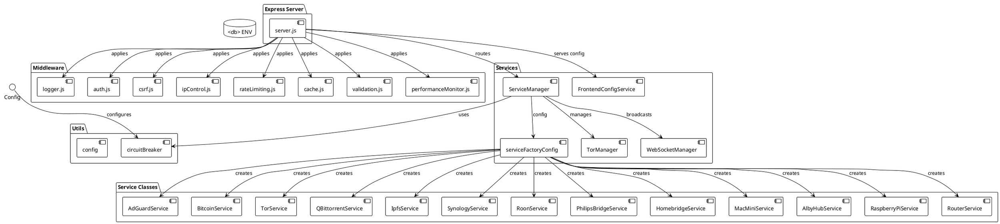

# Backend Architecture

> [!abstract] Overview
> The Watchman backend is a Node.js/Express server that orchestrates service integrations, handles authentication, and provides a REST API with WebSocket support.

## Entry Point

[[apps/backend/server.js|server.js]] - Express application setup, middleware chain, server lifecycle, and delegation of API route wiring to [[apps/backend/routes/registerApiRoutes.js|registerApiRoutes.js]].

- Startup logging is intentionally conservative: it no longer advertises `/api/tor/proxy/health` in boot output.

## Middleware Stack (in order)

Middleware is applied in the following order in [[apps/backend/server.js|server.js]]:

| #   | Middleware                | File                                              | Purpose                                            |
| --- | ------------------------- | ------------------------------------------------- | -------------------------------------------------- |
| 1   | `requestIdMiddleware`     | [[apps/backend/middleware/logger.js]]             | Unique request ID tracking for logging correlation |
| 2   | `requestLogger`           | [[apps/backend/middleware/logger.js]]             | Structured JSON logging with PII redaction         |
| 3   | `performanceMonitor`      | [[apps/backend/middleware/performanceMonitor.js]] | Request performance tracking and metrics           |
| 4   | `enforceIPControl`        | [[apps/backend/middleware/ipControl.js]]          | IP whitelist/blacklist enforcement                 |
| 5   | `requestTimeout`          | [[apps/backend/middleware/requestTimeout.js]]     | Global request timeout (default 30s)               |
| 6   | `responseSizeLimit`       | [[apps/backend/middleware/responseSizeLimit.js]]  | Large response prevention (default 5MB)            |
| 7   | `apiResponseStandardizer` | [[apps/backend/middleware/apiResponse.js]]        | Response format standardization                    |
| 8   | `helmet`                  | External (helmet package)                         | Security headers (CSP, HSTS, etc.)                 |
| 9   | `cors`                    | External (cors package)                           | CORS restrictions based on config                  |
| 10  | `compression`             | External (compression package)                    | gzip compression                                   |

## Middleware Reference

### Authentication & Security

| Middleware                                  | File                | Description                   |
| ------------------------------------------- | ------------------- | ----------------------------- | --------------------------------------------------------- |
| [[apps/backend/middleware/auth.js           | auth.js]]           | JWT authentication middleware | Validates JWT tokens from cookies or Authorization header |
| [[apps/backend/middleware/csrf.js           | csrf.js]]           | CSRF protection               | Double-submit cookie pattern for state-changing requests  |
| [[apps/backend/middleware/ipControl.js      | ipControl.js]]      | IP control                    | Whitelist/blacklist enforcement for sensitive endpoints   |
| [[apps/backend/middleware/rateLimiting.js   | rateLimiting.js]]   | Rate limiting                 | Tiered request throttling per IP address                  |
| [[apps/backend/middleware/accountLockout.js | accountLockout.js]] | Account lockout               | Failed login tracking and temporary lockout               |

### Request Processing

| Middleware                                     | File                   | Description         |
| ---------------------------------------------- | ---------------------- | ------------------- | ------------------------------------------------ |
| [[apps/backend/middleware/cache.js             | cache.js]]             | Response caching    | In-memory cache with TTL (30s health, 60s stats) |
| [[apps/backend/middleware/validation.js        | validation.js]]        | Input validation    | Parameter sanitization and type checking         |
| [[apps/backend/middleware/serviceEnabled.js    | serviceEnabled.js]]    | Service check       | Verifies service is enabled before processing    |
| [[apps/backend/middleware/requestTimeout.js    | requestTimeout.js]]    | Request timeout     | Global timeout prevents hanging requests         |
| [[apps/backend/middleware/responseSizeLimit.js | responseSizeLimit.js]] | Response size limit | Prevents large response DoS attacks              |

### Logging & Monitoring

| Middleware                                      | File                    | Description          |
| ----------------------------------------------- | ----------------------- | -------------------- | ---------------------------------------- |
| [[apps/backend/middleware/logger.js             | logger.js]]             | Request logging      | Structured JSON logging with request IDs |
| [[apps/backend/middleware/performanceMonitor.js | performanceMonitor.js]] | Performance tracking | Request timing and metrics               |

### Response Handling

| Middleware                               | File             | Description           |
| ---------------------------------------- | ---------------- | --------------------- | ------------------------------------------ |
| [[apps/backend/middleware/apiResponse.js | apiResponse.js]] | Response standardizer | Standardizes success/error response format |

## Service Layer

### ServiceManager

[[apps/backend/services/ServiceManager.js|ServiceManager.js]] - Central orchestrator:

- Initializes all enabled services via factory pattern
- Routes health/stats requests
- Applies circuit breaker pattern
- Manages TorManager lifecycle

### Service Factory

[[apps/backend/services/serviceFactoryConfig.js|serviceFactoryConfig.js]] - Factory configuration:

- Maps service names to service classes
- Defines config extraction functions
- Specifies post-initialization hooks

### Service Classes

All services extend a common pattern:

| Service      | File                                              | Description                        |
| ------------ | ------------------------------------------------- | ---------------------------------- |
| AdGuard      | [[apps/backend/services/AdGuardService.js]]       | DNS-level ad blocker monitoring    |
| Bitcoin      | [[apps/backend/services/BitcoinService.js]]       | Bitcoin full node RPC              |
| Tor          | [[apps/backend/services/TorService.js]]           | Tor relay monitoring               |
| qBittorrent  | [[apps/backend/services/QBittorrentService.js]]   | BitTorrent client (multi-instance) |
| IPFS         | [[apps/backend/services/IpfsService.js]]          | IPFS node monitoring               |
| Synology     | [[apps/backend/services/SynologyService.js]]      | Synology NAS (multi-instance)      |
| Roon         | [[apps/backend/services/RoonService.js]]          | Music server (multi-instance)      |
| Philips Hue  | [[apps/backend/services/PhilipsBridgeService.js]] | Smart lighting                     |
| Homebridge   | [[apps/backend/services/HomebridgeService.js]]    | HomeKit bridge                     |
| Mac Mini     | [[apps/backend/services/MacMiniService.js]]       | macOS server (multi-instance)      |
| Alby Hub     | [[apps/backend/services/AlbyHubService.js]]       | Lightning wallet (multi-instance)  |
| Raspberry Pi | [[apps/backend/services/RaspberryPiService.js]]   | Raspberry Pi (multi-instance)      |
| Router       | [[apps/backend/services/RouterService.js]]        | Network router                     |
| Nostrcheck   | (configured in config.js)                         | Nostr relay checker                |

### Managers

| Manager               | File                                               | Purpose                        |
| --------------------- | -------------------------------------------------- | ------------------------------ |
| TorManager            | [[apps/backend/services/TorManager.js]]            | Tor proxy lifecycle management |
| WebSocketManager      | [[apps/backend/services/WebSocketManager.js]]      | Real-time status broadcasting  |
| FrontendConfigService | [[apps/backend/services/FrontendConfigService.js]] | Frontend config endpoint       |

### Shared Utilities

| Utility                     | File                                          | Purpose                                                                                                                                                               |
| --------------------------- | --------------------------------------------- | --------------------------------------------------------------------------------------------------------------------------------------------------------------------- |
| auth token extraction       | [[apps/backend/utils/authToken.js]]           | Shared extraction/parsing for HTTP middleware, `/api/auth/me`, and WebSocket auth handshake                                                                           |
| environment parsing helpers | [[apps/backend/utils/env.js]]                 | Standardized parsing for ints/bools/lists/optional values used by config, service factory, and WebSocket manager                                                      |
| router ARP extraction       | [[apps/backend/services/RouterArpService.js]] | Encapsulated ARP neighbor lookup and LAN host filtering used by router ARP route, with short-lived in-memory TTL cache (3s) and bounded max-entry pruning             |
| route context/error helpers | [[apps/backend/routes/routeUtils.js]]         | Shared route helpers `getErrorMessage(error)` and `getServiceContext(getServiceManager, serviceName)` used by route modules to keep error/context handling consistent |

## Route Architecture

API route composition is orchestrated by [[apps/backend/routes/registerApiRoutes.js|registerApiRoutes.js]], which is called from [[apps/backend/server.js|server.js]].

`registerApiRoutes(...)` wires dedicated registration modules plus factory-generated service routes:

- [[apps/backend/routes/authRoutes.js]]
- [[apps/backend/routes/metaRoutes.js]]
- [[apps/backend/routes/controlRoutes.js]]
- [[apps/backend/routes/instanceRoutes.js]]
- [[apps/backend/routes/serviceAliasRoutes.js]]
- [[apps/backend/routes/homebridgeRoutes.js]]
- [[apps/backend/routes/routerRoutes.js]]
- [[apps/backend/routes/securityRoutes.js]]

`server.js` now delegates this full API registration block to `registerApiRoutes(...)`, reducing inline route composition surface without changing API contracts.

1. **Auth routes**: `/api/auth/login`, `/api/auth/logout`, `/api/auth/me`
2. **Health**: `/health`
3. **Cache**: `/api/cache/clear`
4. **Multi-instance pattern**: `/api/:serviceId(\w+_\d+)/status`, `/api/:serviceId(\w+_\d+)/stats` via [[apps/backend/routes/instanceRoutes.js]]
5. **Service routes**: Generated via `createServiceRoutes()` in [[apps/backend/routes/serviceFactory.js]] for each service
   - Canonical factory routes are used for standard stats/status (including Synology); no duplicate explicit Synology stats override route is maintained in `server.js`.
   - Factory success logs were removed as a noise-reduction refactor; error logging remains.
6. **Update routes**: Generated via `createUpdatesRoute()` for supported services
7. **Homebridge special routes**: version/server-information/accessories via [[apps/backend/routes/homebridgeRoutes.js]]
8. **Service alias/special routes**: Bitcoin/Tor alias health and relay endpoints plus IPFS updates route are registered via `registerServiceAliasRoutes()` in [[apps/backend/routes/serviceAliasRoutes.js]]
   - Route modules use shared helpers from [[apps/backend/routes/routeUtils.js]] for service lookup context and error message normalization, reducing duplication while preserving existing response semantics.
9. **Router ARP route**: `/api/router/arp` via [[apps/backend/routes/routerRoutes.js]], using [[apps/backend/services/RouterArpService.js]]
10. **Security/admin routes**: security endpoints are registered via `registerSecurityRoutes()` in [[apps/backend/routes/securityRoutes.js]] (`/api/security/alerts`, `/api/security/stats` placeholder handlers), plus IP control endpoints from existing middleware/route flow

Route modules updated to consume the shared route utilities include:

- [[apps/backend/routes/serviceFactory.js]]
- [[apps/backend/routes/serviceAliasRoutes.js]]
- [[apps/backend/routes/routerRoutes.js]]
- [[apps/backend/routes/metaRoutes.js]]
- [[apps/backend/routes/controlRoutes.js]]
- [[apps/backend/routes/homebridgeRoutes.js]]
- [[apps/backend/routes/instanceRoutes.js]]
- [[apps/backend/routes/authRoutes.js]]

### WebSocket disconnect handling

- [[apps/backend/services/WebSocketManager.js]] uses an idempotency guard for disconnect handling so close/error paths do not double-process a single client disconnect.
- Broadcast cleanup now routes stale/disconnected sockets through `handleClientDisconnect()` so `connectionsByIp` remains consistent with `clients` set cleanup.
- On WebSocket server close, internal tracking maps are explicitly reset (`clients.clear()` and `connectionsByIp.clear()`) to keep post-shutdown state consistent.

### Homebridge accessories normalization

- Accessories extraction and normalization are centralized in `extractHomebridgeAccessories()` within [[apps/backend/routes/homebridgeRoutes.js]].
- Existing warning passthrough semantics are preserved:
  - if upstream accessories call fails and no list is available, API still returns paginated empty data with `warning` and `message` fields,
  - cached/last-known accessories fallback behavior remains unchanged.

## Configuration

[[apps/backend/config.js|config.js]] - Environment variable parsing:

- `validateEnvironment()` - Validates required env vars
- `getConfig()` - Returns parsed configuration object
- `cachedConfig` - Cached config for cross-module access
- `parseServiceInstances()` - Multi-instance env var parsing
- Uses shared helper functions from [[apps/backend/utils/env.js]] for consistent parsing semantics

## Circuit Breaker

[[apps/backend/utils/circuitBreaker.js|circuitBreaker.js]] - Fault tolerance:

- Per-service circuit breakers
- 5 failure threshold
- 30 second reset timeout
- 5 second request timeout

## PlantUML Diagrams

### Component Architecture



### Middleware Stack Sequence

```plantuml
@startuml
!theme plain

actor "Client" as Client
participant "Server" as Server
participant "Middleware Chain" as MW

Client -> Server : HTTP Request
Server -> MW[1] : requestIdMiddleware
MW[1] -> MW[2] : requestLogger
MW[2] -> MW[3] : performanceMonitor
MW[3] -> MW[4] : enforceIPControl
MW[4] -> MW[5] : requestTimeout
MW[5] -> MW[6] : responseSizeLimit
MW[6] -> MW[7] : apiResponseStandardizer
MW[7] -> MW[8] : helmet
MW[8] -> MW[9] : cors
MW[9] -> MW[10] : compression
MW[10] -> Server : Route Handler
Server -> Client : HTTP Response

note right of MW[1]
  1. requestIdMiddleware
  Adds unique ID for tracing
end note

note right of MW[2]
  2. requestLogger
  Structured JSON logging
end note

note right of MW[4]
  4. enforceIPControl
  IP whitelist/blacklist
end note

note right of MW[5]
  5. requestTimeout
  30s default timeout
end note
@enduml
```

## Related

- [[docs/architecture/data-flow|Data Flow]]
- [[docs/integrations/index|Service Integrations]]
- [[docs/security/index|Security]]
- [[docs/api/index|API Documentation]]
