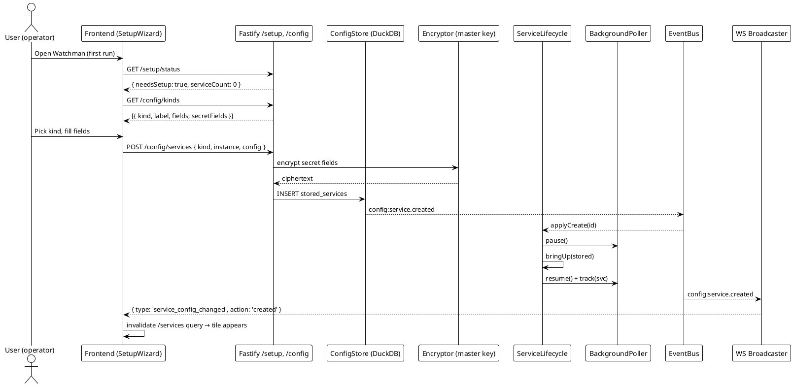
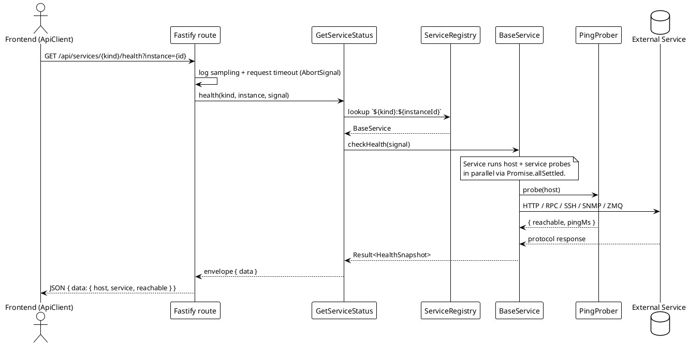
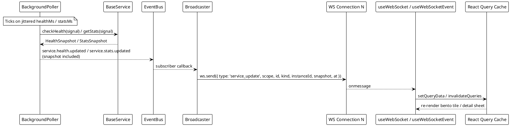
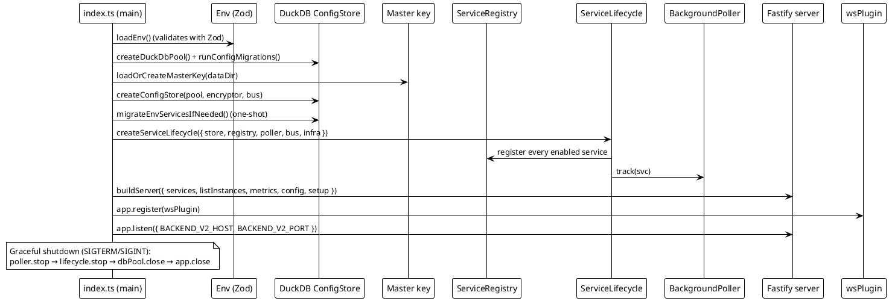

# Data Flow

> [!abstract] Overview
> This document describes the primary data flows in Watchman: setup, service monitoring with the two-tier health model, real-time WebSocket updates, and the encrypted ConfigStore service lifecycle.
>
> **No built-in authentication** — Watchman is a single-user home-lab app; network isolation (firewall / VPN / LAN) is the operator's responsibility. See [[docs/adr/017-remove-authentication-frontend-v2-migration|ADR-017]].
>
> **Two-Tier Health Model** (Phase 0a): Each service check runs ICMP ping and protocol probe in parallel, returning separate `host` and `service` tiers. See [[docs/adr/019-two-tier-health-and-monitoring-upgrades|ADR-019]] Phase 0a.

## Setup Wizard / First-Run Flow

```
1. App starts → backend reads dataDir, loads-or-creates the master key
2. ConfigStore migrations run (DuckDB)
3. Optional env→DB migration: legacy env services are imported once
4. ServiceLifecycle.start() loads all stored services, brings up enabled ones,
   registers them in ServiceRegistry, hands them to BackgroundPoller
5. Frontend boots → GET /setup/status
   → { needsSetup: services.length === 0, serviceCount }
6. If needsSetup, the SetupWizard renders
7. User picks a kind from GET /config/kinds and submits config
   → POST /config/services
   → ConfigStore encrypts secret fields (AES-GCM, per-install master key)
   → INSERT into DuckDB, bus.emit('config:service.created')
   → ServiceLifecycle.applyCreate(id) brings up the service and tracks it
8. Broadcaster sees `config:service.created` and sends `service_config_changed`
9. Frontend invalidates `/services` query, the tile appears
```

## Service Monitoring Flow (Two-Tier Health)

```
1. Backend runs BackgroundPoller on healthMs interval
2. ServiceManager.getHealth(service) invokes service.checkHealth(signal)
3. Each service calls withHostPing() helper (new in Phase 0a):
   a. Promise.allSettled() runs in parallel:
      - ICMP ping to host via PingProber.probe()
      - Protocol probe (HTTP, RPC, SSH, etc.) via service-specific probe()
   b. Results assembled into HostHealth + ServiceHealth tiers
   c. Top-level reachable = AND/OR logic (service-dependent)
4. HealthSnapshot returned with host, service, and at timestamp
5. Frontend requests → GET /services/{kind}/health
6. Response cached (service-dependent TTL)
7. Frontend renders two indicator dots (host + service)
8. Tooltip shows host.pingMs + service.latencyMs + service.message
```

### Two-Tier Response Structure

```json
{
  "host": {
    "reachable": true,
    "pingMs": 12
  },
  "service": {
    "reachable": true,
    "latencyMs": 45,
    "message": "OK"
  },
  "reachable": true
}
```

- **host** — ICMP reachability (always attempted first)
- **service** — Protocol probe reachability (HTTP, RPC, SSH, etc.)
- **reachable** — Composite (semantics vary; HTTP services use `host AND service`, routers use `host OR service`)

### Stats Flow

```
1. Frontend requests stats → GET /api/services/{kind}/stats?instance={id}
2. Fastify request timeout attaches AbortSignal
3. GetServiceStatus.stats(kind, instance, signal) is invoked
4. ServiceRegistry resolves `${kind}:${instanceId}` → BaseService
5. svc.getStats(signal) returns a StatsSnapshot (cached in-process when applicable)
6. Envelope { data | error } returned to frontend; React Query stores it
```

## Real-Time Updates Flow

```
1. Frontend loads → establishes WebSocket connection
2. ConnectionManager tracks connected clients
3. BackgroundPoller polls services on configured interval (15s)
4. Status change detected → eventBus emits service.stats.updated or service.health.updated
5. Broadcaster receives event with snapshot payload
6. Broadcaster sends WebSocket message to all connected clients with snapshot included
7. Frontend hook (useWebSocket) processes message
8. React Query cache invalidated
9. UI re-renders with updated status
```

### WebSocket Message Payload (Phase 0a+)

All `service_update` messages now include optional `snapshot` field:

```json
{
  "type": "service_update",
  "scope": "health" | "stats",
  "id": "bitcoin:main",
  "kind": "bitcoin",
  "instanceId": "main",
  "at": 1714000000000,
  "snapshot": { /* HealthSnapshot or StatsSnapshot if present */ }
}
```

- **snapshot** — Full `HealthSnapshot` or `StatsSnapshot` included when event is published; eliminates need for REST re-fetch on every WS event
- **scope** — "health" or "stats" to distinguish event type

## Configuration Flow (UI-Driven ConfigStore)

```
1. Backend starts → loadEnv() validates env with Zod
2. createDuckDbPool() + runConfigMigrations() prepare the on-disk store
3. loadOrCreateMasterKey(dataDir, WATCHMAN_MASTER_KEY) ensures key material
4. createConfigStore(dbPool, encryptor, bus) wires encrypted reads/writes
5. migrateEnvServicesIfNeeded() one-shot imports legacy ENABLED_SERVICES env
6. ServiceLifecycle.start() iterates StoredService rows:
   - bringUp(stored) for each enabled service
   - svc.onStart() if present (e.g. Tor onStart spins up ControlPort event
     subscription for BW events — Task B5)
   - registry.register(svc) keyed by `${kind}:${instanceId}`
   - poller.track(svc) schedules jittered health + stats polls
7. Frontend lifecycle:
   - GET /setup/status renders SetupWizard if needsSetup
   - GET /config/kinds → field schema + secret-field list for each service type
   - GET /config/services / POST / PUT / DELETE go through ConfigStore;
     each write emits a typed bus event and triggers
     ServiceLifecycle.applyCreate/Update/Delete which re-registers
     and re-tracks the affected service
   - GET /services aggregates the live registry into BentoDashboard tiles
8. Graceful shutdown (SIGTERM/SIGINT): poller.stop → lifecycle.stop
   → dbPool.close → app.close (each service's onStop runs in turn)
```

## PlantUML Diagrams

### Setup Wizard Flow



### Service Monitoring Flow (two-tier health)



### Real-Time Updates Flow



### Boot / Lifecycle Initialization Flow



## Related

- [[docs/architecture/backend-architecture|Backend Architecture]]
- [[docs/architecture/frontend-architecture|Frontend Architecture]]
- [[docs/features/real-time-updates|Real-Time Updates]]
- [[docs/adr/017-remove-authentication-frontend-v2-migration|ADR-017 — Single-user, no auth]]
- [[docs/adr/015-ui-driven-service-configuration|ADR-015 — UI-driven ConfigStore]]
- [[docs/flow-visualizer.html|Interactive flow visualizer]]
