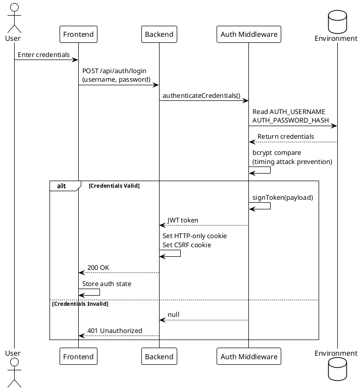
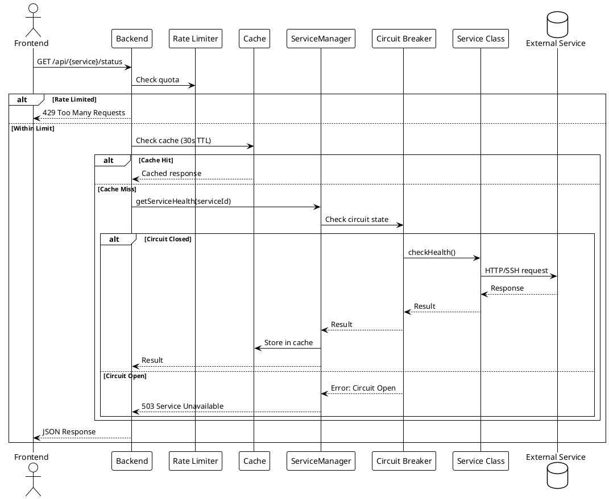
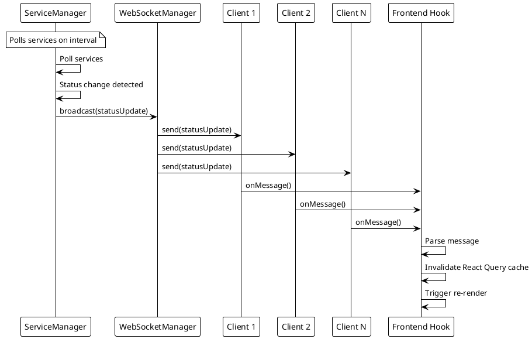
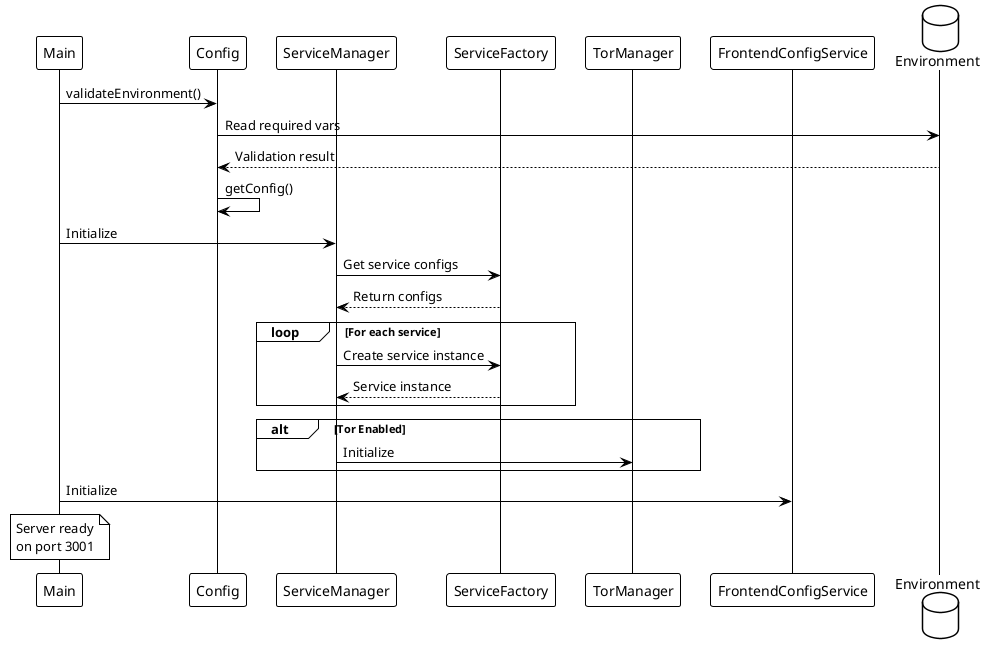

# Data Flow

> [!abstract] Overview
> This document describes the primary data flows in Watchman: authentication, service monitoring, and real-time updates.

## Authentication Flow

```
1. User submits credentials → POST /api/auth/login
2. Backend validates credentials (bcrypt hash comparison)
3. JWT access token generated
4. Token set as HTTP-only cookie with secure flags
5. CSRF token issued (double-submit cookie pattern)
6. Frontend stores auth state
7. Subsequent requests include JWT cookie automatically
8. CSRF token sent in request header for mutations
9. Middleware validates JWT on protected routes
10. CSRF middleware verifies token match
```

### Cookie Configuration

- `httpOnly: true` - Not accessible via JavaScript
- `secure: true` (production) - HTTPS only
- `sameSite: strict` (production) - CSRF protection
- `maxAge: 8 hours` - Session duration

## Service Monitoring Flow

```
1. Frontend requests service status → GET /api/{service}/status
2. Rate limiting middleware checks request quota
3. Cache middleware checks for cached response (30s TTL)
4. ServiceManager retrieves service instance
5. Circuit breaker checks service health state
6. Service makes HTTP/SSH call to external service
7. Response normalized and cached
8. JSON response sent to frontend
9. Frontend updates UI with service status
```

### Stats Flow (requires auth)

```
1. Frontend requests stats → GET /api/{service}/stats
2. Auth middleware validates JWT
3. Cache middleware checks for cached response (60s TTL)
4. ServiceManager retrieves service instance
5. Service fetches detailed statistics
6. Response cached and returned
```

## Real-Time Updates Flow

```
1. Frontend loads → establishes WebSocket connection
2. WebSocketManager tracks connected clients
3. ServiceManager polls services on configured interval
4. Status change detected → WebSocketManager.broadcast()
5. All connected clients receive update
6. Frontend hook (useWebSocket) processes message
7. React Query cache invalidated
8. UI re-renders with updated status
```

## Configuration Flow

```
1. Backend starts → validateEnvironment()
2. Parse ENABLED_SERVICES from env
3. Parse multi-instance configurations
4. Initialize ServiceManager
5. Initialize TorManager (if tor enabled)
6. Initialize each service via factory pattern
7. Frontend requests config → GET /api/config/frontend
8. FrontendConfigService returns enabled services list
9. Frontend renders cards for enabled services
```

## PlantUML Diagrams

### Authentication Flow



### Service Monitoring Flow



### Real-Time Updates Flow



### Configuration Initialization Flow



## Related

- [[docs/architecture/backend-architecture|Backend Architecture]]
- [[docs/architecture/frontend-architecture|Frontend Architecture]]
- [[docs/security/authentication|Authentication]]
