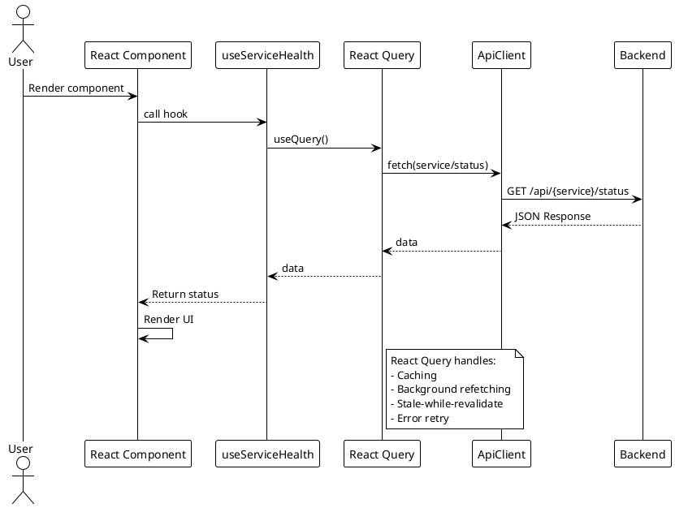
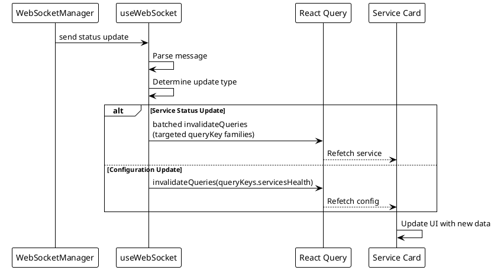

# Frontend Architecture

> [!abstract] Overview
> The Watchman frontend is a **single-user** React 18 + TypeScript application built with Vite, styled with Tailwind CSS. It consumes the v2 API contract with standardized response envelope ({data} or {error}). **Phase 2** introduces a dark-luxury design system with OKLCH tokens, Geist typography, and 14 typed primitives. **Phase 3** adds the bento dashboard with a renderer registry pattern driving all service tiles. No authentication required.

## Entry Point

[[apps/frontend/src/main.tsx|main.tsx]] - Application bootstrap.
[[apps/frontend/src/App.tsx|App.tsx]] - Root component with routing and offline banner.

**Backend URL Resolution (Split Deploy)**

In split-deploy mode (Electron client paired with remote Pi backend):

- `[[apps/frontend/src/lib/backendUrl.ts|backendUrl.ts]]` defines `getBackendUrl()` which reads from `window.__WATCHMAN__.apiUrl` (injected by Electron IPC)
- If `apiUrl` is not set, returns empty string (dev mode uses vite proxy to `localhost:3001`)
- SetupWizard gates on `apiUrl` presence; if empty, starts at ConnectStep (split-deploy URL entry)
- OfflineBanner polls `/meta/health` every 10s; if 3 consecutive probes fail, shows offline state with Retry and Change URL options
- See [[docs/adr/018-split-deploy-pi-backend|ADR-018]] for architecture rationale

## Pages

| Page                       | File                                                            | Description                                                                                      |
| -------------------------- | --------------------------------------------------------------- | ------------------------------------------------------------------------------------------------ |
| Dashboard (Legacy)         | Removed (Phase 3)                                               | Replaced by bento dashboard                                                                      |
| Dashboard (Bento, Phase 3) | `[[apps/frontend/src/components/dashboard/BentoDashboard.tsx]]` | New bento dashboard (behind `?bento=1` flag)                                                     |
| Setup Wizard               | `[[apps/frontend/src/pages/setup/SetupWizard.tsx]]`             | Multi-step first-boot configuration wizard (4 steps: welcome → kind picker → configure → review) |
| Settings — Services        | `[[apps/frontend/src/pages/Settings/Services.tsx]]`             | Service CRUD interface with list, edit, delete                                                   |
| Settings — Editor          | `[[apps/frontend/src/pages/Settings/ServiceEditor.tsx]]`        | Dynamic form driven by `/config/kinds` schemas                                                   |
| Settings — Audit           | `[[apps/frontend/src/pages/Settings/Audit.tsx]]`                | Timeline of configuration changes and migrations                                                 |
| Not Found                  | `[[apps/frontend/src/pages/NotFound.tsx]]`                      | 404 fallback page                                                                                |

> [!note] Auth Removed (v2.3)
> The Login page and AuthGuard component have been removed as of v2.3. Watchman is now a single-user application. See [[docs/adr/017-remove-authentication-frontend-v2-migration|ADR-017]] for details.

## Component Hierarchy: Legacy (Phase 1–2)

```
App
├── Router
│   ├── Index (Dashboard)
│   │   ├── LiveServerDashboard
│   │   │   ├── dashboardStatus helpers
│   │   │   ├── dashboardData helpers
│   │   │   ├── useDashboardQueries hook
│   │   │   ├── DashboardTileSection
│   │   │   ├── ServerStatusBadge
│   │   │   └── Service Cards (grid)
│   │   │       ├── ServiceLink
│   │   │       ├── UpdateBadge
│   │   │       └── [Service-specific Card] (14 total)
│   │   └── ErrorBoundary
│   └── NotFound
```

## Component Hierarchy: Bento (Phase 3+, behind `?bento=1`)

```
App
├── Router
│   ├── BentoDashboard (Phase 3)
│   │   ├── useServiceInstances (fetch /api/instances)
│   │   ├── TooltipProvider
│   │   ├── DashboardGrid (12-col)
│   │   │   └── ServiceTile[] (filtered by renderer + configured instance count)
│   │   │       ├── Surface (tone-aware)
│   │   │       ├── StatusDot (health indicator)
│   │   │       ├── Badge (status label)
│   │   │       ├── MetricValue (primary stat)
│   │   │       └── 2-col dl (secondary metrics)
│   │   └── ServiceDetailSheet (on tile click)
│   │       ├── Tabs
│   │       │   ├── Metrics Tab (detail groups from renderer)
│   │       │   └── Charts Tab (Phase 5 placeholder)
│   │       └── History (Phase 5: visx charts)
│   └── NotFound
```

**Note**: BentoDashboard dynamically filters tiles by checking both renderer availability and configured service instances via the `/api/instances` endpoint. If no instances exist, displays empty state.

## Service Cards (Removed — Phase 3)

All 18 service-specific card components (`AdGuardCard`, `BitcoinCard`, `TorCard`, etc.) were removed in Phase 3. The bento dashboard replaces them with a single [[apps/frontend/src/components/tile/ServiceTile.tsx|ServiceTile]] component driven by the renderer registry. See [[docs/reference/code-patterns|ServiceRenderer Registry Pattern]].

## State Management

### Data Fetching

- **TanStack Query (React Query)** - Server state management
- **ApiClient** - public HTTP client wrapper (`[[apps/frontend/src/services/ApiClient.ts]]`) backed by decomposed internals in `[[apps/frontend/src/services/apiClient/core.ts]]`, `[[apps/frontend/src/services/apiClient/endpoints.ts]]`, and `[[apps/frontend/src/services/apiClient/types.ts]]`
  - **Timeout handling**: Uses native `AbortSignal.timeout(timeoutMs)` combined with optional caller signal via `AbortSignal.any()` (removes manual timer leak)
  - **Catch branch**: Handles both `TimeoutError` and `AbortError` (native abort signal errors)
- **queryKeys** - Centralized query key factory (`[[apps/frontend/src/lib/queryKeys.ts]]`)
- **Dashboard tile helpers** - `[[apps/frontend/src/components/dashboard/dashboardData.ts]]` provides reusable instance-tile assembly helpers (`appendInstanceTiles`, `getInstanceNumber`)
- **Dashboard section rendering** - `[[apps/frontend/src/components/dashboard/DashboardTileSection.tsx]]` centralizes repeated Software/Hardware tile-section rendering

### Frontend Logging

- Frontend diagnostics for hooks/components are normalized through `[[apps/frontend/src/lib/logger.ts]]` rather than direct `console.*` usage in hot paths.
- Recent cleanup updates include `[[apps/frontend/src/hooks/useWebSocket.ts]]` and `[[apps/frontend/src/components/ErrorBoundary.tsx]]`.
- Logger redaction fallback now handles regex matches without a capture group by returning `[REDACTED]` (covered in `[[apps/frontend/src/lib/logger.test.ts]]`).
- WebSocket hook behavior coverage now includes `[[apps/frontend/src/hooks/useWebSocket.test.tsx]]` for batched/deduped invalidation and alert/unknown message handling.

### Query Retry

- React Query retry behavior in `[[apps/frontend/src/App.tsx]]` uses a predicate that avoids retries for 4xx responses while keeping capped retries for retryable failures

### Service Renderer Registry (Phase 3)

The bento dashboard uses a pluggable renderer registry to drive tile summaries, detail sheets, and charts. Each service kind has a `ServiceRenderer` that defines:

- **summary** — 1–3 key metrics for the tile view
- **detail** — Metric groups for the detail sheet
- **charts** — Chart specs for Phase 5 visualization
- **tone()** — Function to derive status (ok/warn/crit) from health + stats
- **quickLink()** — Optional URL to native service UI
- **subtitle()** — Optional custom text for context

Location: `[[apps/frontend/src/services/renderers/]]`

| Service      | Status     | Location                                               |
| ------------ | ---------- | ------------------------------------------------------ |
| Bitcoin      | ✅ Phase 3 | `[[apps/frontend/src/services/renderers/bitcoin.ts]]`  |
| Synology     | ✅ Phase 3 | `[[apps/frontend/src/services/renderers/synology.ts]]` |
| 14 remaining | ⏳ Phase 4 | Stubbed in `index.ts`                                  |

**Registry API**: `getRenderer(kind: ServiceKind)` returns the renderer or undefined if not yet implemented.

See [[docs/services/renderers/index|Renderer Registry Documentation]] for complete specification and implementation guide.

### Custom Hooks

| Hook                  | Purpose                        | File                                                  |
| --------------------- | ------------------------------ | ----------------------------------------------------- |
| `useSetupDismissal`   | Setup wizard dismissal state   | `[[apps/frontend/src/hooks/useSetupDismissal.ts]]`    |
| `useServiceHealth`    | Single service health          | `[[apps/frontend/src/hooks/useServiceHealth.ts]]`     |
| `useServiceInstances` | Multi-instance management      | `[[apps/frontend/src/hooks/useServiceInstances.tsx]]` |
| `useEnabledServices`  | Enabled services config        | `[[apps/frontend/src/hooks/useEnabledServices.ts]]`   |
| `useBackendReachable` | LAN backend reachability probe | `[[apps/frontend/src/hooks/useBackendReachable.ts]]`  |
| `useWebSocket`        | Real-time WebSocket connection | `[[apps/frontend/src/hooks/useWebSocket.ts]]`         |
| `use-mobile`          | Mobile breakpoint              | `[[apps/frontend/src/hooks/use-mobile.tsx]]`          |

> [!note] Removed (v2.3)
> Deleted hooks: `useAuth`, `useFrontendConfig` (auth removed); deleted modules: `csrf.ts`, `RequestOptimizer.ts`. See [[docs/adr/017-remove-authentication-frontend-v2-migration|ADR-017]].

## Routing

React Router v7 with the following structure:

- `/` → Dashboard (Index page)
- `*` → Not Found page

> [!info] No Auth Routes (v2.3)
> Login page and route protection have been removed. Watchman is single-user with no authentication.

## Styling & Design System

- **Design System** - Dark-luxury OKLCH tokens, Geist typography, motion foundations, and the ADR-028 liquid-glass material layer (see [[docs/architecture/frontend-design-system|Frontend Design System]])
- **Glass material** (`styles/glass.css`) - `.glass-thin/regular/thick/topbar` frosted utilities applied app-wide; static `.atmosphere` backdrop rendered once at the App root in `App.tsx` (see [[docs/adr/028-liquid-glass-observability-tiles|ADR-028]])
- **Service visuals** (`lib/serviceVisuals.ts`) - Per-service icon watermark map and `heroState()` bool-hero chip helper shared by `ServiceTile` and `ServiceDetailSheet`
- **Primitives** - 14 typed components <150 LOC each (see [[docs/components/primitives/index|Primitives Index]])
- **Tailwind CSS** - Utility-first CSS framework with extended token utilities
- **shadcn/ui** - Component library (`[[apps/frontend/src/components/ui/]]`, legacy, scheduled for gradual replacement)
- **PostCSS** - CSS processing

## PlantUML Diagrams

### Component Hierarchy

```plantuml
@startuml
!theme plain

package "App" {
  [App.tsx] as App
}

package "Router" {
  [Index.tsx] as Dashboard
  [Login.tsx] as Login
  [NotFound.tsx] as NotFound
}

package "Layout" {
  [LiveServerDashboard] as Layout
  [DashboardTileSection] as DashSection
  [dashboardStatus.ts] as DashStatus
  [dashboardData.ts] as DashData
  [useDashboardQueries.ts] as DashQueries
  [ErrorBoundary] as ErrBoundary
}

package "Shared Components" {
  [ServerStatusBadge] as Badge
  [ServiceLink] as SvcLink
  [UpdateBadge] as Update
}

package "Service Cards" {
  [AdGuardCard] as AdGuard
  [BitcoinCard] as Bitcoin
  [TorCard] as Tor
  [QBittorrentCard] as QB
  [IpfsCard] as IPFS
  [SynologyCard] as Syno
  [RoonCard] as Roon
  [PhilipsBridgeCard] as Philips
  [HomebridgeCard] as HB
  [MacMiniCard] as Mac
  [AlbyHubCard] as Alby
  [RaspberryPiCard] as RPi
  [RouterCard] as Router
}

package "Hooks" {
  [useAuth] as Auth
  [useServiceHealth] as SvcHealthOne
  [useServiceInstances] as SvcInst
  [useEnabledServices] as Enabled
  [useWebSocket] as WS
  [useFrontendConfig] as Config
  [useMobile] as Mobile
  [useToast] as Toast
}

package "Services" {
  [ApiClient] as API
  [queryKeys] as QueryKeys
}

App --> Router : routes
Router --> Dashboard
Router --> Login
Router --> NotFound

Dashboard --> Layout
Dashboard --> ErrBoundary

Layout --> Badge
Layout --> DashSection
Layout --> DashStatus : uses
Layout --> DashData : uses
Layout --> DashQueries : uses

Layout --> AdGuard
Layout --> Bitcoin
Layout --> Tor
Layout --> QB
Layout --> IPFS
Layout --> Syno
Layout --> Roon
Layout --> Philips
Layout --> HB
Layout --> Mac
Layout --> Alby
Layout --> RPi
Layout --> Router
Layout --> SvcLink
Layout --> Update

Auth --> API : uses
SvcHealthOne --> API : uses
SvcHealthOne --> QueryKeys : keys
SvcInst --> API : uses
Enabled --> API : uses
Enabled --> QueryKeys : keys
Config --> QueryKeys : keys
WS --> API : connects
WS --> QueryKeys : invalidates
@enduml
```

### Data Fetching Flow



### WebSocket Integration



## Related

- [[docs/architecture/frontend-design-system|Frontend Design System]] — Tokens, typography, motion, elevation
- [[docs/architecture/data-flow|Data Flow]]
- [[docs/architecture/core-systems|Core Systems]] — Event Bus and Service Lifecycle
- [[docs/components/index|Components Index]]
- [[docs/components/primitives/index|Primitives Index]] — 14 core primitives
- [[docs/performance/request-optimization|Request Optimization]]
