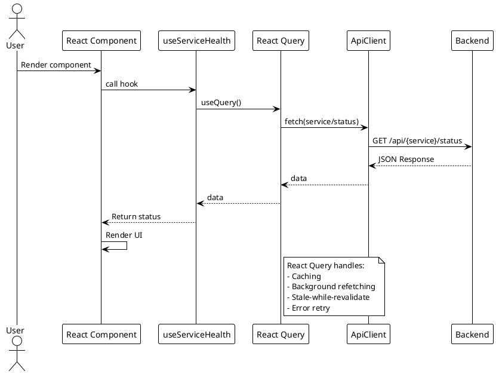
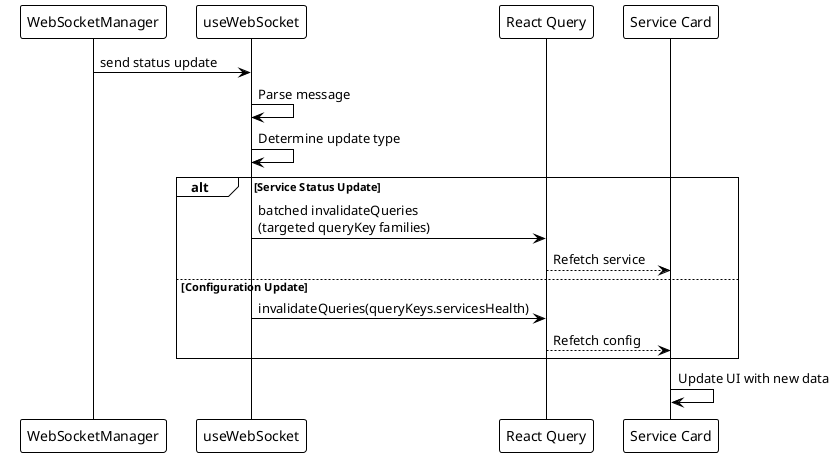

# Frontend Architecture

> [!abstract] Overview
> The Watchman frontend is a React 18 + TypeScript application built with Vite, styled with Tailwind CSS and shadcn/ui components.

## Entry Point

[[apps/frontend/src/main.tsx|main.tsx]] - Application bootstrap.
[[apps/frontend/src/App.tsx|App.tsx]] - Root component with routing.

## Pages

| Page      | File                                       | Description               |
| --------- | ------------------------------------------ | ------------------------- |
| Dashboard | `[[apps/frontend/src/pages/Index.tsx]]`    | Main monitoring dashboard |
| Login     | `[[apps/frontend/src/pages/Login.tsx]]`    | Authentication page       |
| Not Found | `[[apps/frontend/src/pages/NotFound.tsx]]` | 404 fallback page         |

## Component Hierarchy

```
App
├── Router
│   ├── Index (Dashboard)
│   │   ├── LiveServerDashboard
│   │   │   ├── dashboardStatus helpers
│   │   │   ├── dashboardData helpers
│   │   │   ├── useDashboardQueries hook
│   │   │   ├── DashboardTileSection
│   │   │   ├── ServerStatusBadge
│   │   │   └── Service Cards (grid)
│   │   │       ├── ServiceLink
│   │   │       ├── UpdateBadge
│   │   │       └── [Service-specific Card]
│   │   └── ErrorBoundary
│   ├── Login
│   │   └── AuthGuard
│   └── NotFound
```

## Service Cards

Each service has a dedicated card component with service-specific queries/rendering. Legacy shared base card wrappers were removed during refactor.

- Type-focused cleanup in card internals keeps behavior unchanged while reducing loose casting in frontend config/stat access (notably [[apps/frontend/src/components/IpfsCard.tsx|IpfsCard.tsx]] and [[apps/frontend/src/components/AlbyHubCard.tsx|AlbyHubCard.tsx]]).
- `IpfsCard` now uses a local `IpfsStats` payload type plus typed `FrontendConfig` access; `AlbyHubCard` now uses typed `FrontendConfig` access.

| Card Component    | Base      | File                                                     |
| ----------------- | --------- | -------------------------------------------------------- |
| AdGuardCard       | Optimized | `[[apps/frontend/src/components/AdGuardCard.tsx]]`       |
| BitcoinCard       | Optimized | `[[apps/frontend/src/components/BitcoinCard.tsx]]`       |
| TorCard           | Optimized | `[[apps/frontend/src/components/TorCard.tsx]]`           |
| QBittorrentCard   | Optimized | `[[apps/frontend/src/components/QBittorrentCard.tsx]]`   |
| IpfsCard          | Optimized | `[[apps/frontend/src/components/IpfsCard.tsx]]`          |
| SynologyCard      | Optimized | `[[apps/frontend/src/components/SynologyCard.tsx]]`      |
| RoonCard          | Optimized | `[[apps/frontend/src/components/RoonCard.tsx]]`          |
| PhilipsBridgeCard | Optimized | `[[apps/frontend/src/components/PhilipsBridgeCard.tsx]]` |
| HomebridgeCard    | Optimized | `[[apps/frontend/src/components/HomebridgeCard.tsx]]`    |
| MacMiniCard       | Optimized | `[[apps/frontend/src/components/MacMiniCard.tsx]]`       |
| AlbyHubCard       | Optimized | `[[apps/frontend/src/components/AlbyHubCard.tsx]]`       |
| RaspberryPiCard   | Optimized | `[[apps/frontend/src/components/RaspberryPiCard.tsx]]`   |
| RouterCard        | Optimized | `[[apps/frontend/src/components/RouterCard.tsx]]`        |
| NostrcheckCard    | Optimized | `[[apps/frontend/src/components/NostrcheckCard.tsx]]`    |

## State Management

### Data Fetching

- **TanStack Query (React Query)** - Server state management
- **ApiClient** - public HTTP client wrapper (`[[apps/frontend/src/services/ApiClient.ts]]`) backed by decomposed internals in `[[apps/frontend/src/services/apiClient/core.ts]]`, `[[apps/frontend/src/services/apiClient/endpoints.ts]]`, and `[[apps/frontend/src/services/apiClient/types.ts]]`
- **queryKeys** - Centralized query key factory (`[[apps/frontend/src/lib/queryKeys.ts]]`)
- **UpdateBadge query path** - `[[apps/frontend/src/components/UpdateBadge.tsx]]` uses `useQuery` with `queryKeys.serviceUpdates(service)` and `apiClient.getServiceUpdates(service)` for update checks
- **Dashboard query orchestration** - `[[apps/frontend/src/components/dashboard/useDashboardQueries.ts]]` centralizes LiveServerDashboard queries and refresh behavior, with `torRelay` and `frontendConfig` fetched as separate queries
- **Dashboard manual refresh scope** - `refreshEnabledQueries()` in `[[apps/frontend/src/components/dashboard/useDashboardQueries.ts]]` also refetches `servicesHealthQuery` so overview counters refresh with manual refresh
- **Dashboard refresh coverage** - `[[apps/frontend/src/components/dashboard/useDashboardQueries.test.ts]]` covers `refreshEnabledQueries()` selective refetching for enabled services plus guaranteed `servicesHealth` refetch
- **Dashboard tile helpers** - `[[apps/frontend/src/components/dashboard/dashboardData.ts]]` provides reusable instance-tile assembly helpers (`appendInstanceTiles`, `getInstanceNumber`)
- **Dashboard section rendering** - `[[apps/frontend/src/components/dashboard/DashboardTileSection.tsx]]` centralizes repeated Software/Hardware tile-section rendering used by `[[apps/frontend/src/components/LiveServerDashboard.tsx]]`

### Frontend Logging

- Frontend diagnostics for hooks/components are normalized through `[[apps/frontend/src/lib/logger.ts]]` rather than direct `console.*` usage in hot paths.
- Recent cleanup updates include `[[apps/frontend/src/hooks/useWebSocket.ts]]`, `[[apps/frontend/src/hooks/useAuth.tsx]]`, `[[apps/frontend/src/components/ErrorBoundary.tsx]]`, and `[[apps/frontend/src/lib/csrf.ts]]`.
- Logger redaction fallback now handles regex matches without a capture group by returning `[REDACTED]` (covered in `[[apps/frontend/src/lib/logger.test.ts]]`).
- WebSocket hook behavior coverage now includes `[[apps/frontend/src/hooks/useWebSocket.test.tsx]]` for batched/deduped invalidation and alert/unknown message handling.

### Query Retry and Auth Bootstrap

- React Query retry behavior in `[[apps/frontend/src/App.tsx]]` now uses a predicate that avoids retries for 4xx responses while keeping capped retries for retryable failures
- Auth bootstrap in `[[apps/frontend/src/hooks/useAuth.tsx]]` keeps initial load behavior, and uses a silent post-login `/api/auth/me` refresh to avoid transient loading-state flicker

### Dashboard Re-render Isolation

- `Updated Xs ago` display in `[[apps/frontend/src/components/LiveServerDashboard.tsx]]` is isolated into memoized `LastUpdatedText` so the 1-second timer does not force full dashboard re-render

### Custom Hooks

| Hook                  | Purpose                        | File                                                  |
| --------------------- | ------------------------------ | ----------------------------------------------------- |
| `useAuth`             | Authentication state           | `[[apps/frontend/src/hooks/useAuth.tsx]]`             |
| `useServiceHealth`    | Single service health          | `[[apps/frontend/src/hooks/useServiceHealth.ts]]`     |
| `useServiceInstances` | Multi-instance management      | `[[apps/frontend/src/hooks/useServiceInstances.tsx]]` |
| `useEnabledServices`  | Enabled services config        | `[[apps/frontend/src/hooks/useEnabledServices.ts]]`   |
| `useWebSocket`        | Real-time WebSocket connection | `[[apps/frontend/src/hooks/useWebSocket.ts]]`         |
| `useFrontendConfig`   | Frontend configuration         | `[[apps/frontend/src/hooks/useFrontendConfig.ts]]`    |
| `use-mobile`          | Mobile breakpoint              | `[[apps/frontend/src/hooks/use-mobile.tsx]]`          |
| `use-toast`           | Toast notifications            | `[[apps/frontend/src/hooks/use-toast.ts]]`            |

> [!note]
> Removed hook/module references: `use-config.tsx` and `useServicesHealth.ts` are deleted; `RequestOptimizer.ts` is no longer present.

## Routing

React Router v6 with the following structure:

- `/` → Dashboard (Index page)
- `/login` → Login page
- `*` → Not Found page
- AuthGuard wraps protected routes

## Styling

- **Tailwind CSS** - Utility-first CSS framework
- **shadcn/ui** - Component library (`[[apps/frontend/src/components/ui/]]`)
- **PostCSS** - CSS processing

## PlantUML Diagrams

### Component Hierarchy

```plantuml
@startuml
!theme plain

package "App" {
  [App.tsx] as App
}

package "Router" {
  [Index.tsx] as Dashboard
  [Login.tsx] as Login
  [NotFound.tsx] as NotFound
}

package "Layout" {
  [LiveServerDashboard] as Layout
  [DashboardTileSection] as DashSection
  [dashboardStatus.ts] as DashStatus
  [dashboardData.ts] as DashData
  [useDashboardQueries.ts] as DashQueries
  [ErrorBoundary] as ErrBoundary
}

package "Shared Components" {
  [ServerStatusBadge] as Badge
  [ServiceLink] as SvcLink
  [UpdateBadge] as Update
}

package "Service Cards" {
  [AdGuardCard] as AdGuard
  [BitcoinCard] as Bitcoin
  [TorCard] as Tor
  [QBittorrentCard] as QB
  [IpfsCard] as IPFS
  [SynologyCard] as Syno
  [RoonCard] as Roon
  [PhilipsBridgeCard] as Philips
  [HomebridgeCard] as HB
  [MacMiniCard] as Mac
  [AlbyHubCard] as Alby
  [RaspberryPiCard] as RPi
  [RouterCard] as Router
  [NostrcheckCard] as Nostr
}

package "Hooks" {
  [useAuth] as Auth
  [useServiceHealth] as SvcHealthOne
  [useServiceInstances] as SvcInst
  [useEnabledServices] as Enabled
  [useWebSocket] as WS
  [useFrontendConfig] as Config
  [useMobile] as Mobile
  [useToast] as Toast
}

package "Services" {
  [ApiClient] as API
  [queryKeys] as QueryKeys
}

App --> Router : routes
Router --> Dashboard
Router --> Login
Router --> NotFound

Dashboard --> Layout
Dashboard --> ErrBoundary

Layout --> Badge
Layout --> DashSection
Layout --> DashStatus : uses
Layout --> DashData : uses
Layout --> DashQueries : uses

Layout --> AdGuard
Layout --> Bitcoin
Layout --> Tor
Layout --> QB
Layout --> IPFS
Layout --> Syno
Layout --> Roon
Layout --> Philips
Layout --> HB
Layout --> Mac
Layout --> Alby
Layout --> RPi
Layout --> Router
Layout --> Nostr
Layout --> SvcLink
Layout --> Update

Auth --> API : uses
SvcHealthOne --> API : uses
SvcHealthOne --> QueryKeys : keys
SvcInst --> API : uses
Enabled --> API : uses
Enabled --> QueryKeys : keys
Config --> QueryKeys : keys
WS --> API : connects
WS --> QueryKeys : invalidates
@enduml
```

### Data Fetching Flow



### WebSocket Integration



## Related

- [[docs/architecture/data-flow|Data Flow]]
- [[docs/components/index|Components Index]]
- [[docs/performance/request-optimization|Request Optimization]]
