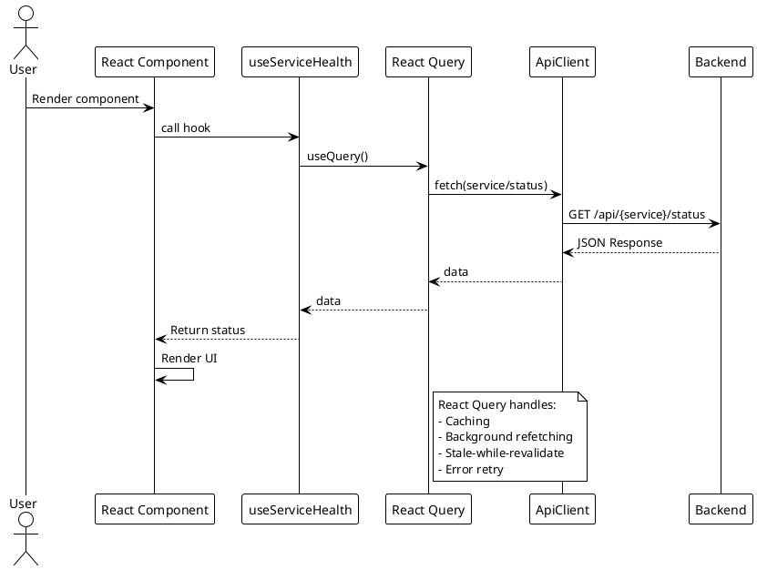
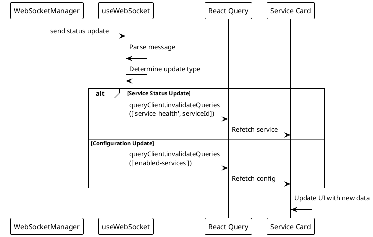

# Frontend Architecture

> [!abstract] Overview
> The Watchman frontend is a React 18 + TypeScript application built with Vite, styled with Tailwind CSS and shadcn/ui components.

## Entry Point

[[apps/frontend/src/main.tsx|main.tsx]] - Application bootstrap.
[[apps/frontend/src/App.tsx|App.tsx]] - Root component with routing.

## Pages

| Page      | File                                       | Description               |
| --------- | ------------------------------------------ | ------------------------- |
| Dashboard | `[[apps/frontend/src/pages/Index.tsx]]`    | Main monitoring dashboard |
| Login     | `[[apps/frontend/src/pages/Login.tsx]]`    | Authentication page       |
| Not Found | `[[apps/frontend/src/pages/NotFound.tsx]]` | 404 fallback page         |

## Component Hierarchy

```
App
├── Router
│   ├── Index (Dashboard)
│   │   ├── LiveServerDashboard
│   │   │   ├── ServerStatusBadge
│   │   │   └── Service Cards (grid)
│   │   │       ├── OptimizedServiceCard / PerformantServiceCard
│   │   │       │   ├── ServiceLink
│   │   │       │   └── UpdateBadge
│   │   │       └── [Service-specific Card]
│   │   └── ErrorBoundary
│   ├── Login
│   │   └── AuthGuard
│   └── NotFound
```

## Service Cards

Each service has a dedicated card component that extends either `OptimizedServiceCard` or `PerformantServiceCard`:

| Card Component    | Base      | File                                                     |
| ----------------- | --------- | -------------------------------------------------------- |
| AdGuardCard       | Optimized | `[[apps/frontend/src/components/AdGuardCard.tsx]]`       |
| BitcoinCard       | Optimized | `[[apps/frontend/src/components/BitcoinCard.tsx]]`       |
| TorCard           | Optimized | `[[apps/frontend/src/components/TorCard.tsx]]`           |
| QBittorrentCard   | Optimized | `[[apps/frontend/src/components/QBittorrentCard.tsx]]`   |
| IpfsCard          | Optimized | `[[apps/frontend/src/components/IpfsCard.tsx]]`          |
| SynologyCard      | Optimized | `[[apps/frontend/src/components/SynologyCard.tsx]]`      |
| RoonCard          | Optimized | `[[apps/frontend/src/components/RoonCard.tsx]]`          |
| PhilipsBridgeCard | Optimized | `[[apps/frontend/src/components/PhilipsBridgeCard.tsx]]` |
| HomebridgeCard    | Optimized | `[[apps/frontend/src/components/HomebridgeCard.tsx]]`    |
| MacMiniCard       | Optimized | `[[apps/frontend/src/components/MacMiniCard.tsx]]`       |
| AlbyHubCard       | Optimized | `[[apps/frontend/src/components/AlbyHubCard.tsx]]`       |
| RaspberryPiCard   | Optimized | `[[apps/frontend/src/components/RaspberryPiCard.tsx]]`   |
| RouterCard        | Optimized | `[[apps/frontend/src/components/RouterCard.tsx]]`        |
| NostrcheckCard    | Optimized | `[[apps/frontend/src/components/NostrcheckCard.tsx]]`    |

## State Management

### Data Fetching

- **TanStack Query (React Query)** - Server state management
- **RequestOptimizer** - Request batching and deduplication (`[[apps/frontend/src/services/RequestOptimizer.ts]]`)
- **ApiClient** - HTTP client wrapper (`[[apps/frontend/src/services/ApiClient.ts]]`)

### Custom Hooks

| Hook                  | Purpose                        | File                                                  |
| --------------------- | ------------------------------ | ----------------------------------------------------- |
| `useAuth`             | Authentication state           | `[[apps/frontend/src/hooks/useAuth.tsx]]`             |
| `useServicesHealth`   | Batch health polling           | `[[apps/frontend/src/hooks/useServicesHealth.ts]]`    |
| `useServiceHealth`    | Single service health          | `[[apps/frontend/src/hooks/useServiceHealth.ts]]`     |
| `useServiceInstances` | Multi-instance management      | `[[apps/frontend/src/hooks/useServiceInstances.tsx]]` |
| `useEnabledServices`  | Enabled services config        | `[[apps/frontend/src/hooks/useEnabledServices.ts]]`   |
| `useWebSocket`        | Real-time WebSocket connection | `[[apps/frontend/src/hooks/useWebSocket.ts]]`         |
| `use-config`          | Frontend configuration         | `[[apps/frontend/src/hooks/use-config.tsx]]`          |
| `use-mobile`          | Mobile breakpoint              | `[[apps/frontend/src/hooks/use-mobile.tsx]]`          |
| `use-toast`           | Toast notifications            | `[[apps/frontend/src/hooks/use-toast.ts]]`            |

## Routing

React Router v6 with the following structure:

- `/` → Dashboard (Index page)
- `/login` → Login page
- `*` → Not Found page
- AuthGuard wraps protected routes

## Styling

- **Tailwind CSS** - Utility-first CSS framework
- **shadcn/ui** - Component library (`[[apps/frontend/src/components/ui/]]`)
- **PostCSS** - CSS processing

## PlantUML Diagrams

### Component Hierarchy

```plantuml
@startuml
!theme plain

package "App" {
  [App.tsx] as App
}

package "Router" {
  [Index.tsx] as Dashboard
  [Login.tsx] as Login
  [NotFound.tsx] as NotFound
}

package "Layout" {
  [LiveServerDashboard] as Layout
  [ErrorBoundary] as ErrBoundary
}

package "Shared Components" {
  [ServerStatusBadge] as Badge
  [ServiceLink] as SvcLink
  [UpdateBadge] as Update
}

package "Service Cards" {
  [OptimizedServiceCard] as OptCard
  [PerformantServiceCard] as PerfCard
  [AdGuardCard] as AdGuard
  [BitcoinCard] as Bitcoin
  [TorCard] as Tor
  [QBittorrentCard] as QB
  [IpfsCard] as IPFS
  [SynologyCard] as Syno
  [RoonCard] as Roon
  [PhilipsBridgeCard] as Philips
  [HomebridgeCard] as HB
  [MacMiniCard] as Mac
  [AlbyHubCard] as Alby
  [RaspberryPiCard] as RPi
  [RouterCard] as Router
  [NostrcheckCard] as Nostr
}

package "Hooks" {
  [useAuth] as Auth
  [useServicesHealth] as SvcHealth
  [useServiceHealth] as SvcHealthOne
  [useServiceInstances] as SvcInst
  [useEnabledServices] as Enabled
  [useWebSocket] as WS
  [useConfig] as Config
  [useMobile] as Mobile
  [useToast] as Toast
}

package "Services" {
  [ApiClient] as API
  [RequestOptimizer] as Optimizer
}

App --> Router : routes
Router --> Dashboard
Router --> Login
Router --> NotFound

Dashboard --> Layout
Dashboard --> ErrBoundary

Layout --> Badge
Layout --> OptCard
Layout --> PerfCard

OptCard --> AdGuard : extends
OptCard --> Bitcoin : extends
OptCard --> Tor : extends
OptCard --> IPFS : extends
OptCard --> Syno : extends
OptCard --> Roon : extends
OptCard --> Philips : extends
OptCard --> HB : extends
OptCard --> Mac : extends
OptCard --> Alby : extends
OptCard --> RPi : extends
OptCard --> Router : extends
OptCard --> Nostr : extends

OptCard --> SvcLink
OptCard --> Update

Auth --> API : uses
SvcHealth --> API : uses
SvcHealth --> Optimizer : uses
SvcHealthOne --> API : uses
SvcInst --> API : uses
Enabled --> API : uses
WS --> API : connects
@enduml
```

### Data Fetching Flow



### WebSocket Integration



## Related

- [[docs/architecture/data-flow|Data Flow]]
- [[docs/components/index|Components Index]]
- [[docs/performance/request-optimization|Request Optimization]]
