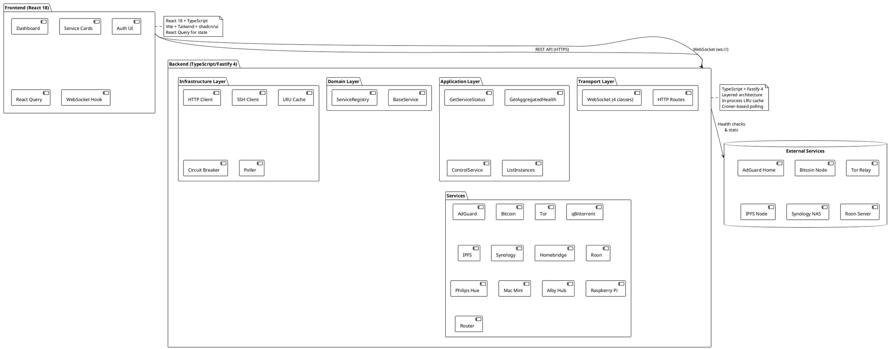
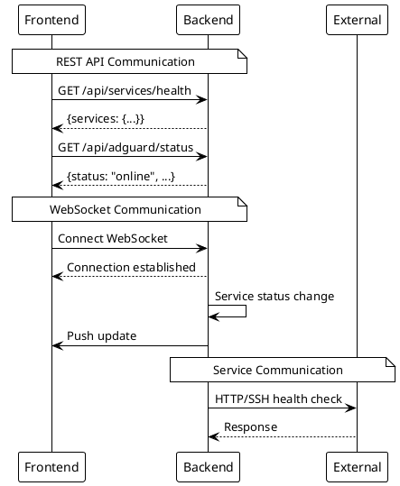

# Architecture

> [!abstract] Overview
> Watchman is a **single-user home-lab monitoring dashboard** with a React 18 frontend and TypeScript + Fastify 4 backend. No built-in authentication; security relies on network isolation. The backend uses a layered architecture (config → core → infra → domain → application → transport) with in-process LRU caching and croner-based background polling. The frontend is available as both a web app and as a standalone Electron desktop wrapper.

> [!note]
> The backend is bootstrapped from [[apps/backend/src/index.ts|index.ts]], which initializes the config, core, infra, and domain layers, then registers HTTP routes and WebSocket handlers via Fastify. The desktop app [[apps/desktop/src/main.ts|main.ts]] spawns the backend process and serves the frontend via a custom `watchman://` protocol.

## Architecture Index

```dataview
TABLE WITHOUT ID file.link AS "Document", date AS "Date", status AS "Status"
FROM "docs/architecture"
WHERE type = "architecture"
SORT file.name ASC
```

## Documents

| Document                                  | Description             |
| ----------------------------------------- | ----------------------- | ----------------------------------------------- |
| [[docs/architecture/frontend-design-system | Frontend Design System]] | OKLCH tokens, typography, motion, primitives |
| [[docs/architecture/backend-architecture  | Backend Architecture]]  | Services, middleware, routes, and orchestration |
| [[docs/architecture/frontend-architecture | Frontend Architecture]] | Pages, components, hooks, and state management  |
| [[docs/architecture/core-systems          | Core Systems]]          | Event Bus and Service Lifecycle orchestration  |
| [[docs/architecture/data-flow             | Data Flow]]             | Authentication, monitoring, and WebSocket flows |

## Deployment Topology

### Bundled Electron (Single-Box)

Frontend and backend run on the same machine (macOS, Windows, or Linux) as a standalone Electron app. The backend process is spawned as a child of the Electron main process at startup and uses a loopback port. Data (master key, service configs) lives at `<userData>/data/`. See [[docs/adr/016-electron-desktop-wrapper|ADR-016]] and [[docs/guides/running-the-desktop-app|Desktop App Guide]].

## System Overview

```
┌─────────────────────────────────────────────────────────────┐
│                    Frontend (Vite + React)                  │
│  ┌──────────────┐  ┌──────────────┐  ┌──────────────┐     │
│  │   Dashboard  │  │  Service     │  │   Settings   │     │
│  │              │  │  Cards       │  │              │     │
│  └──────────────┘  └──────────────┘  └──────────────┘     │
└─────────────────────────────────────────────────────────────┘
                            │ HTTP (LAN)
                            ▼
┌─────────────────────────────────────────────────────────────┐
│            Backend API (Node.js + Fastify 4)                │
│  ┌──────────────┐  ┌──────────────┐  ┌──────────────┐     │
│  │  Middleware  │  │   Logging    │  │   API Routes │     │
│  │  - CORS      │  │  - Audit     │  │  - /health   │     │
│  │  - Timeout   │  │  - PII       │  │  - /api/*    │     │
│  │  - Validation│  │  - redaction │  │  - /api/docs │     │
│  └──────────────┘  └──────────────┘  └──────────────┘     │
│                                                             │
│  ┌─────────────────────────────────────────────────────┐   │
│  │            ServiceRegistry + Poller                │   │
│  │  ┌────────┐ ┌────────┐ ┌────────┐ ┌────────┐     │   │
│  │  │AdGuard │ │Bitcoin │ │  Tor   │ │ IPFS   │ ... │   │
│  │  └────────┘ └────────┘ └────────┘ └────────┘     │   │
│  │                                                    │   │
│  │  DuckDB: service config + audit trail             │   │
│  │  In-memory: recent-activity ring buffer           │   │
│  └─────────────────────────────────────────────────────┘   │
└─────────────────────────────────────────────────────────────┘
                            │
              ┌─────────────┼─────────────┐
              ▼             ▼             ▼
    ┌──────────────┐ ┌──────────────┐ ┌──────────────┐
    │   AdGuard    │ │   Bitcoin    │ │     Tor      │
    │     Home     │ │     Node     │ │    Relay     │
    └──────────────┘ └──────────────┘ └──────────────┘
```

## Related

- [[docs/adr/index|Architecture Decision Records]]
- [[docs/adr/013-backend-rewrite-typescript-fastify|ADR-013]] — TypeScript + Fastify 4 backend
- [[docs/adr/014-time-series-duckdb-and-bento-design-system|ADR-014]] — Time-series + bento design system
- [[docs/adr/015-ui-driven-service-configuration|ADR-015]] — UI-driven service configuration with DuckDB + encryption
- [[docs/adr/016-electron-desktop-wrapper|ADR-016]] — Electron desktop wrapper with custom protocol and subprocess backend
- [[docs/adr/017-remove-authentication-frontend-v2-migration|ADR-017]] — Single-user design, removed auth, frontend v2 migration
- [[docs/adr/019-revert-split-deploy-and-remove-time-series|ADR-019]] — Revert Pi split deploy; remove persistent time-series; restore Mac-only Electron + embedded backend
- [[docs/guides/running-the-desktop-app|Desktop App Guide]] — Build and run the Electron app
- [[docs/components/primitives/index|Primitive Components Index]]
- [[docs/features/index|Features]]

## PlantUML Diagrams

### System Architecture Overview



### Communication Patterns


