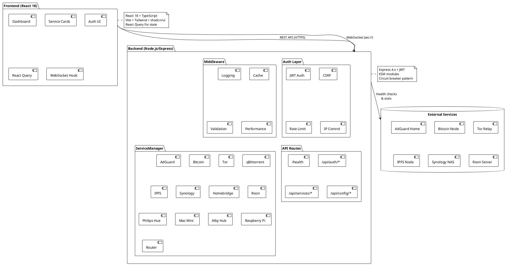
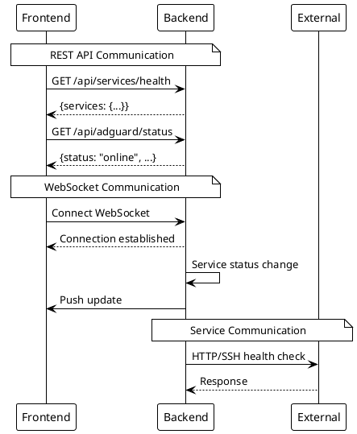

# Architecture

> [!abstract] Overview
> Watchman uses a client-server architecture with a React frontend and Node.js/Express backend communicating via REST API and WebSocket.

## Architecture Index

```dataview
TABLE WITHOUT ID file.link AS "Document", date AS "Date", status AS "Status"
FROM "docs/architecture"
WHERE type = "architecture"
SORT file.name ASC
```

## Documents

| Document                                  | Description             |
| ----------------------------------------- | ----------------------- | ----------------------------------------------- |
| [[docs/architecture/backend-architecture  | Backend Architecture]]  | Services, middleware, routes, and orchestration |
| [[docs/architecture/frontend-architecture | Frontend Architecture]] | Pages, components, hooks, and state management  |
| [[docs/architecture/data-flow             | Data Flow]]             | Authentication, monitoring, and WebSocket flows |

## System Overview

```
┌─────────────────────────────────────────────────────────────┐
│                    Frontend (Vite + React)                  │
│  ┌──────────────┐  ┌──────────────┐  ┌──────────────┐     │
│  │   Dashboard  │  │  Service     │  │   Auth UI    │     │
│  │              │  │  Cards       │  │              │     │
│  └──────────────┘  └──────────────┘  └──────────────┘     │
└─────────────────────────────────────────────────────────────┘
                            │ HTTPS / HTTP
                            ▼
┌─────────────────────────────────────────────────────────────┐
│                  Backend API (Node.js/Express)              │
│  ┌──────────────┐  ┌──────────────┐  ┌──────────────┐     │
│  │ Auth Layer   │  │  Middleware  │  │   API Routes │     │
│  │ - JWT        │  │  - CSRF      │  │  - /health   │     │
│  │ - Rate Limit │  │  - Logging   │  │  - /api/*    │     │
│  │ - IP Control │  │  - Cache     │  │  - /api/docs │     │
│  └──────────────┘  └──────────────┘  └──────────────┘     │
│                                                             │
│  ┌─────────────────────────────────────────────────────┐   │
│  │              ServiceManager                         │   │
│  │  ┌────────┐ ┌────────┐ ┌────────┐ ┌────────┐     │   │
│  │  │AdGuard │ │Bitcoin │ │  Tor   │ │ IPFS   │ ... │   │
│  │  └────────┘ └────────┘ └────────┘ └────────┘     │   │
│  └─────────────────────────────────────────────────────┘   │
└─────────────────────────────────────────────────────────────┘
                            │
              ┌─────────────┼─────────────┐
              ▼             ▼             ▼
    ┌──────────────┐ ┌──────────────┐ ┌──────────────┐
    │   AdGuard    │ │   Bitcoin    │ │     Tor      │
    │     Home     │ │     Node     │ │    Relay     │
    └──────────────┘ └──────────────┘ └──────────────┘
```

## Related

- [[docs/adr/index|Architecture Decision Records]]
- [[docs/features/index|Features]]

## PlantUML Diagrams

### System Architecture Overview



### Communication Patterns


