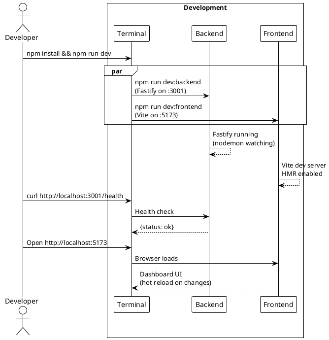
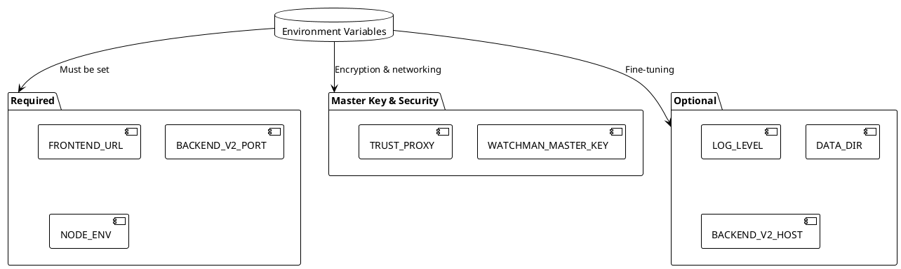
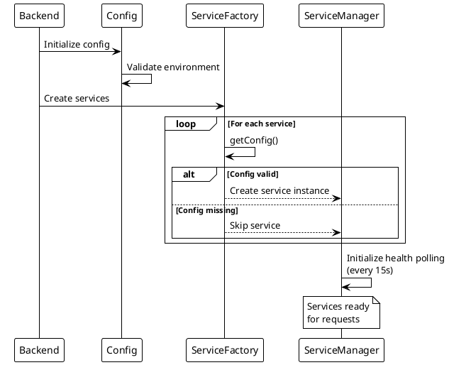

# Common Tasks

> [!abstract] Purpose
> Quick reference for frequently performed tasks in the Watchman project.

## Startup Flows

### Option A — macOS Desktop

```bash
./install.sh
npm run electron:prod
```

Installs to `/Applications/Watchman.app`. Backend auto-spawns on loopback port.

### Option B — Production Self-Host (Server)

```bash
npm install && npm run build && npm run start
```

Builds production artifacts and runs concurrently (suitable for Raspberry Pi, VPS, etc.).

### Option C — Development

```bash
npm install && npm run dev
```

Starts Vite (5173) + Fastify (3001) with hot reload. See [[docs/guides/setup|Setup Guide]].

## Development Tasks

### Check Backend Health

```bash
curl http://localhost:3001/health
```

### View API Documentation

Open `http://localhost:3001/api/docs` (Swagger UI).

### Watch Backend Tests

```bash
npm run test:watch
```

### Run All Tests

```bash
npm run test:all       # Backend + frontend concurrently
npm run test:e2e       # Playwright smoke tests
npm run test:e2e:visual # Update E2E snapshots
```

### Generate TypeScript Types from OpenAPI

```bash
npm run generate:types
```

This syncs `apps/backend/openapi.yaml` → `apps/frontend/src/types/generated.ts`.

## Adding a Service

1. Create service class in `apps/backend/services/`
2. Register in `serviceFactoryConfig.js`
3. Add env vars to `.env.example`
4. Register routes via `apps/backend/routes/*.js` (wired from `apps/backend/server.js`)
5. Create frontend card component
6. Update OpenAPI spec
7. Create integration doc

See [[docs/guides/adding-services|Adding Services Guide]] for details.

## Configuration

### Enable Specific Services

```bash
ENABLED_SERVICES=adguard,tor,bitcoin
```

### Add Multi-Instance Service

```bash
QBITTORRENT_1_URL=http://192.0.2.10:8080
QBITTORRENT_2_URL=http://192.0.2.11:8080
```

### Explore Architecture Interactively

```bash
Open http://localhost:5173 in browser, or view the flow visualizer:
[[docs/flow-visualizer.html|Interactive Flow Visualizer]]
```

Pick a flow (poll cycle, dashboard load, setup wizard, etc.) and trace data across packages with annotated payloads.

## Code Quality

### Lint Frontend & Backend

```bash
npm run lint            # Frontend ESLint
npm run lint:backend    # Backend ESLint
```

### Format Code

```bash
npm run format          # Uses Prettier
npm run format:check    # Check formatting without changes
```

## Troubleshooting

### Backend Won't Start

- Check port availability: `lsof -i :3001`
- Check required env vars are set (see `.env.example`)
- Check Node.js version: `node --version` (need 18+)

### Frontend Won't Build

- Check Node.js version and npm cache: `npm cache clean --force && npm install`
- If Vite errors, delete `apps/frontend/dist/` and rebuild: `npm run build`

### Desktop App Won't Launch (Option A)

- Verify `.app` built: `ls -la /Applications/Watchman.app`
- Check quarantine attribute: `xattr /Applications/Watchman.app` (should be empty)
- Manually remove quarantine: `xattr -d com.apple.quarantine /Applications/Watchman.app`

### Service Shows Offline

- Check service env vars are set
- Verify service is in `ENABLED_SERVICES`
- Check network connectivity to service host
- Check backend logs: `tail -f apps/backend/logs/*`

## Related

- [[docs/guides/setup|Setup Guide]]
- [[docs/troubleshooting.md|Troubleshooting]]
- [[docs/reference/environment-variables|Environment Variables]]

## PlantUML Diagrams

### Development Workflow (Option C)



### Environment Configuration



### Service Lifecycle


