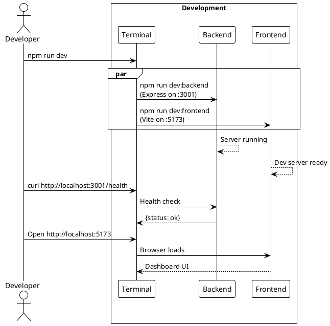
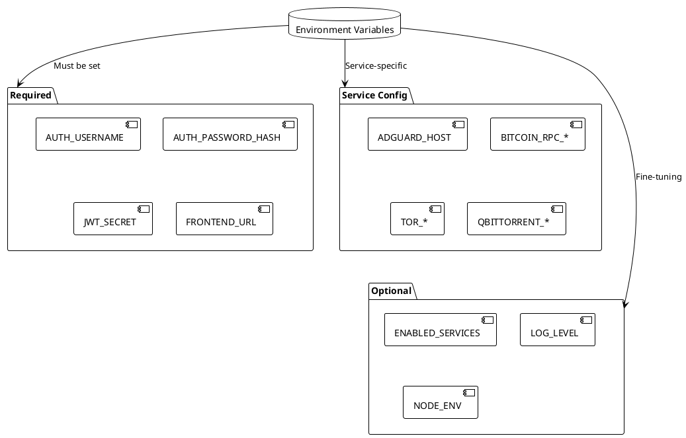
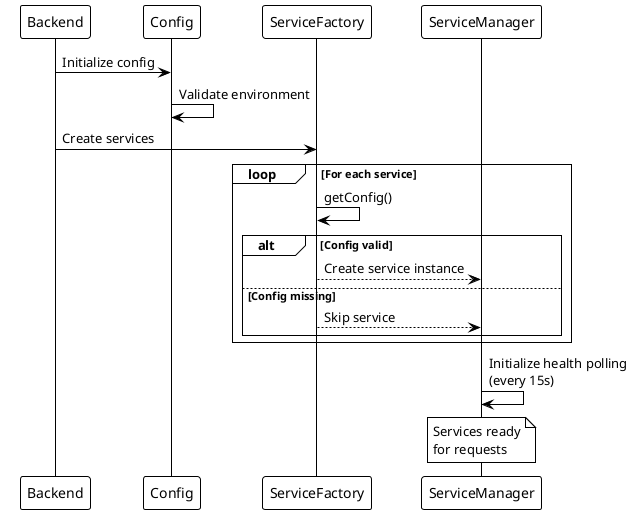

# Common Tasks

> [!abstract] Purpose
> Quick reference for frequently performed tasks in the Watchman project.

## Development

### Start Development

```bash
npm install && npm run dev
```

### Check Backend Health

```bash
curl http://localhost:3001/health
```

### View API Documentation

Open `http://localhost:3001/api/docs`

### Generate Password Hash

```bash
node -e "console.log(require('bcrypt').hashSync('yourpassword', 10))"
```

## Adding a Service

1. Create service class in `apps/backend/services/`
2. Register in `serviceFactoryConfig.js`
3. Add env vars to `.env.example`
4. Add route in `server.js`
5. Create frontend card component
6. Update OpenAPI spec
7. Create integration doc

See [[docs/guides/adding-services|Adding Services Guide]] for details.

## Configuration

### Enable Specific Services

```bash
ENABLED_SERVICES=adguard,tor,bitcoin
```

### Add Multi-Instance Service

```bash
QBITTORRENT_1_URL=http://192.0.2.10:8080
QBITTORRENT_2_URL=http://192.0.2.11:8080
```

### Clear Backend Cache

```bash
curl -X POST http://localhost:3001/api/cache/clear \
  -H "Authorization: Bearer YOUR_TOKEN"
```

## Troubleshooting

### Backend Won't Start

- Check required env vars: `AUTH_USERNAME`, `AUTH_PASSWORD_HASH`, `JWT_SECRET`, `FRONTEND_URL`
- Check port availability: `lsof -i :3001`

### Frontend Can't Connect

- Verify `FRONTEND_URL` matches frontend origin
- Check CORS configuration
- Verify backend is running on port 3001

### Service Shows Offline

- Check service env vars are set
- Verify service is in `ENABLED_SERVICES`
- Check network connectivity to service host

## Related

- [[docs/guides/setup|Setup Guide]]
- [[docs/troubleshooting.md|Troubleshooting]]
- [[docs/reference/environment-variables|Environment Variables]]

## PlantUML Diagrams

### Development Workflow



### Environment Configuration



### Service Lifecycle


