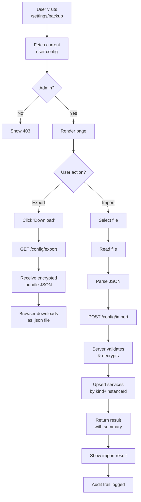

# BackupRestore Component

> [!abstract] Purpose
> Provides admin-only UI for exporting all service configurations to an encrypted bundle file and importing previously exported bundles to restore or migrate configurations across instances.

## Location

`apps/frontend/src/pages/Settings/BackupRestore.tsx`

## Route

- **Path**: `/settings/backup`
- **Guard**: [[docs/components/auth-guard|AuthGuard]] (admin-only)
- **Lazy loaded**: Yes

## Props

None. Component is a page, not a reusable component.

## Features

### Export

Exports all configured services to an encrypted JSON bundle:

- **Button**: "Download Backup"
- **Encryption**: AES-256-GCM with server's `WATCHMAN_MASTER_KEY`
- **Format**: `{ version: 1, exportedAt, payload: base64 }`
- **Download**: Triggers browser download with `Content-Disposition: attachment`
- **File name**: `watchman-backup-{date}.json`
- **Error handling**: Shows toast on network failure

**Implementation:**
- Uses `useExportConfig()` hook from `configApi.ts`
- Calls `GET /config/export` endpoint
- Loader state prevents duplicate clicks during export

### Import

Imports a previously exported bundle to restore or migrate configurations:

- **File Picker**: Click to select `.json` file or drag-and-drop
- **Validation**: Checks bundle format before processing
- **Progress**: Shows import result (imported, updated, skipped, errors)
- **Error Feedback**: Lists any services that failed to import with reasons
- **Confirmation**: Optional warning if bundle is from different date/time

**Implementation:**
- Uses `useImportConfig()` hook from `configApi.ts`
- Calls `POST /config/import` endpoint with bundle payload
- Returns `{ imported, updated, skipped, errors }` summary
- Errors are displayed per-service with reason
- Audit trail logged with action `import`

## Data Flow



## Related Components & Hooks

| Related | Purpose |
|---------|---------|
| [[docs/components/use-auth-hook|useAuth]] | Check if current user is admin |
| `configApi.ts` functions | Export/import API calls |
| `useExportConfig()` hook | TanStack Query mutation for export |
| `useImportConfig()` hook | TanStack Query mutation for import |

## Security Considerations

> [!warning] Master Key Requirement
> Both export and import require the server's `WATCHMAN_MASTER_KEY` to be properly set. If the key is lost or rotated:
> - Existing exported bundles cannot be imported
> - All stored secrets become unrecoverable

### Protection

- **Admin-only access**: Component is behind `AuthGuard` (requires valid JWT + admin role)
- **Encryption**: All secrets encrypted with AES-256-GCM; plaintext never exposed in bundle
- **Audit trail**: Import action is logged to `app_config_audit`
- **Master key**: Stored in env; never sent to frontend

## API Integration

### Export Endpoint

**Endpoint**: `GET /config/export`

**Returns**:
```typescript
{
  data: {
    version: 1,
    exportedAt: string,  // ISO 8601 timestamp
    payload: string      // Base64 AES-256-GCM ciphertext
  }
}
```

**Error Codes**:
- `401 UNAUTHORIZED` — User not authenticated
- `403 FORBIDDEN` — User not admin

### Import Endpoint

**Endpoint**: `POST /config/import`

**Request**:
```typescript
{
  version: 1,
  exportedAt: string,
  payload: string  // Base64 AES-256-GCM ciphertext
}
```

**Returns**:
```typescript
{
  data: {
    imported: number,   // New services created
    updated: number,    // Existing services upserted
    skipped: number,    // Already exist, no change
    errors: Array<{
      kind: string,      // Service kind
      instanceId: string,
      message: string    // Error reason
    }>
  }
}
```

**Error Codes**:
- `400 VALIDATION` — Invalid bundle format or decryption failed
- `400 MISMATCH` — Bundle encrypted with different master key
- `401 UNAUTHORIZED` — User not authenticated
- `403 FORBIDDEN` — User not admin

## Styling

- Uses Tailwind CSS with Watchman dark-luxury tokens
- Layout: Card-based UI with sections for export and import
- States:
  - **Idle**: Default button and file picker
  - **Loading**: Spinner on button during export/import
  - **Success**: Toast notification + result summary
  - **Error**: Red error callout with details

## Testing

- Unit tests cover export/import mutation calls
- Integration tests verify API communication
- E2E tests verify file download/upload workflow (when applicable)

See [[docs/testing/testing-strategy|Testing Strategy]] for coverage requirements.

## Related Documentation

- [[docs/features/ui-configuration|UI Configuration Feature]] — Complete user guide
- [[docs/api/config|Configuration API Reference]] — Endpoint specification
- [[docs/adr/015-ui-driven-service-configuration|ADR-015]] — Design decision
- [[docs/components/index|Component Index]] — All frontend components
