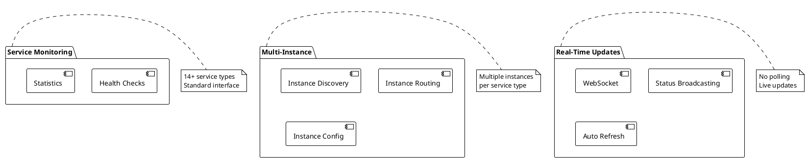

# Features

> [!abstract] Overview
> Watchman's core features provide comprehensive monitoring of self-hosted services.

## Feature Index

```dataview
TABLE WITHOUT ID file.link AS "Feature", date AS "Date", status AS "Status"
FROM "docs/features"
WHERE type = "feature"
SORT file.name ASC
```

## Core Features

| Feature                            | Description              |
| ---------------------------------- | ------------------------ | -------------------------------------------------- |
| [[docs/features/service-monitoring | Service Monitoring]]     | Health checks and statistics for external services |
| [[docs/features/multi-instance     | Multi-Instance Support]] | Run multiple nodes of the same service type        |
| [[docs/features/real-time-updates  | Real-Time Updates]]      | WebSocket-based status broadcasting                |
| [[docs/features/ui-configuration   | UI Configuration]]       | Runtime service CRUD from UI with encryption and hot-reload |

> [!note] Removed Features
> Time-series history (persistent DuckDB-backed metrics with rollups and charting) was removed as part of [[docs/adr/019-revert-split-deploy-and-remove-time-series|ADR-019]]. The dashboard now provides real-time status and recent activity in an in-memory buffer, lost on restart. See [[docs/features/time-series-history|Time-Series Feature (Archived)]] for historical context.

## Related

- [[docs/integrations/index|Service Integrations]]
- [[docs/architecture/index|Architecture Overview]]

## PlantUML Diagrams

### Core Features Overview



### Feature Integration

```plantuml
@startuml
!theme plain

[Frontend] --> [Service Monitoring]
[Frontend] --> [Multi-Instance]
[Frontend] --> [Real-Time Updates]

[Service Monitoring] --> [Backend API]
[Multi-Instance] --> [Backend API]
[Real-Time Updates] --> [WebSocket]

[Backend API] --> [Service Classes]
[Backend API] --> [Cache]

[Service Classes] --> [External Services]

note over Frontend, External Services
  Complete monitoring pipeline
end note
@enduml
```
