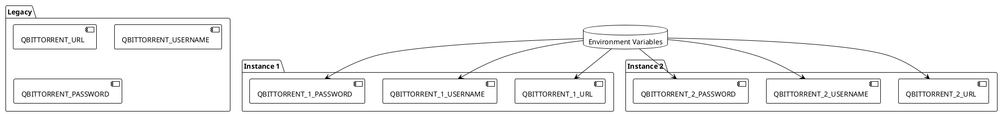
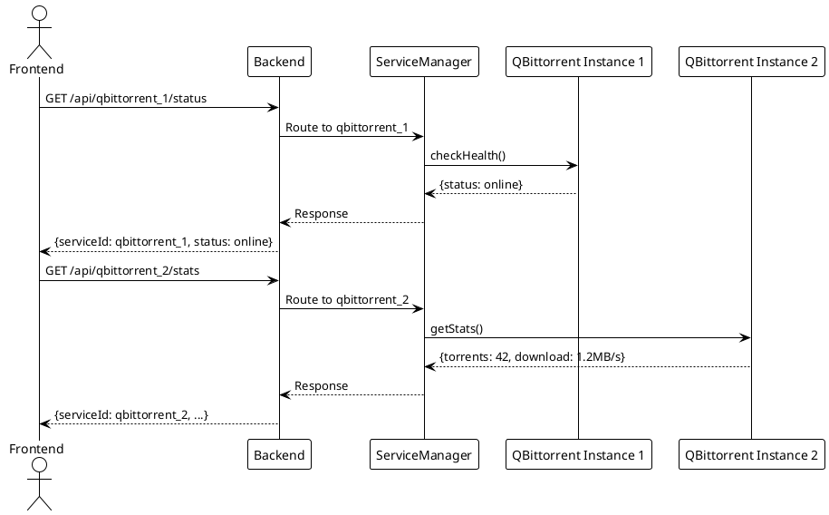
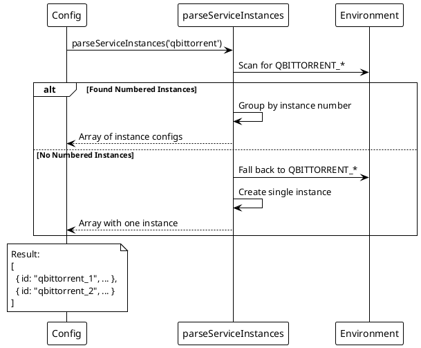

# Multi-Instance Support

> [!abstract] Overview
> Watchman supports running multiple instances of the same service type, useful for monitoring several nodes of the same software.

## Configuration

### Environment Variables

Use numbered prefixes for each instance:

```bash
# qBittorrent Instance 1
QBITTORRENT_1_URL=http://192.0.2.10:8080
QBITTORRENT_1_USERNAME=admin
QBITTORRENT_1_PASSWORD=password1

# qBittorrent Instance 2
QBITTORRENT_2_URL=http://192.0.2.11:8080
QBITTORRENT_2_USERNAME=admin
QBITTORRENT_2_PASSWORD=password2
```

### Legacy Single Instance

Legacy single-instance configuration is still supported:

```bash
QBITTORRENT_URL=http://127.0.0.1:8069
QBITTORRENT_USERNAME=admin
QBITTORRENT_PASSWORD=your-password
```

## Supported Services

Services that support multi-instance:

- qBittorrent
- Synology
- Roon
- Philips Hue
- Mac Mini
- Alby Hub
- Raspberry Pi
- Router (Beryl/Telenet)

## API Pattern

Multi-instance services use the route pattern:

```
GET /api/{serviceType}_{instanceNum}/status
GET /api/{serviceType}_{instanceNum}/stats
```

Examples:

- `/api/qbittorrent_1/status`
- `/api/qbittorrent_2/stats`
- `/api/synology_1/status`

## Instance Discovery

The `GET /api/services/instances` endpoint returns metadata about all configured instances:

```json
{
  "instances": {
    "qbittorrent": {
      "count": 2,
      "instances": [
        { "id": "qbittorrent_1", "type": "qbittorrent" },
        { "id": "qbittorrent_2", "type": "qbittorrent" }
      ]
    }
  },
  "timestamp": "2026-04-02T..."
}
```

## Implementation

Instance parsing is handled in `apps/backend/config.js` via `parseServiceInstances()`:

1. Scans `process.env` for `{SERVICE}_{N}_` pattern
2. Collects all env vars for each instance number
3. Falls back to legacy single-instance config if no numbered instances found

## PlantUML Diagrams

### Instance Configuration Pattern



### Multi-Instance API Routing



### Instance Discovery Flow



## Related

- [[docs/features/service-monitoring|Service Monitoring]]
- [[docs/reference/environment-variables|Environment Variables]]
- `apps/backend/config.js`
