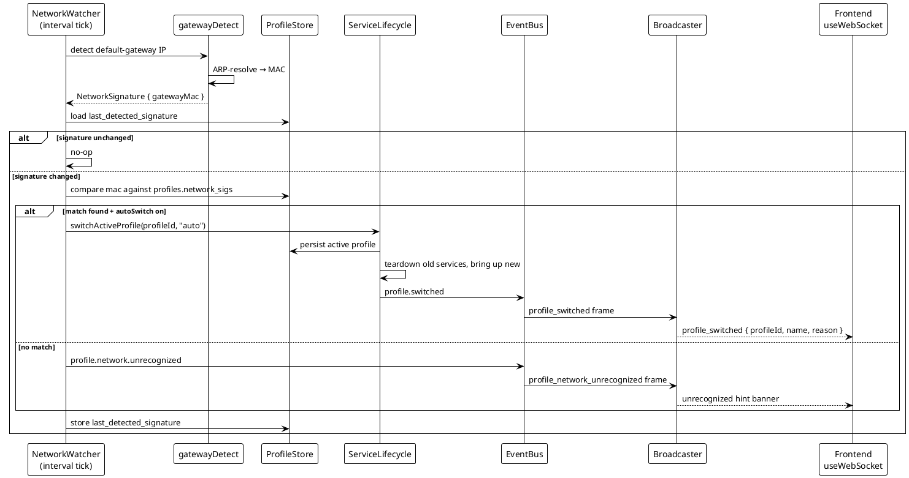

# Service Profiles and Network Auto-Switch

> [!abstract] Overview
> **Profiles** let a Watchman installation maintain separate, preconfigured service sets for different physical locations (e.g. Home, Office). Exactly one profile is **active** at any moment; only its services are instantiated, polled, and shown on the dashboard. Out-of-profile services are fully torn down — no wasted probes, no circuit-breaker churn from unreachable hosts on the wrong LAN.
>
> The active profile is chosen automatically by matching the current LAN's default-gateway MAC address against each profile's captured network signatures, with a manual override in the top-bar profile switcher.
>
> **ADR**: [[docs/adr/027-service-profiles-and-network-auto-switch|ADR-027]]

## Concepts

### Profile

A named set of service instances bound to one location. Every service instance belongs to exactly one profile — membership is **disjoint**. A profile stores:

- Name, description, optional color label.
- An array of `network_sigs` — each signature is the gateway MAC captured when the user assigns a network to that profile.

### Active Profile

Exactly one profile is active at a time. The `ServiceLifecycle` gate is:

```
enabled && profileId === activeProfileId
```

Services whose `profileId` does not match the active profile are never brought up. When the active profile changes, `ServiceLifecycle.switchActiveProfile(id, reason)` tears down running out-of-profile services, brings up the newly active set, and emits `profile.switched` on the EventBus.

### Default Profile

On first boot (or when no profiles exist), `ProfileStore.ensureBootstrap()` auto-creates a **Default** profile, sets it active, and backfills every existing `app_service_instance` row whose `profile_id` is null into it. This ensures upgrades from pre-profile versions are seamless — all existing services continue to appear without operator action.

### Network Signature

A `NetworkSignature` is the gateway MAC address of the current LAN (obtained via `gatewayDetect.ts`). It uniquely identifies a router/subnet combination without relying on IPs (which collide across private-range networks). The backend stores the last detected signature in `app_setting` and compares it against each profile's `network_sigs` array.

## Data Model

Three database artifacts (managed by [[apps/backend/src/config/store/migrations.ts]]):

| Artifact            | Description                                                                      |
| ------------------- | -------------------------------------------------------------------------------- |
| `app_profile` table | `id`, `name`, `description`, `color`, `network_sigs` (JSON array of MAC strings) |
| `app_setting` table | Generic key/value: active profile id, auto-switch flag, last detected signature  |
| `profile_id` column | Nullable FK on `app_service_instance`; backfilled to Default on upgrade          |

Profile CRUD and settings access live in [[apps/backend/src/config/store/ProfileStore.ts]].

## Lifecycle Gate

[[apps/backend/src/application/ServiceLifecycle.ts]] enforces profile membership in `bringUp()`:

```
service.enabled && service.profileId === activeProfileId
```

Switching the active profile calls `switchActiveProfile(id, reason)`:

1. Persists the new active id via `ProfileStore`.
2. Pauses the background poller.
3. Stops and tears down all currently running services not in the new profile.
4. Brings up all enabled services in the new profile.
5. Re-tracks them in the poller.
6. Resumes the poller.
7. Emits `profile.switched` → `Broadcaster` sends `profile_switched` WebSocket frame.

## LAN Auto-Switch

[[apps/backend/src/application/NetworkWatcher.ts]] runs on boot and on a periodic interval:

1. `gatewayDetect.ts` reads the default gateway IP (`ip route` on Linux, `route -n get default` on macOS/BSD) and ARP-resolves it to a MAC address.
2. Compares the MAC to `last_detected_signature` in `app_setting`. If unchanged, stops — no action.
3. On a _change_: iterates profiles and checks whether the new MAC appears in any profile's `network_sigs`.
   - **Match found + auto-switch on**: calls `switchActiveProfile(id, "auto")`.
   - **Match found + auto-switch off**: does not switch (manual override in effect).
   - **No match**: emits `profile.network.unrecognized` → `Broadcaster` sends `profile_network_unrecognized` WebSocket frame; the UI shows an "unrecognized network — assign it?" hint.
4. Stores the new signature regardless of match outcome (so future ticks detect changes correctly).

### Override-Stick Semantics

Auto-switch only fires on a **change** of the detected gateway MAC. A manual override via `PUT /profiles/active` stores the chosen profile as active, and since the network signature has not changed, the `NetworkWatcher` will not override it on its next tick. The override persists until the LAN actually changes.

### Degraded Detection

If `ip`/`route`/`arp` tooling is unavailable (e.g. sandboxed environment), `gatewayDetect` returns `undefined` gracefully. `NetworkWatcher` treats this as a no-op — auto-switch simply never fires. The operator can still switch profiles manually.

## Delete Invariants

A profile **cannot** be deleted (responds `409 Conflict`) when:

- It is the currently active profile.
- It has one or more services assigned to it (non-empty).
- It is the last remaining profile.

These invariants ensure the dashboard never reaches a state with no monitorable services.

## REST API

Full reference: [[docs/api/profiles|Profiles API]]. All endpoints follow the [[docs/api/index|standard response envelope]].

| Endpoint                             | Method | Description                                             |
| ------------------------------------ | ------ | ------------------------------------------------------- |
| `GET /profiles`                      | GET    | List all profiles with `serviceCount` and `isActive`    |
| `POST /profiles`                     | POST   | Create a new profile                                    |
| `GET /profiles/:id`                  | GET    | Fetch a single profile                                  |
| `PUT /profiles/:id`                  | PUT    | Update profile name/description/color                   |
| `DELETE /profiles/:id`               | DELETE | Delete (409 if active, non-empty, or last)              |
| `GET /profiles/active`               | GET    | Get the active profile                                  |
| `PUT /profiles/active`               | PUT    | Manual switch — `{ profileId }`                         |
| `PUT /profiles/settings`             | PUT    | Toggle auto-switch — `{ autoSwitch }`                   |
| `GET /profiles/current-network`      | GET    | Current detected signature + `matchedProfileId`         |
| `POST /profiles/:id/capture-network` | POST   | Assign current LAN MAC to a profile                     |
| `PUT /config/services/:id/profile`   | PUT    | Move a service to a different profile — `{ profileId }` |

`POST /config/services` also accepts an optional `profileId` field; service objects in all `/config/services` responses include `profileId`.

## WebSocket Events

Two new frames broadcast via [[apps/backend/src/transport/ws/Broadcaster.ts]]:

| Frame type                     | Trigger                                 | Payload                       |
| ------------------------------ | --------------------------------------- | ----------------------------- |
| `profile_switched`             | Active profile changed (auto or manual) | `{ profileId, name, reason }` |
| `profile_network_unrecognized` | Detected LAN matches no profile         | `{ signature }`               |

The frontend handles both in [[apps/frontend/src/hooks/useWebSocket.ts]].

## Frontend

### Profile Switcher (`ProfileSwitcher.tsx`)

A Popover component in the top navigation bar ([[apps/frontend/src/components/dashboard/ProfileSwitcher.tsx]], wired into `TopNav.tsx`). Shows:

- The active profile name with its color indicator.
- A list of all profiles; clicking one calls `PUT /profiles/active`.
- Auto-switch toggle (reads/writes `PUT /profiles/settings`).
- A "network unrecognized" banner when the `profile_network_unrecognized` WS event is received, with a one-click **Assign to [Profile]** action that calls `POST /profiles/:id/capture-network`.

### Profiles Settings Page (`/settings/profiles`)

[[apps/frontend/src/pages/Settings/Profiles.tsx]] — full profile management:

- Create / rename / delete profiles.
- View service count per profile.
- Capture current network to a profile.
- Manage the auto-switch setting.

Route registered in `App.tsx`.

### Services Settings — Profile Selector

[[apps/frontend/src/pages/Settings/Services.tsx]] has a per-service profile drop-down that calls `PUT /config/services/:id/profile` to move a service between profiles.

### Query Layer

API calls go through [[apps/frontend/src/services/profilesApi.ts]]; React Query hooks live in [[apps/frontend/src/pages/Settings/useProfileQueries.ts]].

## Sequence: Network Auto-Switch



## Related

- [[docs/adr/027-service-profiles-and-network-auto-switch|ADR-027]] — Architecture Decision Record
- [[docs/api/profiles|Profiles API Reference]]
- [[docs/features/multi-instance|Multi-Instance Support]]
- [[docs/features/service-monitoring|Service Monitoring]]
- [[docs/architecture/backend-architecture|Backend Architecture]]
- [[docs/architecture/data-flow|Data Flow]]
- [[apps/backend/src/config/store/ProfileStore.ts]]
- [[apps/backend/src/application/NetworkWatcher.ts]]
- [[apps/backend/src/infra/net/gatewayDetect.ts]]
- [[apps/backend/src/application/ServiceLifecycle.ts]]
- [[apps/backend/src/transport/http/routes/profiles.ts]]
