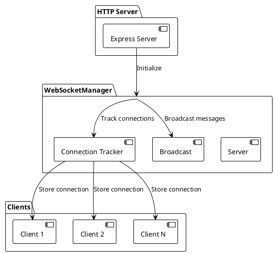
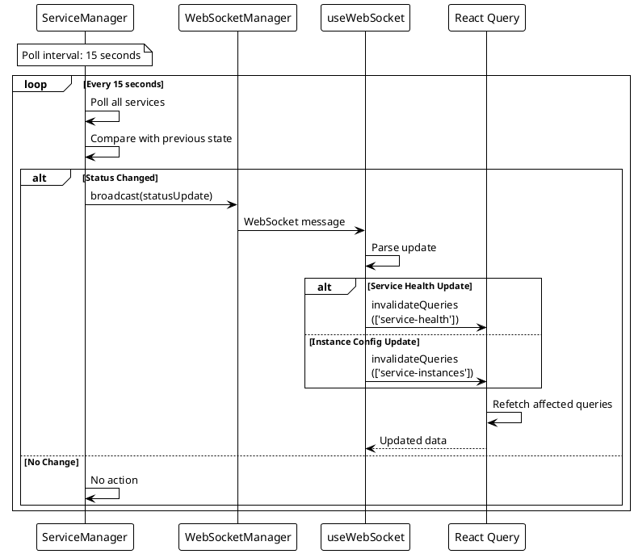
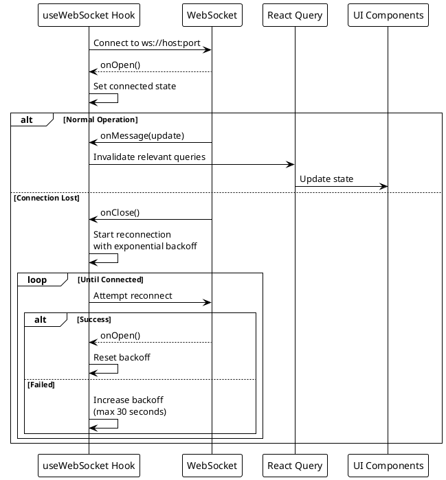

# Real-Time Updates

> [!abstract] Overview
> Watchman uses WebSocket connections to broadcast service status changes to the frontend in real-time, eliminating the need for polling.

## Architecture

### WebSocketManager

The [[apps/backend/services/WebSocketManager.js|WebSocketManager]] handles:

1. WebSocket server initialization on HTTP server
2. Client connection management
3. Status change broadcasting
4. Graceful shutdown

### Data Flow

```
ServiceManager polls services (interval)
  → Status change detected
  → WebSocketManager.broadcast(statusUpdate)
  → All connected clients receive update
  → Frontend updates UI
```

### Frontend Integration

The [[apps/frontend/src/hooks/useWebSocket.ts|useWebSocket]] hook manages:

1. WebSocket connection establishment
2. Message parsing and dispatch
3. Reconnection logic
4. Connection state tracking

## Benefits

- **No polling overhead** - Frontend doesn't need to poll for updates
- **Immediate updates** - Status changes are pushed instantly
- **Reduced bandwidth** - Only changes are transmitted
- **Better UX** - Dashboard feels live and responsive

## Connection Lifecycle

1. Frontend loads → establishes WebSocket connection
2. ServiceManager polls services on configured interval
3. On status change → broadcast to all connected clients
4. Frontend receives update → re-renders affected components
5. On disconnect → automatic reconnection with backoff

## PlantUML Diagrams

### WebSocket Server Architecture



### Status Update Broadcasting



### Client Connection Lifecycle



## Related

- [[docs/features/service-monitoring|Service Monitoring]]
- [[docs/architecture/data-flow|Data Flow]]
- [[apps/backend/services/WebSocketManager.js|WebSocketManager]]
- [[apps/frontend/src/hooks/useWebSocket.ts|useWebSocket Hook]]
