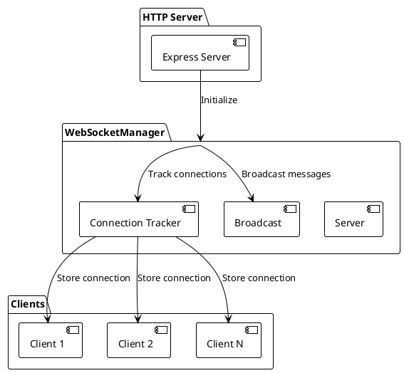
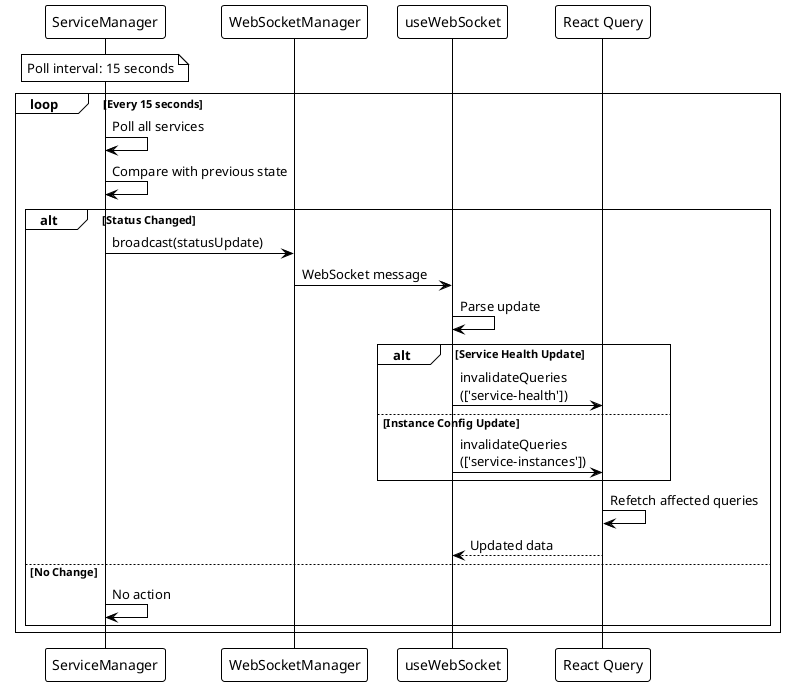
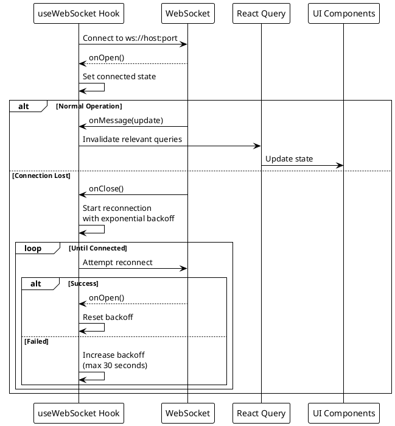

# Real-Time Updates

> [!abstract] Overview
> Watchman uses WebSocket connections to broadcast service status changes to the frontend in real-time. The backend emits service status updates via EventBus; the frontend maintains a singleton WebSocket connection wrapped in a `<WebSocketProvider>` that invalidates React Query when messages arrive.

## Architecture

### Backend WebSocket Layer

The WebSocket layer is split into 4 classes in `[[apps/backend/src/transport/ws/]]`:

### AuthGate

Handles CORS and origin validation on WebSocket handshake upgrade. Rejects disallowed origins with code `1008`.

### ConnectionManager

Manages active client connections:
- Track each connection with unique ID
- Track IP address per connection (for rate limiting, security alerts)
- Clean up disconnected clients (idempotent handling)
- Prevent double-processing on close/error

### HeartbeatScheduler

Maintains connection liveness:
- Sends ping messages every 30 seconds
- Tracks pong responses
- Closes stale connections (no pong after 2 pings)
- Graceful shutdown of all heartbeat intervals
- **Snapshot iteration**: Creates a snapshot via spread (`[...manager.entries()]`) to prevent breakage if the underlying connection view becomes live (e.g., concurrent add/remove during iteration)

### Broadcaster

Publishes status changes to connected clients:
- Receives status-change events from domain layer via eventBus
- Serializes events to JSON message format
- Sends to all connected clients (or filtered by service type if needed)
- Handles send errors gracefully (disconnected clients don't crash broadcaster)

### Data Flow

```
BackgroundPoller polls services (15s interval, croner-based)
  → Status change detected
  → Emits event to eventBus
  → Broadcaster receives event
  → Sends WebSocket message to all connected clients
  → Frontend useWebSocket hook invalidates React Query
  → Components re-render with updated data
```

### Frontend Integration

**WebSocket Provider Pattern:**

The [[apps/frontend/src/providers/WebSocketProvider.tsx|WebSocketProvider]] wraps the entire React tree and manages a singleton WebSocket connection:

1. **Singleton Connection** — Mounts exactly once (via context + hook)
2. **Connection State** — Exposes `isConnected` and `reconnectAttempts` via `useWebSocketContext()`
3. **Raw Events** — Provides `useWebSocketEvent(type)` hook for consuming specific message types

**Hook-Level Details:**

The [[apps/frontend/src/hooks/useWebSocket.ts|useWebSocket]] hook manages:

1. WebSocket connection establishment (upgrade to `/ws` endpoint)
2. Message parsing and dispatch (recognizes `service_update`, `metrics`, `connection` message types)
3. Reconnection logic with exponential backoff (max 30 seconds)
4. Connection state tracking (connected/disconnecting/reconnecting)
5. Debounced React Query invalidation on service.stats.updated events (prevents thundering herd)
6. Error handling and recovery
7. Hook-level observability via frontend logger (`logger.warn`/`logger.debug`)

## Benefits

- **No polling overhead** - Frontend doesn't need to poll for updates
- **Immediate updates** - Status changes are pushed instantly
- **Reduced bandwidth** - Only changes are transmitted
- **Better UX** - Dashboard feels live and responsive

## Connection Lifecycle

1. Frontend loads → `useWebSocket` hook initializes
2. Establishes WebSocket upgrade to `/ws` endpoint (via AuthGate)
3. ConnectionManager registers client connection
4. HeartbeatScheduler starts ping/pong keep-alives
5. BackgroundPoller runs on 15s interval, emits status changes
6. Broadcaster sends updates to all connected clients
7. Frontend receives message → React Query invalidates
8. Components re-render with fresh data from cache/API
9. On disconnect → HeartbeatScheduler stops, ConnectionManager cleans up
10. Frontend hook attempts reconnection with exponential backoff

## Test Coverage Notes

- Frontend WebSocket message-handling coverage includes [[apps/frontend/src/hooks/useWebSocket.test.tsx]] for [[apps/frontend/src/hooks/useWebSocket.ts]]:
  - batched/deduped `service_update` invalidation behavior
  - alert-level toast routing (`error`/`warning`/`info`)
  - unknown message-type warning path
  - send-error handling when socket send fails despite an open-state call path
  - unmount-time invalidation flush for queued service updates
  - tor/router invalidation family behavior (`queryKeys.torRelay()` and `queryKeys.routerArp(...)`)
  - metrics invalidation and `connection` message toast behavior
  - max reconnect attempts error path and reconnect terminal-state handling
  - cleanup stability for singleton WebSocket state across tests
- Frontend notification-state coverage now also includes [[apps/frontend/src/hooks/use-toast.test.tsx]] for [[apps/frontend/src/hooks/use-toast.ts]]:
  - reducer limit and dismiss-all behavior
  - hook lifecycle coverage for add/update/dismiss/remove transitions

## PlantUML Diagrams

### WebSocket Server Architecture



### Status Update Broadcasting



### Client Connection Lifecycle



## Related

- [[docs/features/service-monitoring|Service Monitoring]]
- [[docs/architecture/data-flow|Data Flow]]
- [[docs/architecture/backend-architecture|Backend Architecture]]
- [[apps/backend/src/transport/ws/AuthGate.ts|AuthGate]]
- [[apps/backend/src/transport/ws/ConnectionManager.ts|ConnectionManager]]
- [[apps/backend/src/transport/ws/HeartbeatScheduler.ts|HeartbeatScheduler]]
- [[apps/backend/src/transport/ws/Broadcaster.ts|Broadcaster]]
- [[apps/frontend/src/hooks/useWebSocket.ts|useWebSocket Hook]]
