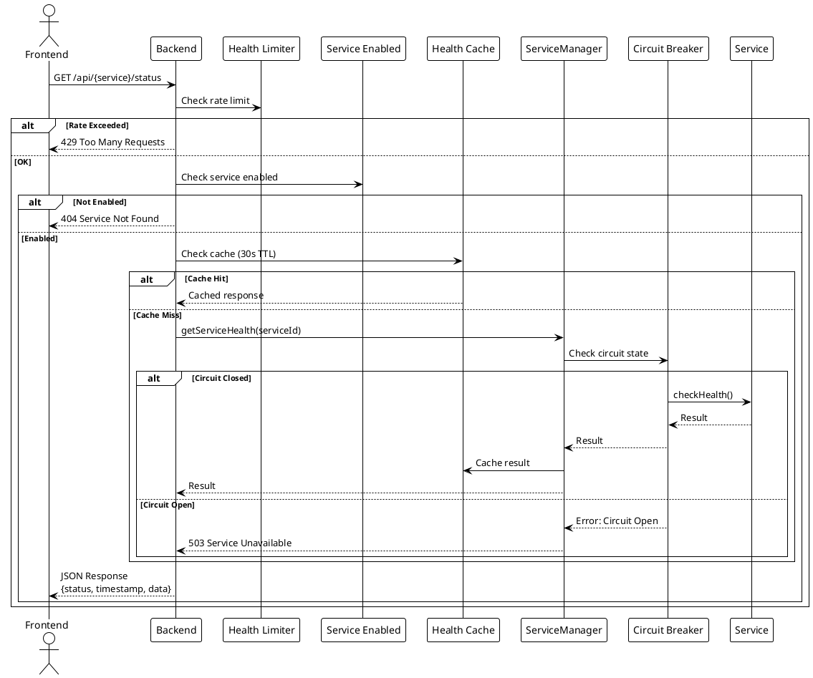
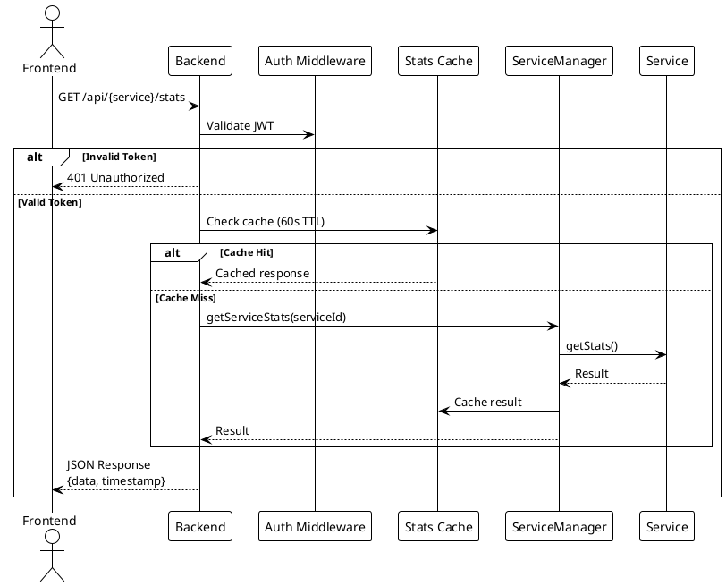
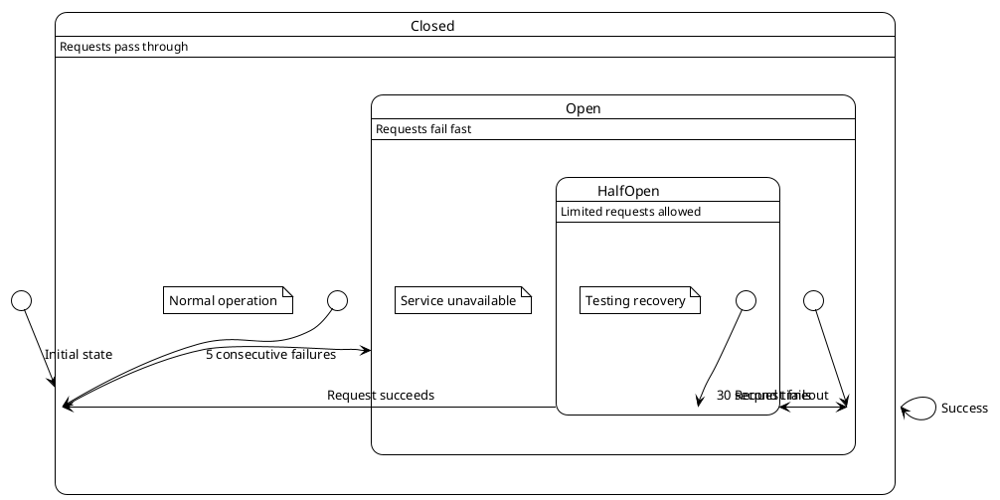

# Service Monitoring

> [!abstract] Overview
> Watchman's core feature is monitoring the health and statistics of self-hosted services through a unified interface.

## Architecture

### Service Pattern

Every service extends `BaseService` (TypeScript, v2) and implements two-tier health checks:

```typescript
export class ServiceName extends BaseService {
  readonly kind = "service-name";

  async checkHealth(signal: AbortSignal): Promise<HealthResult> {
    // Two-tier health: ICMP ping (host) + protocol probe (service)
    // Always returns ok(HealthSnapshot) — errors become reachable: false snapshots
    return withHostPing(
      { host: this.host, ... },
      async (sig) => { /* protocol probe */ },
      signal
    );
  }

  async getStats(signal: AbortSignal): Promise<StatsResult> {
    // Detailed metrics — also always returns ok(StatsSnapshot)
  }
}
```

**Health Model (Phase 0a+):** Each `HealthSnapshot` carries both tiers:
- `host: { reachable: boolean, pingMs?: number }` — ICMP reachability
- `service: { ok: boolean, latencyMs?: number, ... }` — protocol probe result
- `reachable: boolean` — composite (host AND service)

See [[docs/adr/019-two-tier-health-and-monitoring-upgrades|ADR-019]], [[apps/backend/src/domain/BaseService.ts]], and [[apps/backend/src/domain/ServiceRegistry.ts]].

### BackgroundPoller

The `apps/backend/src/infra/scheduler/BackgroundPoller.ts` (BackgroundPoller) orchestrates all services:

1. Tracks registered services from `ServiceRegistry`
2. Polls each service on a configurable interval (default 15 seconds with ±2 second jitter)
3. Emits `service.health.updated` and `service.stats.updated` events on status change
4. Broadcaster publishes events (including snapshots) to WebSocket clients
5. TimeSeriesWriter persists both stats and health metrics to DuckDB (Phase 0a+)
6. Applies circuit breaker pattern for fault tolerance

### Health Check Flow

```
Frontend → GET /services/{id}/health
  → Fastify route handler
  → BackgroundPoller cached result
  → Circuit breaker state
  → Return JSON { data: { status, ... } }
```

### Stats Flow

```
Frontend → GET /services/{id}/stats
  → Fastify route handler
  → SWR cache (TTL configurable)
  → service.getStats()
  → Return JSON { data: { ... } }
```

## Supported Services

See [[docs/integrations/index|Service Integrations]] for per-service documentation.

## Caching

- **Health checks**: 30s TTL
- **Statistics**: 60s TTL
- Cache invalidation on write endpoints that mutate monitored state (for example, cache clear and AdGuard protection toggle)

## Circuit Breaker

Services use circuit breaker pattern to prevent cascading failures:

- **Failure threshold**: 5 consecutive failures
- **Reset timeout**: 30 seconds
- **Request timeout**: 5 seconds

## Frontend Coverage Notes (Monitoring UI)

### Two-Tier Status Rendering (Phase 0a — F1 + F2 + F3)

Two-tier status dots are rendered in two places with full color-blind accessibility:

#### F1: ServiceTile (Dashboard Grid)

[[docs/components/service-tile|ServiceTile]] renders **two-tier status dots** when backend supplies both `host` and `service` health tiers:

- First dot: **host tier** (ICMP reachability) — "host: up/down"
- Second dot: **service tier** (protocol probe) — "service: up/down"
- Fallback: single dot when only one or neither tier is present (backward compat)

Implementation: `[[apps/frontend/src/components/tile/ServiceTile.tsx]]` (lines 59–65, 140–155)
Tests: `[[apps/frontend/src/components/tile/ServiceTile.test.tsx]]` (6 tests)

#### F2: ServiceDetailSheet (Detail View)

[[docs/components/service-detail-sheet|ServiceDetailSheet]] header now also renders **two-tier status dots** using identical pattern:

- First dot: **host tier** (ICMP reachability) — "host: up/down"
- Second dot: **service tier** (protocol probe) — "service: up/down"
- Fallback: single dot when only one or neither tier is present (backward compat)

Implementation: `[[apps/frontend/src/components/detail/ServiceDetailSheet.tsx]]` (lines 80–90, 171–186)
Tests: `[[apps/frontend/src/components/detail/ServiceDetailSheet.test.tsx]]` (5 tests)

#### F3: Color-Blind Accessibility (Phase 0a)

**STATUS: COMPLETE** — StatusDot now includes shape-based tone discrimination for color-blind users:

- **ok** (green): Circle ⚪
- **warn** (yellow): Diamond ◇
- **crit** (red): Square ▢
- **neutral** (gray): Rectangle ▬

All dots expose a `data-state` attribute matching their tone, allowing semantic testing and CSS targeting without relying on color.

Implementation: [[docs/components/primitives/status-dot|StatusDot]] primitive
Tests: [[apps/frontend/src/components/primitives/StatusDot.test.tsx]] (5 tests covering data-state attribute)

#### User Experience

This allows users to distinguish at both dashboard and detail view levels:
- Host ✅ + Service ✅ = normal operation (both green circles)
- Host ✅ + Service ❌ = daemon issue (green circle + red square)
- Host ❌ + Service ❌ = network issue (both red squares)
- Shape is visible to all users, color is redundant reinforcement

### Other Monitoring UI Tests

- Dashboard query-orchestration coverage in `apps/frontend/src/components/dashboard/useDashboardQueries.test.ts` for `apps/frontend/src/components/dashboard/useDashboardQueries.ts` now includes:
  - selective refetching for enabled service queries
  - always-refetched aggregate `servicesHealth`
  - expanded enablement branches for `frontendConfig` and `qbittorrent`
- Shared monitoring UI coverage now includes:
  - `apps/frontend/src/components/UpdateBadge.test.tsx` for update-check + click behavior in `apps/frontend/src/components/UpdateBadge.tsx`
  - [[apps/frontend/src/components/ServiceLink.test.tsx]] for host-only link display and click behavior in [[apps/frontend/src/components/ServiceLink.tsx]]
  - `apps/frontend/src/components/ServerStatusBadge.test.tsx` for status variant rendering in `apps/frontend/src/components/ServerStatusBadge.tsx`

## PlantUML Diagrams

### Health Check Flow



### Stats Flow (Authenticated)



### Circuit Breaker State Machine



## Related

- [[docs/features/multi-instance|Multi-Instance Support]]
- [[docs/features/real-time-updates|Real-Time Updates]]
- [[docs/integrations/index|Service Integrations]]
- [[docs/performance/caching-strategies|Caching Strategies]]
