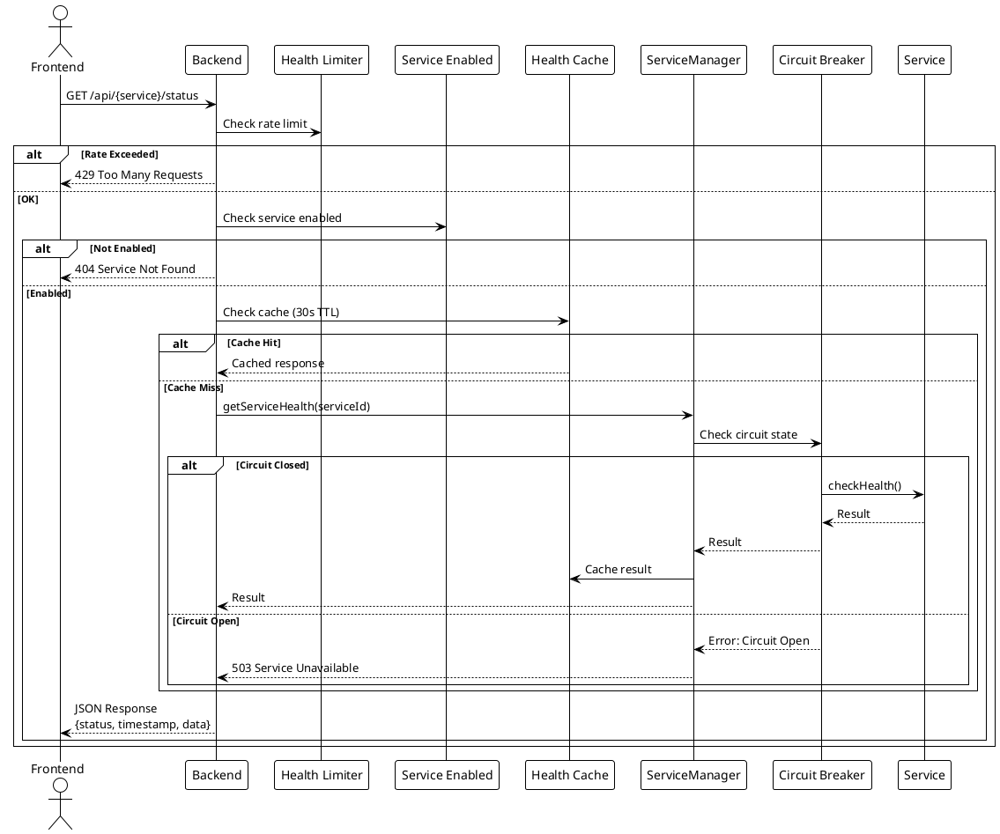
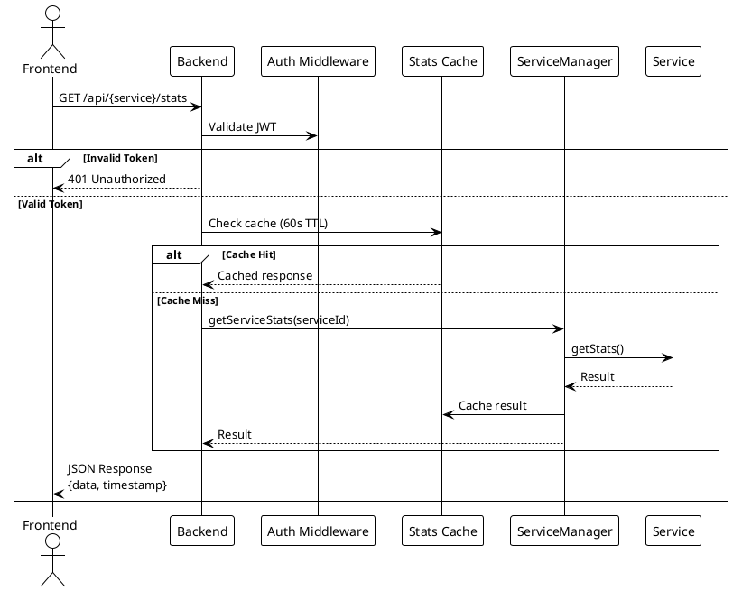
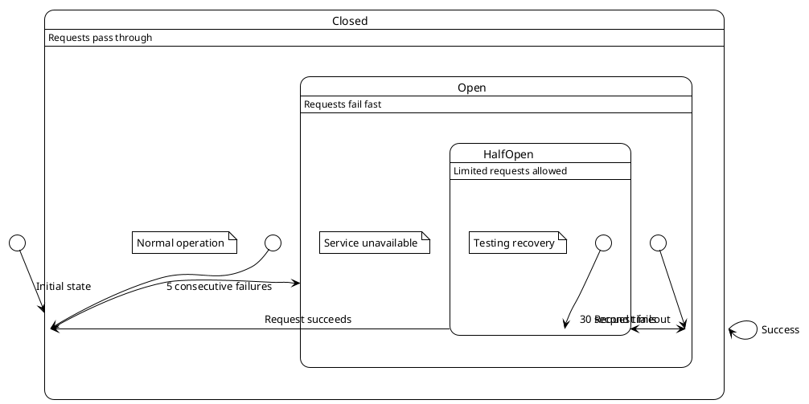

# Service Monitoring

> [!abstract] Overview
> Watchman's core feature is monitoring the health and statistics of self-hosted services through a unified interface.

## Architecture

### Service Pattern

Every service follows a standard interface:

```javascript
class ServiceName {
  constructor(config) {
    this.name = "service-name";
    this.config = config;
    this.enabled = this.checkConfig();
  }

  async checkHealth() {
    // Lightweight ping - returns { status, timestamp, data }
  }

  async getStats() {
    // Detailed metrics - returns { data, timestamp }
  }
}
```

### ServiceManager

The [[apps/backend/services/ServiceManager.js|ServiceManager]] orchestrates all services:

1. Reads `ENABLED_SERVICES` from environment
2. Initializes each service via factory pattern
3. Routes health/stats requests to appropriate service
4. Applies circuit breaker pattern for fault tolerance

### Health Check Flow

```
Frontend → GET /api/{service}/status
  → healthLimiter middleware
  → requireServiceEnabled middleware
  → healthCacheMiddleware (30s TTL)
  → ServiceManager.getServiceHealth()
  → Circuit breaker check
  → service.checkHealth()
  → Cache result
  → Return JSON response
```

### Stats Flow

```
Frontend → GET /api/{service}/stats
  → requireAuth middleware
  → statsCacheMiddleware (60s TTL)
  → ServiceManager.getServiceStats()
  → service.getStats()
  → Cache result
  → Return JSON response
```

## Supported Services

See [[docs/integrations/index|Service Integrations]] for per-service documentation.

## Caching

- **Health checks**: 30s TTL
- **Statistics**: 60s TTL
- Cache invalidation on write endpoints that mutate monitored state (for example, cache clear and AdGuard protection toggle)

## Circuit Breaker

Services use circuit breaker pattern to prevent cascading failures:

- **Failure threshold**: 5 consecutive failures
- **Reset timeout**: 30 seconds
- **Request timeout**: 5 seconds

## PlantUML Diagrams

### Health Check Flow



### Stats Flow (Authenticated)



### Circuit Breaker State Machine



## Related

- [[docs/features/multi-instance|Multi-Instance Support]]
- [[docs/features/real-time-updates|Real-Time Updates]]
- [[docs/integrations/index|Service Integrations]]
- [[docs/performance/caching-strategies|Caching Strategies]]
