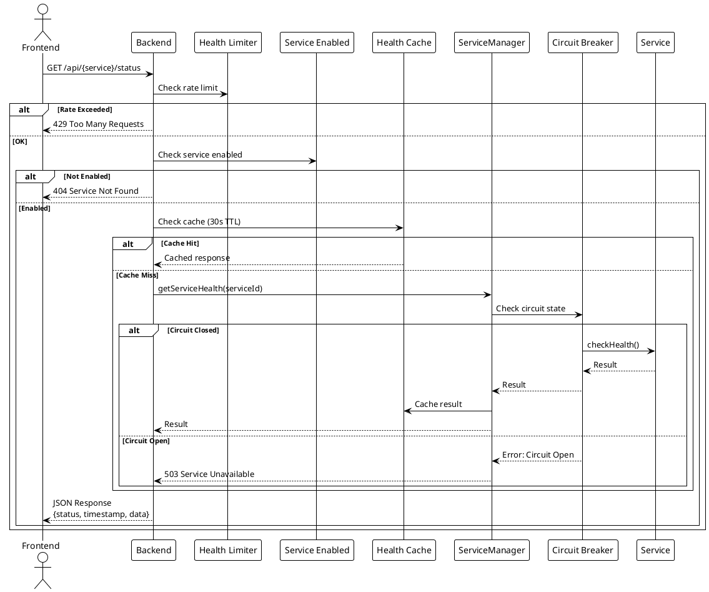
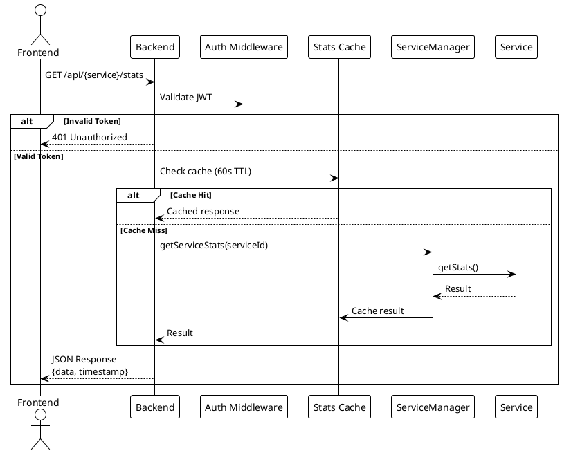
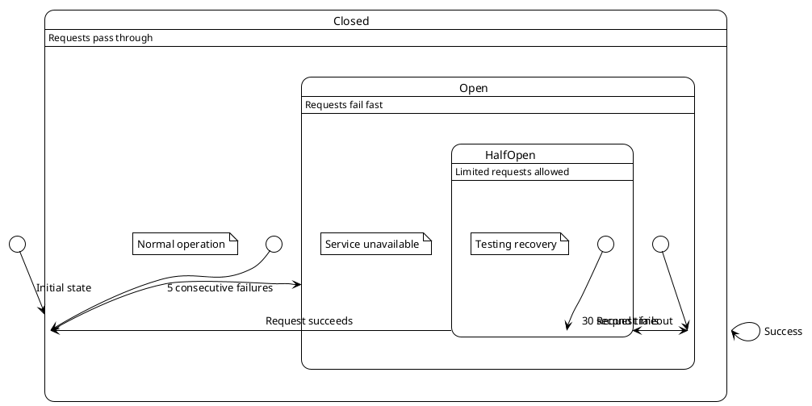

# Service Monitoring

> [!abstract] Overview
> Watchman's core feature is monitoring the health and statistics of self-hosted services through a unified interface.

## Architecture

### Service Pattern

Every service extends `BaseService` (TypeScript, v2):

```typescript
export class ServiceName extends BaseService {
  readonly kind = "service-name";

  async checkHealth(): Promise<HealthResult> {
    // Lightweight ping
  }

  async getStats(): Promise<StatsResult> {
    // Detailed metrics
  }
}
```

See [[apps/backend/src/domain/BaseService.ts]] and [[apps/backend/src/domain/ServiceRegistry.ts]].

### BackgroundPoller

The `apps/backend/src/infra/scheduler/BackgroundPoller.ts` (BackgroundPoller) orchestrates all services:

1. Tracks registered services from `ServiceRegistry`
2. Polls each service on a configurable interval
3. Persists results to time-series store (DuckDB)
4. Applies circuit breaker pattern for fault tolerance

### Health Check Flow

```
Frontend → GET /services/{id}/health
  → Fastify route handler
  → BackgroundPoller cached result
  → Circuit breaker state
  → Return JSON { data: { status, ... } }
```

### Stats Flow

```
Frontend → GET /services/{id}/stats
  → Fastify route handler
  → SWR cache (TTL configurable)
  → service.getStats()
  → Return JSON { data: { ... } }
```

## Supported Services

See [[docs/integrations/index|Service Integrations]] for per-service documentation.

## Caching

- **Health checks**: 30s TTL
- **Statistics**: 60s TTL
- Cache invalidation on write endpoints that mutate monitored state (for example, cache clear and AdGuard protection toggle)

## Circuit Breaker

Services use circuit breaker pattern to prevent cascading failures:

- **Failure threshold**: 5 consecutive failures
- **Reset timeout**: 30 seconds
- **Request timeout**: 5 seconds

## Frontend Coverage Notes (Monitoring UI)

- Dashboard query-orchestration coverage in `apps/frontend/src/components/dashboard/useDashboardQueries.test.ts` for `apps/frontend/src/components/dashboard/useDashboardQueries.ts` now includes:
  - selective refetching for enabled service queries
  - always-refetched aggregate `servicesHealth`
  - expanded enablement branches for `frontendConfig` and `qbittorrent`
- Shared monitoring UI coverage now includes:
  - `apps/frontend/src/components/UpdateBadge.test.tsx` for update-check + click behavior in `apps/frontend/src/components/UpdateBadge.tsx`
  - [[apps/frontend/src/components/ServiceLink.test.tsx]] for host-only link display and click behavior in [[apps/frontend/src/components/ServiceLink.tsx]]
  - `apps/frontend/src/components/ServerStatusBadge.test.tsx` for status variant rendering in `apps/frontend/src/components/ServerStatusBadge.tsx`

## PlantUML Diagrams

### Health Check Flow



### Stats Flow (Authenticated)



### Circuit Breaker State Machine



## Related

- [[docs/features/multi-instance|Multi-Instance Support]]
- [[docs/features/real-time-updates|Real-Time Updates]]
- [[docs/integrations/index|Service Integrations]]
- [[docs/performance/caching-strategies|Caching Strategies]]
