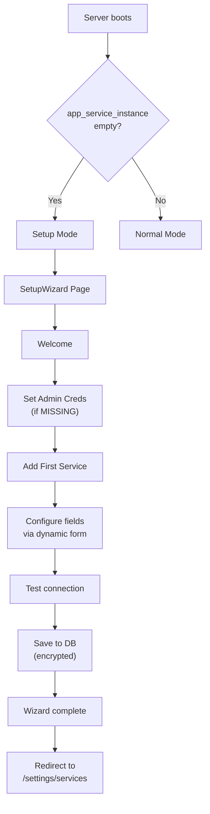
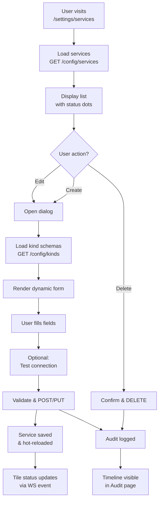
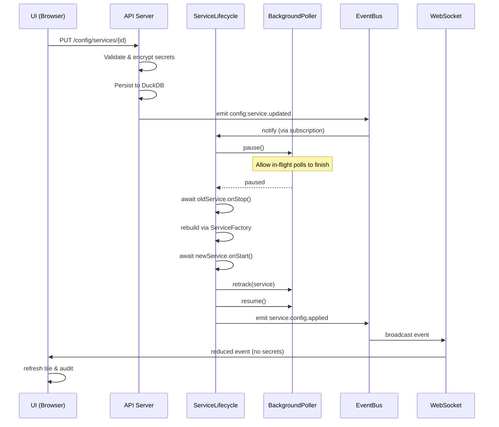

# UI-Driven Service Configuration

> [!abstract] Summary
> Watchman services are now managed entirely from the UI rather than `.env`. Services are stored in DuckDB with AES-256-GCM encrypted secrets, audited on every change, and applied live without restart.

## Overview

Previously, adding or editing a service required editing `.env`, restarting the backend, and losing WebSocket connections. Now:

- **Setup Wizard** guides first-time admins through initial service registration
- **Services UI** provides CRUD interface for all configured services
- **Dynamic Forms** generated from per-kind Zod schemas with client-side validation
- **Encrypted Secrets** stored at rest using `WATCHMAN_MASTER_KEY` (32-byte base64)
- **Hot Reload** pauses polling, swaps instances, retracks, resumes — no restart needed
- **Audit Trail** logs every create/update/delete with redacted diffs and actor
- **Test Connection** validates credentials before saving

## Flow Diagrams

### Setup Wizard (First Boot)



### Service Configuration Flow



### Hot-Reload Process



## Core Components

### SetupWizard (`src/pages/SetupWizard.tsx`)

Multi-step wizard served when no services are configured:

1. **Welcome**: Explains purpose
2. **Admin Setup**: Form to set `AUTH_USERNAME` + `AUTH_PASSWORD_HASH` (if missing in env)
3. **First Service**: Full service configuration form
4. **Complete**: Redirects to `/settings/services`

Uses `useSetupStatus()` query to detect when setup is done and navigate.

### Services UI (`src/pages/Settings/Services.tsx`)

Flat list of configured services:

- Status dot (green/red) for health
- Toggle to enable/disable (not yet implemented; phase 2)
- Edit button → opens `ServiceEditor` dialog
- Delete button → confirms & calls API

Uses `useServices()` and `useDeleteService()` mutations.

### ServiceEditor (`src/pages/Settings/ServiceEditor.tsx`)

Dynamic form driven by `/config/kinds` schemas:

- Per-kind Zod schema defines field types, validation, and UI metadata
- Fields: `label`, `type` (text/password/number/select), `secret`, `required`, `placeholder`, `help`, `options`
- Secret fields show `(saved — leave blank to keep)` on edit
- On submit, empty secret fields are omitted (preserves existing value)
- On response, secret fields masked as `"***"`
- Optional "Test Connection" button validates before save

Uses `useKinds()` to fetch schemas and `useCreateService()` / `useUpdateService()` to save.

### Audit Timeline (`src/pages/Settings/Audit.tsx`)

Chronological log of config changes:

- Each audit entry shows: timestamp, action (create/update/delete/import/export), service, actor, redacted diff
- Timeline format with expandable diffs
- Sorted descending by timestamp

Uses `useAudit()` query.

### Backup & Restore (`src/pages/Settings/BackupRestore.tsx`)

Enables admins to export and import service configurations:

- **Export**: Download encrypted bundle of all service configurations (AES-256-GCM with master key)
  - Button: "Download Backup"
  - Response: JSON file with `.watchman-backup` extension
  - Suitable for backup, migration, or disaster recovery
  
- **Import**: Upload a previously exported bundle
  - File picker and drag-and-drop support
  - Validates bundle format and decryption
  - Shows progress: imported, updated, skipped, and errors
  - Audit trail recorded with action `import`

Uses `useExportConfig()` and `useImportConfig()` mutations from `configApi.ts`.

## Backend Architecture

### ConfigStore (`src/config/store/ConfigStore.ts`)

DuckDB-backed CRUD:

- **Tables**:
  - `app_service_instance`: `id`, `kind`, `name`, `config_public` (JSON), `config_secret` (BLOB), `enabled`, `created_at`, `updated_at`
  - `app_config_audit`: `id`, `timestamp`, `action` (create/update/delete/import), `service_id`, `service_kind`, `diff_redacted`, `actor`, `notes`

- **Methods**:
  - `loadAll()` → Promise<ServiceInstance[]>
  - `findById(id)` → Promise<ServiceInstance | null>
  - `create(kind, name, configPublic, configSecret)` → Promise<ServiceInstance>
  - `update(id, configPublic, configSecret)` → Promise<ServiceInstance>
  - `delete(id)` → Promise<void>
  - `addAuditEntry(action, serviceId, diffRedacted, actor, notes)` → Promise<void>
  - `getAuditLog(limit, offset)` → Promise<AuditEntry[]>

- **Emits**: `config:service.{created,updated,deleted}` events on the event bus

### Encryption (`src/config/store/encryption.ts`)

AES-256-GCM with master key:

- **Key**: `WATCHMAN_MASTER_KEY` env (32 bytes, base64-decoded at boot)
- **Layout**: `IV(12) || TAG(16) || ciphertext`
- **Functions**:
  - `encrypt(plaintext: string): Buffer` → IV || TAG || ciphertext
  - `decrypt(encrypted: Buffer): string` → plaintext or throw
- **Error Handling**: Loss of master key makes secrets unrecoverable; documented in setup wizard and `.env.example`

### Per-Kind Schemas (`src/config/schemas/`)

One file per service kind; example structure:

```typescript
// src/config/schemas/bitcoin.ts
import { z } from 'zod'

export const BitcoinConfigSchema = z.object({
  onionUrl: z.string().url(),
  rpcUser: z.string(),
  rpcPassword: z.string(),
  rpcPort: z.number().int().default(8332),
})

export const BitcoinFieldMeta = [
  { name: 'onionUrl', label: 'Onion Address', type: 'text', required: true, help: 'Tor hidden service URL' },
  { name: 'rpcUser', label: 'RPC User', type: 'text', required: true },
  { name: 'rpcPassword', label: 'RPC Password', type: 'password', secret: true, required: true },
  { name: 'rpcPort', label: 'RPC Port', type: 'number', required: false, placeholder: '8332' },
]

export type BitcoinConfig = z.infer<typeof BitcoinConfigSchema>
```

Schemas are re-exported from `src/config/schemas/index.ts` and used:

- **Backend API**: `/config/kinds` returns all schemas with field metadata
- **Frontend**: `ServiceEditor` uses metadata to render form fields
- **Validation**: Zod schemas validate on both client and server

### ServiceLifecycle (`src/application/ServiceLifecycle.ts`)

Orchestrates hot-reload on config change:

```typescript
// Subscription to config events
eventBus.on('config:service.created', async (event) => {
  const service = await ServiceFactory.createService(event.kind, event.config, infra)
  
  // Mutex: serialize config changes
  await configMutex.runExclusive(async () => {
    poller.pause()
    try {
      service.onStart?.()
      serviceRegistry.register(service)
      poller.retrack(service)
    } finally {
      poller.resume()
    }
  })
  
  eventBus.emit('service.config.applied', { id: service.id })
})
```

### ServiceFactory (`src/config/ServiceFactory.ts`)

Pure function to instantiate a service from config:

```typescript
export function createService(kind: string, config: Record<string, any>, infra: Infrastructure): BaseService {
  const ServiceClass = serviceRegistry.get(kind)
  if (!ServiceClass) throw new Error(`Unknown service kind: ${kind}`)
  
  return new ServiceClass({ ...config, infra })
}
```

No longer reads env; all config comes from caller.

### Poller Updates (`src/infra/scheduler/poller.ts`)

New methods to support hot-reload:

- `pause()` → Stops polling; in-flight requests allowed to finish
- `resume()` → Resumes polling after pause
- `untrack(id: string)` → Removes service from tracking
- `retrack(service: BaseService)` → Re-adds service to tracking (e.g., after config change)

### API Routes

#### `GET /setup/status`

Returns setup state:

```json
{
  "data": {
    "needsSetup": false,
    "hasServices": true,
    "adminConfigured": true
  }
}
```

#### `GET /config/kinds`

Returns all service kind schemas with field metadata:

```json
{
  "data": {
    "bitcoin": {
      "schema": { /* Zod schema serialized */ },
      "fields": [
        { "name": "onionUrl", "label": "...", "type": "text", ... }
      ]
    },
    ...
  }
}
```

#### `GET /config/services`

List all configured services (secrets masked):

```json
{
  "data": [
    {
      "id": "bitcoin:1",
      "kind": "bitcoin",
      "name": "Main Bitcoin Node",
      "enabled": true,
      "config": {
        "onionUrl": "...",
        "rpcUser": "...",
        "rpcPassword": "***",
        "rpcPort": 8332
      },
      "createdAt": 1713446400000,
      "updatedAt": 1713446400000
    }
  ]
}
```

#### `POST /config/services`

Create a new service:

```json
{
  "kind": "bitcoin",
  "name": "Main Bitcoin Node",
  "config": {
    "onionUrl": "...",
    "rpcUser": "...",
    "rpcPassword": "..."
  }
}
```

Response: As above.

#### `PUT /config/services/{id}`

Update service config (secrets are optional on edit):

```json
{
  "config": {
    "onionUrl": "...",
    "rpcPassword": "" // Omit or empty = keep existing
  }
}
```

#### `DELETE /config/services/{id}`

Delete service:

```
DELETE /config/services/bitcoin:1
```

#### `POST /config/services/{id}/test`

Test connection with provided credentials:

```json
{
  "config": { /* trial config */ }
}
```

Response:

```json
{
  "data": {
    "success": true,
    "message": "Connection successful",
    "details": { /* service-specific */ }
  }
}
```

#### `GET /config/export`

Export all service configurations as encrypted bundle:

```json
{
  "data": {
    "version": 1,
    "exportedAt": "2026-04-19T10:30:00Z",
    "payload": "base64_aes256gcm_ciphertext"
  }
}
```

#### `POST /config/import`

Import a previously exported bundle:

```json
{
  "data": {
    "imported": 5,
    "updated": 2,
    "skipped": 0,
    "errors": []
  }
}
```

#### `GET /config/audit`

List audit log entries (query params: `?limit=50&offset=0`):

```json
{
  "data": [
    {
      "id": "...",
      "timestamp": 1713446400000,
      "action": "create",
      "serviceId": "bitcoin:1",
      "serviceKind": "bitcoin",
      "actor": "admin",
      "diffRedacted": "{ added: { name: 'Main Bitcoin Node' } }",
      "notes": null
    }
  ]
}
```

## Environment Variables

### New

| Variable           | Description                                      | Required | Example                                   |
| ------------------ | ------------------------------------------------ | -------- | ----------------------------------------- |
| `WATCHMAN_MASTER_KEY` | AES-256-GCM key for encrypting secrets (base64) | Yes      | `Z0VzN3AxMHBXZ3UyaDR...` (32 bytes, base64) |

### Removed

- `ENABLED_SERVICES` — Use UI instead
- `WATCHMAN_SERVICES_CONFIG` — Use UI instead
- All per-kind service env vars (`*_URL`, `*_USERNAME`, `*_PASSWORD`, etc.) — Migrated to DB on first boot via `envMigrator`

### Legacy Migration

On first boot with existing `.env`, `envMigrator` runs:
- Scans for legacy `*_MAIN_*`, `*_1_*`, etc. env vars
- Creates `app_service_instance` rows with `config_public` + `config_secret` (encrypted)
- Adds audit entry with action `import`
- Logs warning on subsequent boots if legacy vars still present

Admins should remove legacy service env vars from `.env` after first boot.

## Security Considerations

> [!warning] Master Key Loss
> If `WATCHMAN_MASTER_KEY` is lost or rotated, all encrypted secrets become unrecoverable. Admins must re-enter credentials. Store the key securely in your deployment (secrets vault, encrypted environment, etc.).

### Secret Handling

- Secrets encrypted with AES-256-GCM; plaintext never persisted
- GET responses redact secret fields to `"***"`
- Frontend forms show `(saved — leave blank to keep)` on edit
- On submit, omitted/empty secret fields preserve existing value
- `POST /config/services/{id}/test` executes with plaintext but doesn't persist

### Audit Trail

- Every mutation logged to `app_config_audit`
- Diffs redacted (secret fields shown as `"***"` in audit)
- Actor field for future multi-admin support
- Audit log visible in UI timeline

## Related Documentation

- [[docs/adr/015-ui-driven-service-configuration|ADR-015]] — Design decision
- [[docs/api/config|API Documentation]] — Complete endpoint reference
- [[docs/architecture/backend-architecture|Backend Architecture]] — ServiceFactory, ServiceLifecycle, ConfigStore
- [[docs/architecture/frontend-architecture|Frontend Architecture]] — Settings pages, SetupWizard
- [[docs/reference/environment-variables|Environment Variables]] — Master key setup
