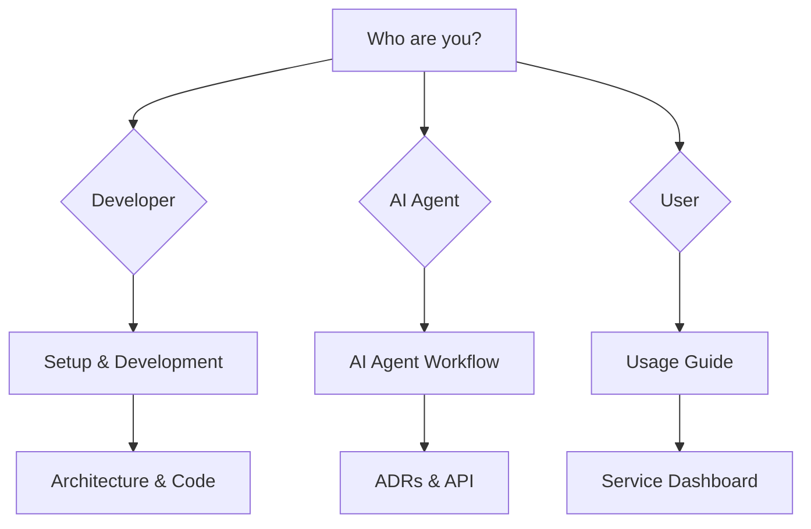

# Getting Started with Watchman

> [!abstract] Welcome
> This Map of Content (MOC) helps you quickly find what you need in the Watchman knowledge base. Follow the path that matches your goal.
>
> **For AI Agents**: Start with [[docs/guides/ai-agent-workflow|AI Agent Workflow]] for complete instructions.

## Quick Navigation



## I'm a New Developer

### 1. Set Up Your Environment

Start with the [[docs/guides/setup|Setup Guide]] to get the project running locally.

```
Setup Guide
├── Prerequisites (Node.js 18+, npm)
├── Clone & Install
├── Environment Variables
└── Run Development Server
```

### 2. Understand the Architecture

Get a high-level view before diving into code:

- [[docs/architecture/index|Architecture Overview]] - System diagrams
- [[docs/architecture/backend-architecture|Backend Architecture]] - Services, middleware, API layer
- [[docs/architecture/frontend-architecture|Frontend Architecture]] - Pages, components, hooks

### 3. Learn the Code Style

- [[docs/guides/contributing|Contributing Guide]] - Workflow and conventions
- [[docs/reference/code-patterns|Code Patterns]] - Standard patterns for all layers

### 4. Understand Key Features

- [[docs/features/service-monitoring|Service Monitoring]] - Core feature
- [[docs/features/multi-instance|Multi-Instance Support]] - Running multiple service nodes
- [[docs/features/real-time-updates|Real-Time Updates]] - WebSocket broadcasting

## I'm an AI Agent

### Start Here: AI Agent Workflow

> [!warning] Important
> Before making any code changes, **you must** read [[docs/guides/ai-agent-workflow|AI Agent Workflow]].

### Before Making Changes

1. Read relevant [[docs/adr/index|Architecture Decision Records]] for context
2. Check [[docs/api/index|API Documentation]] for existing endpoints
3. Search the KB using Obsidian MCP tools before reading code

### After Making Changes

1. Update relevant feature/API/integration docs
2. Add `[[code links]]` to new files
3. Update frontmatter dates

### Key Patterns

- **Wiki-links**: Use `[[path/to/file]]` format for code references
- **Frontmatter**: Always include `title`, `type`, `date`, `tags`, `description`
- **Callouts**: Use `> [!info]`, `> [!warning]`, `> [!tip]` for emphasis
- **Search first**: Use Obsidian MCP tools to search the KB before code

## I Need to Find Something

### API Endpoints

→ [[docs/api/index|API Documentation]] - All REST endpoints

### Service Integrations

→ [[docs/integrations/index|Integrations]] - AdGuard, Bitcoin, Tor, qBittorrent, and more

### Frontend Components

→ [[docs/components/index|Components Index]] - All React components and hooks

### Security

→ [[docs/security/index|Security]] - Authentication, rate limiting, IP control

### Error Codes

→ [[docs/reference/error-codes|Error Codes]] - All API error responses

### Environment Variables

→ [[docs/reference/environment-variables|Environment Variables]] - Complete reference

## I'm Making an Architectural Decision

1. Check existing [[docs/adr/index|Architecture Decisions]]
2. Use the [[docs/adr/template|ADR Template]]
3. Update relevant docs after implementation

## Knowledge Base Navigation

| Area            | Link                      | Description          |
| --------------- | ------------------------- | -------------------- | ---------------------- |
| 🏗️ Decisions    | [[docs/adr/index          | ADR Index]]          | Architecture decisions |
| 📡 APIs         | [[docs/api/index          | API Index]]          | REST endpoints         |
| 📖 Guides       | [[docs/guides/index       | Guides Index]]       | How-to guides          |
| ⚡ Features     | [[docs/features/index     | Features Index]]     | Feature docs           |
| 🔌 Integrations | [[docs/integrations/index | Integrations Index]] | External services      |
| 🧩 Components   | [[docs/components/index   | Components Index]]   | React components       |
| 📐 Architecture | [[docs/architecture/index | Architecture Index]] | System diagrams        |
| 🚀 Performance  | [[docs/performance/index  | Performance Index]]  | Optimizations          |
| 🧪 Testing      | [[docs/testing/index      | Testing Index]]      | Test strategies        |
| 🔒 Security     | [[docs/security/index     | Security Index]]     | Security docs          |

## Quick Reference

### Build Commands

```bash
# Install and start development
npm install && npm run dev

# Individual services
npm run dev:frontend    # Frontend only (Vite on 5173)
npm run dev:backend     # Backend only (Express on 3001)

# Production
npm run build           # Build all
npm run start           # Start production

# Quality
npm run lint            # Lint all workspaces
npm run test            # Run tests
```

### Key Directories

| Path                 | Description           |
| -------------------- | --------------------- |
| `apps/frontend/src/` | React frontend source |
| `apps/backend/`      | Node.js backend       |
| `docs/`              | This knowledge base   |
| `packages/shared/`   | Shared packages       |

### Default Ports

| Service           | Port |
| ----------------- | ---- |
| Frontend (Vite)   | 5173 |
| Backend (Express) | 3001 |

### Important Files

| File                        | Purpose                 |
| --------------------------- | ----------------------- |
| `apps/backend/server.js`    | Backend entry point     |
| `apps/backend/config.js`    | Configuration           |
| `apps/backend/openapi.yaml` | API specification       |
| `apps/frontend/src/App.tsx` | Main frontend component |
| `package.json`              | Root package config     |

## Common Tasks

See [[docs/common-tasks.md|Common Tasks]] for quick reference to:

- Starting development
- Adding a new service
- Configuring services
- Troubleshooting issues

## Troubleshooting

- [[docs/troubleshooting.md|Troubleshooting Guide]] - Common issues and solutions
- [[docs/reference/error-codes|Error Codes]] - Error code reference
- [[docs/guides/deployment|Deployment Guide]] - Production deployment
