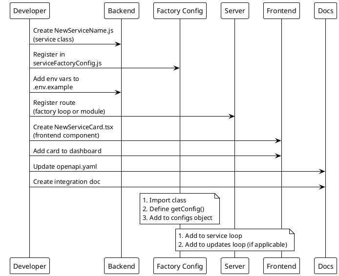
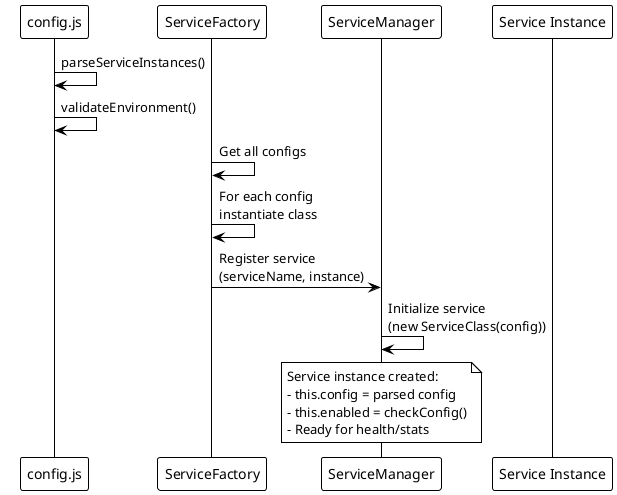
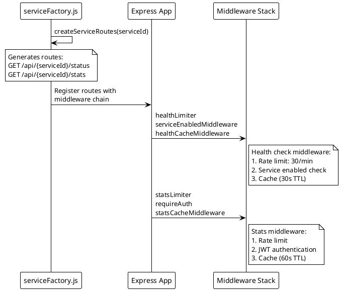

# Adding Services Guide

> [!abstract] Overview
> This guide walks you through adding a new service integration to Watchman.

## Overview

Each service follows a standard pattern:

1. Backend service class with health/stats methods
2. Factory configuration registration
3. Route generation (automatic via factory)
4. Frontend card component
5. OpenAPI spec update
6. Documentation

## Step 1: Create Backend Service Class

Create `apps/backend/services/NewServiceName.js`:

```javascript
export default class NewServiceName {
  constructor(config) {
    this.name = "newservice";
    this.config = config;
    this.enabled = this.checkConfig();
  }

  checkConfig() {
    return !!(this.config.host && this.config.port);
  }

  async checkHealth() {
    if (!this.enabled)
      return { status: "offline", timestamp: new Date().toISOString() };
    try {
      // Ping service endpoint
      const response = await fetch(
        `http://${this.config.host}:${this.config.port}/health`
      );
      return {
        status: response.ok ? "online" : "offline",
        timestamp: new Date().toISOString(),
        data: {
          /* service-specific data */
        },
      };
    } catch (error) {
      return {
        status: "offline",
        error: error.message,
        timestamp: new Date().toISOString(),
      };
    }
  }

  async getStats() {
    if (!this.enabled) return null;
    try {
      // Fetch detailed stats
      return {
        data: {
          /* stats */
        },
        timestamp: new Date().toISOString(),
      };
    } catch (error) {
      return { error: error.message, timestamp: new Date().toISOString() };
    }
  }
}
```

## Step 2: Register in Factory Config

Edit `apps/backend/services/serviceFactoryConfig.js`:

```javascript
import NewServiceName from "./NewServiceName.js";

export const serviceFactoryConfigs = {
  // ... existing services
  newservice: {
    ServiceClass: NewServiceName,
    getConfig: () => {
      if (!process.env.NEWSERVICE_HOST) return null;
      return {
        host: process.env.NEWSERVICE_HOST,
        port: parseInt(process.env.NEWSERVICE_PORT) || 8080,
      };
    },
  },
};
```

Add to default enabled services in `config.js`:

```javascript
return new Set([
  // ... existing services
  "newservice",
]);
```

## Step 3: Add Environment Variables

Edit `apps/backend/.env.example`:

```bash
# New Service Configuration
NEWSERVICE_HOST=192.0.2.1
NEWSERVICE_PORT=8080
```

Update `config.js` `getConfig()` to include the service config.

## Step 4: Register Route

For standard service `/status` + `/stats` endpoints, add the service ID to the factory route loop in `apps/backend/server.js`:

```javascript
for (const svc of [
  // ... existing services
  "newservice",
]) {
  app.use(
    `/api/${svc}`,
    createServiceRoutes(svc, serviceManager, factoryMiddleware)
  );
}
```

If the service supports update checks, add to the updates loop:

```javascript
for (const svc of [
  // ... existing services
  "newservice",
]) {
  app.use(
    `/api/${svc}`,
    createUpdatesRoute(svc, serviceManager, factoryMiddleware)
  );
}
```

If the service needs non-standard endpoints, implement them in a dedicated route module under `apps/backend/routes/` and register that module from `apps/backend/server.js` (current examples: `authRoutes.js`, `metaRoutes.js`, `controlRoutes.js`, `instanceRoutes.js`, `homebridgeRoutes.js`, `routerRoutes.js`).

## Step 5: Create Frontend Card Component

Create `apps/frontend/src/components/NewServiceCard.tsx`:

```tsx
import { OptimizedServiceCard } from "./OptimizedServiceCard";

export function NewServiceCard() {
  return (
    <OptimizedServiceCard
      serviceName="newservice"
      title="New Service"
      icon={<Icon />}
      renderStats={(stats) => <div>{/* Render service-specific stats */}</div>}
    />
  );
}
```

Add the card to the dashboard grid in the Index page.

## Step 6: Update OpenAPI Spec

Add endpoints to `apps/backend/openapi.yaml`:

```yaml
/api/newservice/status:
  get:
    summary: Get NewService health status
    tags: [newservice]
    responses:
      200:
        description: Health status
```

## Step 7: Create Documentation

Create `docs/integrations/newservice.md` following the [[docs/integrations/index|integration template]].

Update [[docs/components/index|Components Index]] with the new card.

## Checklist

- [ ] Service class created with `checkHealth()` and `getStats()`
- [ ] Registered in `serviceFactoryConfig.js`
- [ ] Added to default enabled services in `config.js`
- [ ] Environment variables added to `.env.example`
- [ ] Route added to factory loop and/or dedicated route module registered from `server.js`
- [ ] Frontend card component created
- [ ] Card added to dashboard
- [ ] OpenAPI spec updated
- [ ] Integration documentation created
- [ ] Components index updated

## PlantUML Diagrams

### Service Integration Flow



### Service Class Lifecycle



### API Endpoint Registration



## Related

- [[docs/integrations/index|Service Integrations]]
- [[docs/architecture/backend-architecture|Backend Architecture]]
- [[docs/components/index|Components Index]]
