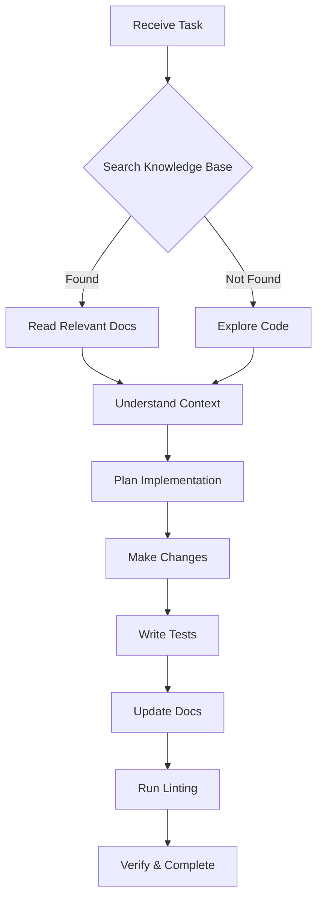

# AI Agent Workflow

> [!abstract] Purpose
> This document provides comprehensive instructions for AI agents working on the Watchman project. It covers the complete workflow from understanding the codebase to making changes and updating documentation.

## Workflow Overview



## Before Starting Any Task

### 1. Search the Knowledge Base

Always search the KB first using Obsidian MCP tools:

```javascript
// Use these tools in order:
mcp - obsidian_obsidian_simple_search(query); // Quick search
mcp - obsidian_obsidian_complex_search(query); // Advanced search by tags/frontmatter
mcp - obsidian_obsidian_list_files_in_dir("docs/"); // List docs in a folder
```

**Search priorities:**

1. Check [[docs/adr/index|Architecture Decision Records]] for design context
2. Check [[docs/api/index|API Documentation]] for existing endpoints
3. Check [[docs/integrations/index|Service Integrations]] for service patterns
4. Check [[docs/guides/adding-services|Adding Services Guide]] if adding new services

### 2. Verify Against Code

After understanding from docs, verify against actual code:

```bash
# Use explore subagent or glob/grep tools
glob("apps/backend/services/*.js")  # Find service files
grep("pattern", "apps/backend/")    # Search code
```

## Common Tasks & Documentation

### Adding a New Service

See [[docs/guides/adding-services|Adding Services Guide]] for step-by-step.

**Summary:**

1. Create service class in `apps/backend/services/`
2. Register in `serviceFactoryConfig.js`
3. Add env vars to `.env.example`
4. Add route in `server.js` or `serviceFactory.js`
5. Create frontend card component in `apps/frontend/src/components/`
6. Update OpenAPI spec in `apps/backend/openapi.yaml`
7. Create integration doc in `docs/integrations/`

### Adding a New API Endpoint

1. Add route in `apps/backend/server.js`
2. Add middleware as needed (auth, CSRF, rate limiting)
3. Update `apps/backend/openapi.yaml`
4. Create API doc in `docs/api/`
5. Update [[docs/api/index|API Documentation]] table

### Fixing a Bug

1. Search [[docs/troubleshooting.md|Troubleshooting]] for known issues
2. Search [[docs/reference/error-codes.md|Error Codes]] for context
3. Use grep to find relevant code
4. Fix the issue
5. Add tests
6. Update relevant docs

### Adding Tests

See [[docs/testing/index|Testing Index]] for framework details.

**Test locations:**

- Frontend: `apps/frontend/src/**/*.test.tsx`
- Backend: `apps/backend/**/*.test.js`

## Documentation Standards

### Frontmatter Requirements

Every document MUST have:

```yaml
---
title: Document Title
type:
  [
    index|endpoint|feature|integration|performance|testing|guide|adr|component|architecture|security|reference,
  ]
status: [active|draft|deprecated]
date: YYYY-MM-DD
tags: [specific, tags, here]
description: Brief description of the document
aliases: [alias1, alias2, alias3]
---
```

### Wiki-Links Format

Always use wiki-links for internal references:

```markdown
// Code references
[[apps/backend/services/ServiceName.js]]

// Doc references
[[docs/api/index|API Documentation]]
[[docs/guides/setup|Setup Guide]]
```

### Callouts

Use Obsidian callouts for emphasis:

```markdown
> [!info] Information
> Contextual information

> [!tip] Tip
> Helpful suggestion

> [!warning] Warning
> Important warning

> [!abstract] Abstract
> Summary or overview
```

## Code Quality

### Linting

Always run before completing:

```bash
npm run lint           # Lint all workspaces
npm run lint:fix       # Fix issues automatically
```

### Code Style

**Backend (Node.js/Express):**

- ES2022+ features, ESM modules
- Use `async/await` for all async code
- Use `import`/`export` syntax
- **Never use `null`** — use `undefined` for optional values
- No comments unless absolutely necessary

**Frontend (React/TypeScript):**

- Functional components with hooks
- PascalCase for components, camelCase for functions
- Use custom hooks for reusable logic
- Use React Query for server state

### Testing Requirements

- Write tests for all new features
- Write tests for bug fixes
- Cover edge cases and error handling
- Never modify original code to make testing easier

## File Naming Conventions

| Type               | Convention         | Example              |
| ------------------ | ------------------ | -------------------- |
| Service class      | `PascalCase.js`    | `AdGuardService.js`  |
| Frontend component | `PascalCase.tsx`   | `AdGuardCard.tsx`    |
| Frontend hook      | `usePascalCase.ts` | `useAuth.tsx`        |
| Middleware         | `kebab-case.js`    | `rate-limiting.js`   |
| Documentation      | `kebab-case.md`    | `adding-services.md` |

## Environment Variables

### Required Backend Variables

| Variable             | Description                       |
| -------------------- | --------------------------------- |
| `AUTH_USERNAME`      | Admin username                    |
| `AUTH_PASSWORD_HASH` | bcrypt hash of password           |
| `JWT_SECRET`         | JWT signing secret (min 32 chars) |
| `FRONTEND_URL`       | Frontend origin URL               |

### Service Variables

Pattern: `{SERVICE}_{INSTANCE}_{FIELD}` or `{SERVICE}_{FIELD}`

Examples:

- `ADGUARD_MAIN_URL`
- `QBITTORRENT_1_URL` (multi-instance)
- `BITCOIN_RPC_USER`

See [[docs/reference/environment-variables|Environment Variables Reference]].

## Key Paths Reference

| Purpose         | Path                                 |
| --------------- | ------------------------------------ |
| Backend entry   | `apps/backend/server.js`             |
| Service classes | `apps/backend/services/*.js`         |
| Middleware      | `apps/backend/middleware/*.js`       |
| Routes          | `apps/backend/routes/*.js`           |
| Config          | `apps/backend/config.js`             |
| OpenAPI spec    | `apps/backend/openapi.yaml`          |
| Frontend entry  | `apps/frontend/src/main.tsx`         |
| Components      | `apps/frontend/src/components/*.tsx` |
| Hooks           | `apps/frontend/src/hooks/*.ts`       |
| API client      | `apps/frontend/src/services/api.ts`  |

## Post-Change Workflow

After making any code changes:

1. **Update documentation:**
   - If new feature → create feature doc in `docs/features/`
   - If new endpoint → update API docs and OpenAPI spec
   - If new service → create integration doc in `docs/integrations/`
   - If new ADR → create new ADR in `docs/adr/`

2. **Add code links:**

   ```markdown
   [[apps/backend/services/NewService.js]]
   [[apps/frontend/src/components/NewComponent.tsx]]
   ```

3. **Update frontmatter:**
   - Set `date: 2026-04-02`
   - Ensure `status: active`

4. **Run verification:**
   ```bash
   npm run lint
   npm run build
   ```

## Troubleshooting

### If docs are unclear

1. Check `docs/troubleshooting.md`
2. Check `docs/reference/error-codes.md`
3. Search the codebase directly
4. Ask human for clarification

### If code and docs conflict

Code is the source of truth. Update docs to match code.

### If tests are failing

1. Don't modify tests to pass
2. Fix the underlying code issue
3. Ensure tests reflect actual behavior

## Related

- [[docs/INDEX.md|Knowledge Base Home]]
- [[docs/getting-started.md|Getting Started]]
- [[docs/guides/contributing.md|Contributing Guide]]
- [[docs/guides/adding-services.md|Adding Services Guide]]
- [[docs/common-tasks.md|Common Tasks]]
- [[docs/tag-taxonomy.md|Tag Taxonomy]]
