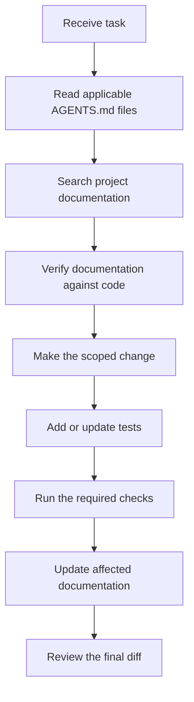

# AI Agent Workflow

> [!abstract] Purpose
> This guide defines the shared workflow for coding agents working on Watchman. The canonical
> repository instructions are in `AGENTS.md`; tool-specific files only provide compatibility.

## Configuration Layout

| Purpose                | Canonical location | Compatibility                                     |
| ---------------------- | ------------------ | ------------------------------------------------- |
| Repository guidance    | `AGENTS.md`        | `CLAUDE.md` imports it                            |
| Documentation guidance | `docs/AGENTS.md`   | `docs/CLAUDE.md` imports it                       |
| Project skills         | `.agents/skills/`  | `.claude/skills/` defers to the same instructions |
| Host-only guidance     | `AGENTS.local.md`  | `CLAUDE.local.md` remains tool-specific           |

Do not copy shared guidance into a tool-specific file. Update the canonical file so every supported
agent receives the same project rules.

## Workflow



### 1. Load Project Guidance

Read the root `AGENTS.md` before work. When editing under `docs/`, also read `docs/AGENTS.md`.
More specific instruction files override broader guidance.

### 2. Search Documentation First

Use repository file search to locate relevant architecture decisions, guides, and reference pages.
Start with:

- [[docs/INDEX|Knowledge Base Home]]
- [[docs/common-tasks|Common Tasks]]
- [[docs/architecture/index|Architecture Overview]]
- [[docs/reference/code-patterns|Code Patterns]]

Treat documentation as intent and code as current behavior. Report and correct drift when the task
touches the stale surface.

### 3. Use Project Skills

Use the `add-service` skill for monitored-service integrations. Use the
`update-watchman-docs` skill after changes that affect behavior, architecture, configuration,
security, APIs, packages, or workflows. Skill bodies live in `.agents/skills/` and use the open
Agent Skills format.

### 4. Keep Scope and Safety Explicit

- Preserve unrelated worktree changes.
- Validate external input with server-side Zod schemas.
- Keep secrets out of logs and commits.
- Preserve the trusted-network security model and shared HTTP/WebSocket origin allowlist.
- Add a new append-only ADR for architectural decisions.
- Explain destructive operations and obtain confirmation before running them.

### 5. Verify in Proportion to Risk

| Change                                       | Minimum verification                                                        |
| -------------------------------------------- | --------------------------------------------------------------------------- |
| Isolated edit                                | Targeted test and lint                                                      |
| Cross-module edit                            | Targeted tests, workspace lint, and typecheck                               |
| API change                                   | OpenAPI update, generated types, route docs, and compatibility statement    |
| Service change                               | Health, timeout, retry, circuit breaker, secrets, and multi-instance checks |
| Security, persistence, or destructive change | Tests, lint, typecheck, build, and focused safety checks                    |

Use `REVIEW.md` before committing. State which checks passed, failed, or were skipped.

## Common Commands

```bash
npm run typecheck
npm run lint
npm run lint:backend
npm run test
npm run test:frontend
npm run build
npm run generate:types
```

## Documentation Completion

Update only pages made stale by the implementation. Preserve frontmatter, wikilinks, callouts,
diagrams, and the interactive flow visualizer when relevant. At the end of a substantial session,
write a concise session note under `docs/` and link it to related project documentation.

## Related

- [[docs/INDEX|Knowledge Base Home]]
- [[docs/guides/contributing|Contributing Guide]]
- [[docs/guides/adding-services|Adding Services Guide]]
- [[docs/testing/index|Testing Index]]
- [[docs/troubleshooting|Troubleshooting]]
