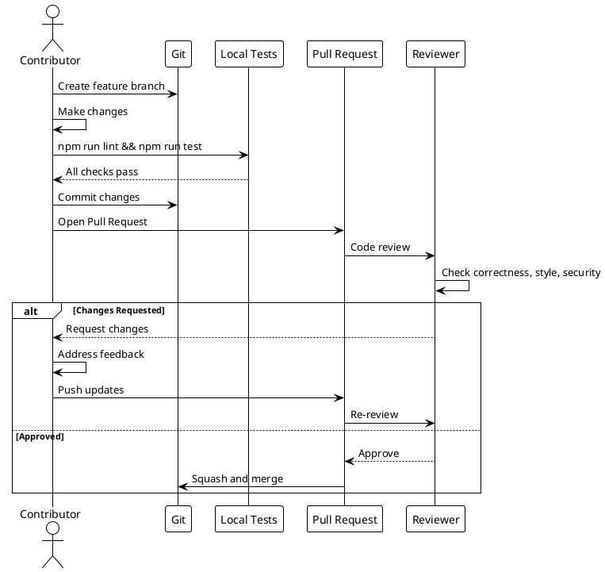
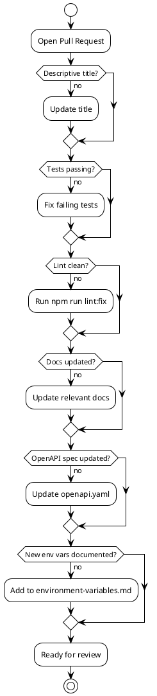

# Contributing Guide

> [!abstract] Overview
> This guide covers the contribution workflow and coding standards for Watchman.

## Getting Started

1. Fork the repository
2. Create a feature/fix branch from `main`
3. Make changes with tests/docs where applicable
4. Run lint/build/test locally
5. Open a pull request with clear context

## Branch Naming

- Features: `feature/description`
- Fixes: `fix/description`
- Docs: `docs/description`
- Refactoring: `refactor/description`

## Code Standards

### General

- Use TypeScript for frontend code
- Use ES modules in backend (`import`/`export`)
- Follow existing code style and conventions
- No secrets or credentials in code

### Formatting

- Use Prettier for code formatting
- Run `npm run format` before committing
- Check formatting with `npm run format:check`

### Linting

- ESLint configured per workspace
- Run `npm run lint` before committing
- Fix issues with `npm run lint:fix`

## Commit Messages

Use descriptive commit messages:

- `feat: add AdGuard protection toggle`
- `fix: resolve WebSocket reconnection issue`
- `docs: update API documentation`
- `refactor: simplify ServiceManager initialization`

## Pull Requests

- Use descriptive PR titles
- Keep PRs focused and small when possible
- Add screenshots/GIFs for UI changes
- Document any new configuration flags or environment variables
- Link related issues

## Testing

- Write tests for new functionality
- Run `npm run test` before submitting PR
- Tests located in `tests/` directory

## Documentation

- Update relevant docs for code changes
- Document new environment variables
- Update OpenAPI spec for API changes
- Follow KB conventions (frontmatter, wiki-links, tags)

## Code Review

- Reviewers check for correctness, style, and security
- Address review feedback promptly
- Squash and merge after approval

## Related

- [[docs/guides/setup|Setup Guide]]
- [[docs/reference/code-patterns|Code Patterns]]
- [[docs/tag-taxonomy.md|Tag Taxonomy]]

## PlantUML Diagrams

### Contribution Workflow

### Pull Request Checklist

